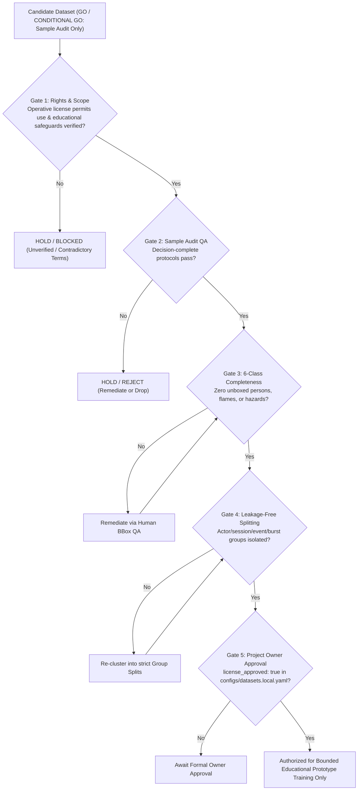

# Replacement Dataset Search: Fall and Fire/Smoke

## Project CCTV Safety — Stage 1 Spatial Detector

> **Review date:** 25 September 2026
> **Binding owner decision (25 September 2026):** This is a non-commercial university course project submitted to an instructor. Dataset originals will not be redistributed in Git, public model weights will not be released, sources and licenses will be cited, identifiable faces in reports and presentations must be blurred, and unresolved upstream-rights limitations must be disclosed.
> **Method:** Primary-source desk review of creator repositories, institutional dataset records, peer-reviewed data descriptors, and license metadata. No dataset archive was downloaded, and no model training was performed.
> **Scope:** Replacement candidates for `fall`, `fire`, and `smoke` in the Stage 1 spatial detector.
> **Legal and license principle:** Non-commercial education does not automatically cure copyright or license issues. Explicit source license terms still control. Unverified or contradictory license terms remain HOLD/BLOCKED.
> **Authorization scope:** GO / CONDITIONAL GO authorizes small-scale sample audit or bounded educational prototype only, **never unrestricted training approval**, commercial deployment, or clean provenance claims.
> **Fire status model:** Replaces the absolute fire BLOCKED policy with a careful status model:
> - A fire dataset may receive **CONDITIONAL GO — educational prototype/sample audit only** when its explicit operative license permits this non-commercial research/education use.
> - Unverified or contradictory license terms remain **HOLD/BLOCKED**.
> - CONDITIONAL GO is never approval to redistribute dataset files, publish weights, deploy commercially, or claim clean provenance.
> **Architecture & schema alignment:**
> - Stage 1 Spatial Detector comprises **exactly six canonical classes**: `0: person`, `1: helmet`, `2: vest`, `3: fall`, `4: fire`, `5: smoke` (see [data_schema_6classes.md](data_schema_6classes.md)).
> - `fight` remains strictly outside Stage 1 and is deferred to the Stage 2 temporal video classifier; Stage 2 remains **BLOCKED / PENDING DATA APPROVAL** (see [two_stage_architecture_migration.md](two_stage_architecture_migration.md) and [fight_dataset_evaluation.md](fight_dataset_evaluation.md)).
> - `no_helmet` and `no_vest` are geometric post-processing events computed by `cctv_safety/ppe.py`, not detector classes.
> - Consistency baseline: Aligned with findings in [stage1_dataset_primary_source_audit.md](stage1_dataset_primary_source_audit.md), [construction_ppe_sample_audit.md](construction_ppe_sample_audit.md), and [dataset_evaluation.md](dataset_evaluation.md).

---

## 1. Executive Summary

A comprehensive primary-source review was conducted to identify clean, legally defensible replacement candidates for `fall`, `fire`, and `smoke` to address the blockers identified in the Stage 1 primary-source audit (where D-Fire, Uttej, Simuletic, and Construction-PPE were held or blocked).

Under the 25 September 2026 binding owner decision for a non-commercial university course project submitted to an instructor, candidate evaluation applies a careful status model rather than an absolute blanket blocker:

1. **Fall Detection Dataset (State-to-Fall + ADL)** — First-party, creator-published video dataset under **CC BY-NC 4.0** created by a four-member academic team. The repository contains 54 MP4 video clips, of which 8 clips currently have CVAT XML bounding-box annotations mapped via `annotations/cvat/annotation_manifest.csv`. It entered as a **GO — sample audit only** to evaluate annotation precision, human likeness/privacy constraints, and actor/session grouping.
   - **Audit Outcome (25 September 2026): PASSED SAMPLE AUDIT — GO (Proceed to Corrected Label Build / Curation Pilot only; NOT training approval)**. 100% XML-to-video mapping verified across all 8 annotated clips (diff = 0). 10-clip stratified audit (487 frames across 8 annotated + 1 sitting + 1 ADL) verified dual-box fall kinematics, 0% missing persons on annotated frames, and 7 actor/session clusters cleanly isolating leakage. Systematic discrepancies cataloged: XML classes use state names (`standing`/`falling`/`fallen`) requiring transformation to Stage 1 `0: person` + `3: fall`; 7/8 clips have unannotated tail frames (450+ frames) requiring truncation/annotation; oversized boxes require tightening. See [fall_discrepancy_log.md](audit_artifacts/fall/fall_discrepancy_log.md).
2. **Boreal Forest Fire, Subset A** — First-party UAV footage of prescribed burns in Finland, published under **CC BY 4.0** by the National Land Survey of Finland and academic partners, documented in *Nature Scientific Data* (2025) and Fairdata IDA. It contains 4,954 images with human-verified YOLO bounding boxes for **smoke only**. It is the strongest rights candidate found, but covers **smoke only** (zero fire boxes) and features an aerial drone perspective rather than fixed indoor CCTV. It enters as a **GO — sample audit only** for supplementary smoke detection.
3. **D-Fire (`gaia-solutions-on-demand/DFireDataset`)** — Curated dataset containing 21,527 images in YOLO format with 14,692 fire boxes and 11,865 smoke boxes. The repository maintainers provide an explicit operative license (**CC0 1.0 Universal**) covering their dataset annotations and collection structure. Because its explicit operative license permits non-commercial research/education use, D-Fire enters under the careful status model as:
   **CONDITIONAL GO — educational prototype/sample audit only**.
   CONDITIONAL GO is strictly bounded: dataset files must never be committed to Git, model weights will not be publicly released, sources and licenses must be cited, identifiable faces in reports/presentations must be blurred, and unresolved upstream-rights limitations (maintainers' disclaimer of third-party image rights) must be disclosed. It is never approval to redistribute dataset files, publish weights, deploy commercially, or claim clean provenance.

### Careful Status Model for Fire
The prior absolute fire BLOCKED policy is replaced by a careful status model:
1. **Operative License Requirement:** A fire candidate can receive CONDITIONAL GO — educational prototype/sample audit only if its explicit operative license permits non-commercial research/education use.
2. **Unverified / Contradictory Terms Remain HOLD/BLOCKED:** Candidates claiming fire annotations that lack camera provenance, capture authority, or source manifests (CQU, Indoor Fire Smoke) or exhibit contradictory license terms across platforms (Simuletic) remain **HOLD/BLOCKED**. Non-commercial education does not cure missing upstream rights.
3. **Strict Boundaries:** CONDITIONAL GO authorizes local sample audit or bounded educational prototype training only; it never authorizes public weights, Git redistribution, commercial deployment, or claims of clean provenance.

### Primary-Source Provenance Corrections for Zenodo Records
A desk review of the raw InvenioRDM metadata on Zenodo revealed that earlier evaluation notes incorrectly reported blank license fields for several candidates. In fact, Zenodo records for **GMDCSA-24** (record 11216408), **EDF/OCCU** (record 15494102), **Indoor Fire Smoke** (record 15826133), and **FIRESENSE** (record 836749) all formally specify **Creative Commons Attribution 4.0 International (CC BY 4.0)** in their repository metadata. However, correcting this factual record does not alter their **HOLD** or **HOLD/BLOCKED** status because other critical blockers remain operative:
- **GMDCSA-24:** Raw video clips only; zero spatial bounding boxes (`person` or `fall`); actor consent in residential settings unverified.
- **EDF/OCCU:** 26.9 GB Kinect depth-sensing archive; zero Stage 1 bounding boxes; domain mismatch with RGB CCTV.
- **Indoor Fire Smoke:** 5,000 images with claimed bounding boxes, but zero capture protocol, camera metadata, or proof of depositor authority over third-party indoor photos. Remains **HOLD/BLOCKED**.
- **FIRESENSE:** EU FP7 video collection for action classification; zero spatial bounding boxes.

---

## 2. Decision Table

| Priority | Candidate | Target Class | Decision Status | Operative License | Immediate Technical & Provenance Reason |
|:---:|---|:---:|:---:|:---:|---|
| **1** | **Fall Detection Dataset (State-to-Fall + ADL)** | `fall` (and `person`) | **GO — Passed Sample Audit (Build Corrected Labels Only)** | CC BY-NC 4.0 | Sample audit completed 25 Sep 2026. 100% XML-to-video mapping confirmed (8/8 clips, diff=0). 487 stratified frames inspected across 10 clips. Actor grouping defined. Discrepancies cataloged for label remediation; unrestricted training remains gated. |
| **2** | **Boreal Forest Fire — Subset A** | `smoke` | **GO — sample audit only** | CC BY 4.0 | First-party prescribed-burn UAV capture by Finnish research institutes; CC BY 4.0; human-reviewed YOLO smoke boxes; aerial domain; covers smoke only (zero fire boxes). Sample audit only. |
| **3** | **D-Fire** | `fire`, `smoke` | **CONDITIONAL GO — educational prototype/sample audit only** | CC0 1.0 (annotations/collection); upstream web images unverified | 21,527 images in YOLO format (14,692 fire boxes, 11,865 smoke boxes). Operative CC0 license on annotations/structure; upstream image rights disclaimed. Bounded educational prototype only; Git redistribution barred, weights private, faces blurred, upstream rights disclosed. |
| **4** | **TsetFall** | `fall` | **HOLD** | GPL-3.0 (repo) | Provides human bbox CSV and sequence IDs, but GPL-3.0 is a software license whose scope over media/likenesses is ambiguous; distributed via MEGA with a Google Form key requirement. |
| **5** | **GMDCSA-24** | `fall` | **HOLD** | CC BY 4.0 (Zenodo) | First-party recordings of 4 actors across 3 homes; Zenodo metadata specifies CC BY 4.0, but data contains only action video clips without Stage 1 bounding boxes; requires complete relabeling. |
| **6** | **EDF / OCCU** | `fall` | **HOLD** | CC BY 4.0 (Zenodo) | 26.9 GB Kinect depth + synchronized RGB archive from 5 subjects; Zenodo metadata specifies CC BY 4.0, but contains no Stage 1 bounding boxes and depth domain diverges from surveillance RGB. |
| **7** | **CQU Annotated Fire-Smoke** | `fire`, `smoke` | **HOLD / BLOCKED** | CC BY 4.0 (stated) | Institutional DOI lists CC BY 4.0, but Schema.org metadata explicitly designates depositor as "Aggregated by" with no source manifest or proof of rights over underlying images. Unverified license authority. |
| **8** | **Indoor Fire Smoke Dataset** | `fire`, `smoke` | **HOLD / BLOCKED** | CC BY 4.0 (Zenodo) | 5,000 images with reported fire/smoke boxes; Zenodo metadata specifies CC BY 4.0, but card provides zero capture protocol, camera provenance, or evidence of depositor copyright. Unverified provenance. |
| **9** | **FIRESENSE** | `fire`, `smoke` | **HOLD** | CC BY 4.0 (Zenodo) | Credible EU FP7 project dataset; Zenodo metadata specifies CC BY 4.0, but provides video-level classification only (flame/smoke), completely lacking spatial bounding boxes. |

---

## 3. Fall Candidate Evaluations

### 1. Fall Detection Dataset (State-to-Fall + ADL) ⭐ [SHORTLISTED FOR SAMPLE AUDIT]

- **Primary source:** [Creator GitHub Repository](https://github.com/samruddhi-2308/FallDetectionDataset)
- **Creators:** Samruddhi Lakare, Shreeya Tapaswi, Vedant Karne, Yash Vidhate.
- **License & authority:** Released under **CC BY-NC 4.0** with explicit `CITATION.cff` and README terms. As first-party creators recording simulated falls, their copyright authority over the video footage is direct and credible. Non-commercial educational use complies with the project owner's scope (25 September 2026), but non-commercial status does not cure license obligations: CC BY-NC 4.0 attribution, non-commercial boundary, and share-alike conditions remain strictly binding.
- **Dataset scale & structure:** 54 MP4 video clips across four action categories:
  - 22 `standing_to_fall`
  - 10 `sleeping_to_fall`
  - 16 `sitting_to_fall`
  - 6 `adl` (Activities of Daily Living, serving as negative controls)
- **Annotation status:** Clip-level action labels for all 54 clips; 8 clips have CVAT XML bounding-box exports (6 `standing_to_fall` and 2 `sleeping_to_fall`). The creators explicitly note that XML-to-video mapping was derived from exact frame counts (`mapped_auto_exact_frame_count` in `annotations/cvat/annotation_manifest.csv`) and requires a visual spot-check.
- **Stage 1 fit:** Provides a foundation for human bounding-box QA. The 8 annotated clips can serve as an annotation verification pilot. The remaining 46 clips require bounding-box annotation for both `person` and `fall`.
- **Grouping:** Must be grouped strictly by participant/actor identity and recording environment. Individual frames must never cross splits.
- **Privacy & likeness:** Human faces and full bodies are visible. Use must comply with the repository's `docs/ethics_and_privacy.md` and `docs/collection_protocol.md`. Identifiable faces in reports or presentations must be blurred.
- **Decision:** **GO — PASSED SAMPLE AUDIT (Proceed to Corrected Label Build / Curation Pilot only; NOT training approval).** Completed 25 September 2026. 100% XML mapping verified across 8 annotated clips. 487 stratified frames inspected across 10 clips. Non-destructive actor grouping defined. See [fall_discrepancy_log.md](audit_artifacts/fall/fall_discrepancy_log.md) for required programmatic transformations before training ingestion.

### 2. TsetFall

- **Primary source:** [Author / Lab Repository](https://github.com/ppgia-unifor/TsetFall_dataset)
- **Publisher:** Applied Artificial Intelligence Laboratory (PPGIA), University of Fortaleza (UNIFOR).
- **License evidence:** Repository displays **GPL-3.0**. While GPL-3.0 is a standard open-source license for software, its application to photographic media, video archives, and participant likenesses is legally uncertain and does not explicitly address model training rights or media sublicensing.
- **Availability & distribution:** Video files (`tsetfall_videos.rar`) and image frames (`tsetfall.rar`) are hosted on MEGA. The archive is encrypted, requiring users to fill out a Google Form to request a decoding key.
- **Scale & content:** 36 structured sequences covering normal walking, sitting, fainting, backward falls, forward falls, exercises, and challenging negatives (e.g., carrying mannequins, handling shirts on hangers, dark lighting).
- **Annotations:** `ground_truth.csv` provides human-annotated bounding boxes with classes: `Not Fallen (NF)`, `Fallen (FN)`, `Falling (FG)`, and `Confounding (C)`. `ground_truth_extended.csv` contains AI-assisted annotations with confidence scores.
- **Grouping:** Filename conventions (`cam_X__seqNumber-seqName__frameNumber.jpeg`) provide clear camera, sequence, and frame indexing suitable for sequence-level grouping.
- **Blockers:** Proprietary gating via Google Form/MEGA; ambiguous media licensing under GPL-3.0; unknown actor consent agreements.
- **Decision:** **HOLD.** Maintain contact with authors to request written clarification on media licensing and participant consent before any data acquisition.

### 3. GMDCSA-24

- **Primary sources:** [Zenodo Record 11216408](https://zenodo.org/records/11216408) (v1.1.0) and [Author GitHub Repository](https://github.com/ekramalam/GMDCSA24-A-Dataset-for-Human-Fall-Detection-in-Videos/tree/1.1.0)
- **Author:** Ekram Alam (Gour Mahavidyalaya).
- **License evidence:** Zenodo InvenioRDM metadata explicitly records **Creative Commons Attribution 4.0 International (CC BY 4.0)**. (Corrected from earlier desk-review notes reporting a blank field).
- **Scale & content:** 984.7 MB archive containing MP4 video clips of falls and Activities of Daily Living (ADL) performed by 4 actors across 3 residential home environments.
- **Annotation & format blocker:** Contains only clip-level video action labels. **No spatial bounding boxes (`person` or `fall`) exist** in the repository.
- **Stage 1 fit:** Using this dataset would require extracting all video frames and executing a ground-up human annotation project for both `0: person` and `3: fall`.
- **Decision:** **HOLD.** Requires written confirmation of actor likeness/privacy consent and would necessitate an extensive bounding-box annotation campaign.

### 4. EDF and OCCU Fall Detection Datasets

- **Primary source:** [University of Texas at Arlington Deposit on Zenodo](https://zenodo.org/records/15494102)
- **Authors:** Zhong Zhang, Christopher Conly, Vassilis Athitsos (University of Texas at Arlington).
- **License evidence:** Zenodo InvenioRDM metadata explicitly records **Creative Commons Attribution 4.0 International (CC BY 4.0)**. (Corrected from earlier desk-review notes reporting a blank field).
- **Scale & content:** 26.9 GB total archive across two subsets:
  - **EDF:** 50,378 frames across 80 synchronized two-viewpoint fall events and 30 fall-like ADL activities performed by 5 subjects.
  - **OCCU:** 49,321 frames across 60 occluded fall events (occluded by a bed) and 80 fall-like ADL activities.
- **Domain & format blocker:** Recorded using Microsoft Kinect depth cameras (depth sensing + synchronized RGB). Designed for occlusion and depth-based action recognition. **No 2D object detection bounding boxes are provided.**
- **Decision:** **HOLD.** The 26.9 GB depth-domain format and complete absence of 2D bounding boxes make it unsuitable as a near-term Stage 1 replacement.

---

## 4. Fire and Smoke Candidate Evaluations

### 5. Boreal Forest Fire — Subset A ⭐ [SHORTLISTED FOR SAMPLE AUDIT]

- **Primary sources:**
  - [Peer-reviewed Data Descriptor: *Scientific Data* 12, 1419 (2025)](https://www.nature.com/articles/s41597-025-05634-0)
  - [Fairdata IDA Persistent Identifier (DOI: 10.23729/fd-72c6cf74-b8eb-3687-860d-bf93a1ab94c9)](https://doi.org/10.23729/fd-72c6cf74-b8eb-3687-860d-bf93a1ab94c9)
  - [Aalto University Institutional Dataset Record](https://research.aalto.fi/en/datasets/boreal-forest-fire-uav-collected-wildfire-detection-and-smoke-seg/)
  - [National Land Survey of Finland (MML / FGI) Research Project](https://www.maanmittauslaitos.fi/tutkimus)
- **Creators:** Julius Pesonen, Anna-Maria Raita-Hakola, Jukka Joutsalainen, Teemu Hakala, Waleed Akhtar, Väinö Karjalainen, Niko Koivumäki, Lauri Markelin, Juha Suomalainen, Raquel Alves de Oliveira, Ilkka Pölönen, Eija Honkavaara.
- **License & authority:** Formally licensed under **Creative Commons Attribution 4.0 International (CC BY 4.0)** by the copyright holder, National Land Survey of Finland (Maanmittauslaitos - FGI). First-party UAV video capture of prescribed forest restoration burns conducted in Finland during summer 2022.
- **GDPR & privacy sanitation:** All raw video frames were manually screened prior to release; frames containing identifiable persons, vehicle license plates, or residential structures were systematically purged to comply with GDPR.
- **Scale & structure:** Subset A contains **4,954 images** (4K resolution, 3840×2160) extracted every 48th frame (~2-second intervals) from drone video, organized across four burn locations:
  - Ruokolahti: 1,767 images
  - Karkkila: 1,313 images
  - Heinola: 943 images
  - Evo: 931 images
  - (Includes **256 intentionally empty negative images** paired with blank label files).
- **Annotations:** Image-by-image human-annotated and visually verified bounding boxes in standard YOLO format (`class_id x_center y_center width height`). Annotations cover **one class only: `smoke` (class 0)**. In their benchmark trials, the creators demonstrated that a "large bounding box" annotation strategy enclosing the smoke plume and immediate background context significantly outperformed multiple fragmented boxes (precision 0.94 vs 0.24 on YOLOv5).
- **Stage 1 domain fit & limitations:**
  - **Smoke only:** Provides high-quality annotations for canonical `5: smoke`. It contains **no annotations for `4: fire`**.
  - **Domain gap:** High-angle aerial UAV perspective (10–200 m altitude) over boreal forest environments. It does not replicate fixed indoor/ceiling-mounted CCTV camera views.
  - **Flame contamination risk:** Because Subset A only annotates smoke, any visible flames within prescribed burns may be unboxed, creating a missing-label penalty against canonical class `4: fire` if directly ingested.
- **Grouping:** Grouping must be conducted at the flight sequence or burn event level. Due to 2-second frame intervals, random splitting would cause severe split leakage.
- **Decision:** **GO — sample audit only.** Proceed to execute the decision-complete sample audit protocol detailed in Section 6. Authorizes sample audit only, not unrestricted training approval.

### 6. CQU Annotated Fire-Smoke Image Dataset for YOLO

- **Primary source:** [Central Queensland University Institutional Record](https://researchdata.edu.au/annotated-fire-smoke-using-yolo/3671995), DOI `10.25946/28747046.v1`.
- **License evidence:** Institutional metadata records **CC BY 4.0**.
- **Scale & claims:** 11,027 labeled images in YOLO format for `fire` and `smoke`, with reported instance counts (10,090 train fire, 9,724 train smoke).
- **Authority & provenance blocker:** The Schema.org structured metadata explicitly designates depositor Shouthiri Partheepan with `"Role": "Aggregated by"`. The record contains no source manifest, no camera metadata, and no evidence that the depositor created or acquired licensing rights for the 11,027 source images. An aggregator cannot grant CC BY 4.0 over third-party copyright works without explicit upstream authority. Non-commercial education does not cure unverified upstream aggregation.
- **Decision:** **HOLD / BLOCKED.** Unverified license authority; does not qualify for CONDITIONAL GO.

### 7. Indoor Fire Smoke Dataset

- **Primary source:** [Zenodo Record 15826133](https://zenodo.org/records/15826133)
- **Author:** Arya Krisna Putra (Binus University).
- **License evidence:** Zenodo InvenioRDM metadata records **Creative Commons Attribution 4.0 International (CC BY 4.0)**. (Corrected from earlier desk-review notes reporting a blank field).
- **Scale & format:** 200.5 MB ZIP archive containing 5,000 images partitioned into 3,500 train, 750 val, 750 test, with reported fire and smoke bounding boxes.
- **Provenance blocker:** The description asserts that images are real and captured in indoor environments (homes, offices, buildings). However, the record provides **no capture protocol, camera equipment documentation, photographer manifests, or evidence establishing depositor copyright authority** over 5,000 indoor building scenes.
- **Decision:** **HOLD / BLOCKED.** Unverified provenance; does not qualify for CONDITIONAL GO.

### 8. FIRESENSE

- **Primary source:** [Zenodo Record 836749](https://zenodo.org/records/836749)
- **Authors:** Nikos Grammalidis, Kosmas Dimitropoulos, Enis Cetin (CERTH / Bilkent University).
- **License evidence:** Zenodo InvenioRDM metadata explicitly records **Creative Commons Attribution 4.0 International (CC BY 4.0)** under European Commission FP7 project funding (Grant 244088). (Corrected from earlier desk-review notes reporting a blank field).
- **Scale & content:** Two archives totaling 820.3 MB containing 27 flame videos (11 positive, 16 negative) and 22 smoke videos (13 positive, 9 negative).
- **Annotation blocker:** **Classification videos only.** The dataset contains no 2D bounding boxes.
- **Decision:** **HOLD.** Format mismatch; usable only as a raw video source for future manual bounding-box annotation projects.

### 9. D-Fire (`gaia-solutions-on-demand/DFireDataset`) ⭐ [CONDITIONALLY ELIGIBLE FOR EDUCATIONAL PROTOTYPE]

- **Primary sources:** [Publisher repository](https://github.com/gaia-solutions-on-demand/DFireDataset), [README](https://github.com/gaia-solutions-on-demand/DFireDataset/blob/master/README.md), and [LICENSE](https://github.com/gaia-solutions-on-demand/DFireDataset/blob/master/LICENSE).
- **Maintainers:** Pedro Vinicius A. B. Venâncio et al.
- **License & authority:** The repository maintainers formally dedicated the dataset collection structure and bounding box annotations under **Creative Commons Zero 1.0 Universal (CC0 1.0)**. However, the maintainers explicitly note:
  > *"The images in this dataset were collected from various public sources on the Internet. We do not claim ownership or copyright over any of the images included. The CC0 license applies to our annotations and dataset structure. If you are the copyright holder of any image..."*
- **Application of binding owner decision (25 September 2026):**
  - This project is a non-commercial university course project submitted to an instructor.
  - The repository's explicit operative CC0 license covers the annotations and collection, permitting non-commercial research/education use.
  - Non-commercial education does **not** cure third-party copyright issues; therefore, D-Fire cannot receive unconditional approval, be deployed commercially, or claim clean provenance.
  - Instead, under the careful status model, D-Fire receives:
    **CONDITIONAL GO — educational prototype/sample audit only**.
- **Mandatory educational safeguards & constraints:**
  1. *No Git redistribution:* Raw images and labels must remain strictly excluded from Git under `data/raw/` or `data/` via `.gitignore`.
  2. *No public weight release:* Checkpoints trained with D-Fire imagery must remain strictly private and will not be published publicly.
  3. *Citation:* Formal attribution and repository citation must be included in project reports.
  4. *Privacy / face blurring:* Any identifiable human faces in fire scenes must be blurred prior to inclusion in report figures or presentation slides.
  5. *Disclose limitations:* The project report and presentation must explicitly disclose that D-Fire's source images were aggregated from the public web with maintainer-disclaimed image copyright.
  6. *Never deploy commercially or claim clean provenance.*
- **Scale & annotations:** 21,527 images in standard YOLO format: 1,164 fire-only, 5,867 smoke-only, 4,658 fire+smoke, and 9,838 negatives (14,692 fire boxes, 11,865 smoke boxes).
- **Decision:** **CONDITIONAL GO — educational prototype/sample audit only.** Proceed to execute the decision-complete sample audit protocol and educational prototype exit gates detailed in Section 7. Authorizes sample audit or bounded educational prototype only, not unrestricted training approval.

### 10. Excluded Leads & Status Retention

- **Simuletic CCTV Smoke and Fire (`simuletic/cctv-smoke-and-fire-emergency-detection-dataset`):** Remains **HOLD / BLOCKED**. Contradictory license terms across platforms (Kaggle CC BY-NC-SA 4.0 vs card CC BY 4.0 vs Hugging Face CC BY-NC 4.0) violate the requirement for consistent, uncontradictory operative licensing.
- **FASDD / New Fire and Smoke:** Excluded. Compiled from YouTube and public web sources without verifiable upstream copyright grants.
- **Mendeley Fire Recognition Dataset:** Excluded. Image classification folders without bounding boxes; compiled from YouTube clips.
- **iStock & Adobe Stock:** **REJECTED**. Commercial stock search portals; licenses strictly prohibit redistribution and training dataset creation.
- **Uttej Fall & Simuletic Fall:** Statuses remain **HOLD** as documented in [stage1_dataset_primary_source_audit.md](stage1_dataset_primary_source_audit.md) and [dataset_evaluation.md](dataset_evaluation.md).

---

## 5. Decision-Complete Sample-Audit Protocol: Fall Detection Dataset

This protocol defines the exact procedure for auditing the shortlisted **Fall Detection Dataset (State-to-Fall + ADL)**. Execution of this protocol authorizes only a local sample audit; **it does not authorize unrestricted model training**.

### 5.1 Sample Size & Target Inventory
- **Target source scale:** 54 MP4 video clips across four action categories:
  - 22 `standing_to_fall`
  - 10 `sleeping_to_fall`
  - 16 `sitting_to_fall`
  - 6 `adl` (Activities of Daily Living)
- **Audit sample size:**
  1. **100% of annotated clips:** Inspect all 8 clips that currently have CVAT XML exports (6 `standing_to_fall` and 2 `sleeping_to_fall`). Extract all frames (~350–600 frames total) to verify mapping and box alignment.
  2. **Unannotated representative spot-checks:** Sample 2 unannotated clips (1 `sitting_to_fall` clip and 1 `adl` hard-negative clip, ~60–100 extracted frames) to evaluate actor consistency, background environment, and manual annotation difficulty.
  3. **Total sample volume:** Exactly 10 video clips (~410–700 frames total).

### 5.2 Sampling & Grouping Protocol
- **Primary grouping unit:** Actor identity and recording session / room setting.
- **Cardinal rule:** **NEVER split by extracted video frames.** All frames from a given video clip, and all clips featuring the same actor in the same setting, must reside in the exact same data split (train, validation, or test) to eliminate identity and background leakage.
- **CVAT mapping verification:** The dataset README states that XML-to-video mapping was derived automatically by frame-count matching (`mapped_auto_exact_frame_count`). The auditor must visually verify the correspondence between `annotations/cvat/annotation_manifest.csv` and the actual video content for all 8 clips.

### 5.3 Human Bounding Box QA
- **Dual-box semantics for fall events:**
  In accordance with Canonical Detector Schema v2 (Rule #25):
  - Prior to the fall motion (standing, walking, sitting normally), a person is annotated with **`0: person` only**.
  - During the active falling transition and while resting in a fallen posture on the floor, the subject must receive **co-occurring bounding boxes: `0: person` AND `3: fall`**.
- **Frame transition precision:** Audit whether the onset frame and completion frame of the fall are precisely identified in the CVAT XML tracks.
- **Box tightness & coverage:** Bounding boxes must tightly enclose the complete human body, including limbs and head. Flag any loose boxes, truncated limbs, or boundary drift across interpolated frames.

### 5.4 Exhaustive Missing-Label Review across All Six Canonical Classes
The auditor must screen every sampled frame for all six canonical classes:
1. `0: person`: Verify that **every visible human** (including fallen subjects, assisting actors, or bystanders) is annotated. A missing person box creates an intolerable negative penalty during training.
2. `1: helmet` & `2: vest`: Inspect whether subjects wear any industrial PPE. In residential ADL footage, PPE is expected to be absent; confirm that no everyday headwear or clothing is mislabeled as PPE.
3. `3: fall`: Verify that normal sitting on chairs, lying in bed, or crouching is **not** labeled as `fall`. `fall` must strictly denote loss of balance or collapse to the floor.
4. `4: fire` & `5: smoke`: Verify background indoor environments (e.g., kitchens, lighting fixtures) for open flames or haze; confirm no false positive artifacts exist.

### 5.5 Duplicate, Near-Duplicate, and Leakage Checks
- **Exact hash check:** Calculate SHA-256 digests across all raw video files to confirm zero duplicated uploads.
- **Perceptual near-duplicate check:** Compute perceptual hashing (pHash) across extracted frames within each clip to identify frame decimation thresholds (e.g., sampling every 5th or 10th frame to avoid near-identical consecutive frames).
- **Cross-clip actor leakage:** Cluster video clips by actor visual features (clothing, hair, facial features) and environment geometry to define authoritative group IDs before proposing any train/val/test allocation.

### 5.6 Required Audit Artifacts
The sample audit must produce and persist the following artifacts in the project audit records:
1. `sample_inventory.csv`: Tabular index recording clip filename, action label, frame count, actor cluster ID, XML mapping status, and canonical instance counts.
2. `visual_qa_overlays/`: Rendered sample frames with color-coded bounding boxes (`person` in green, `fall` in magenta) illustrating correct dual-box annotation and transition frames.
3. `discrepancy_log.md`: Detailed log documenting any misaligned frame counts, box drift, or unannotated persons.

### 5.7 Decision Criteria (GO / HOLD / REJECT)
- **GO (Pass Sample Audit → proceed to relabeling pilot; NOT training approval):**
  - XML-to-video mapping is 100% verified across all 8 annotated clips.
  - Frame-level dual-box semantics (`person` + `fall`) are clear and verifiable.
  - Missing-label rate for visible persons is 0% on annotated frames.
  - Actor clusters can be cleanly isolated into distinct splits.
- **HOLD (Remediation Required):**
  - Minor frame-offset discrepancies in CVAT XML mapping that can be reconciled programmatically.
  - Loose bounding boxes requiring manual boundary refinement.
  - Ambiguous actor identities requiring author inquiry.
- **REJECT (Terminate Candidate):**
  - Systematic XML-to-video mismatch rendering annotations unusable.
  - Pervasive labeling errors (e.g., `fall` applied to entire standing sequences).
  - Unresolvable subject privacy or consent objections.

### 5.8 Executed Sample Audit Outcome & Findings (25 September 2026)

The Fall sample audit was formally executed on 25 September 2026 using `scripts/audit_fall_sample.py`.

- **Audit Decision:** **PASSED SAMPLE AUDIT — GO (Proceed to Corrected Label Build / Curation Pilot only; NOT training approval)**.
- **Machine QA Coverage (100%):** 54 / 54 MP4 video clips readable and decodable via OpenCV; 54 unique SHA-256 digests (0 duplicate video uploads); 8 / 8 CVAT XML files verified with exact 1:1 frame count match (`diff = 0`) to mapped video clips in `annotation_manifest.csv`.
- **Human Visual QA Coverage:** Exactly 10 clips audited (all 8 CVAT-annotated + 1 sitting_to_fall unannotated + 1 ADL hard negative); exactly 487 stratified frames extracted and visually inspected across pre-fall, falling transition, fallen posture, and unannotated tail frames via 10 multi-frame contact sheets rendered under `data/processed/fall_sample_audit/contact_sheets/`.
- **Primary Technical Findings:**
  1. *Dual-Box Semantics:* CVAT tracks use action states (`standing`, `falling`, `fallen` or `Sleeping`, `Falling`, `Fallen`). Pre-fall must map to canonical `0: person`; transition and fallen phases must map to dual-box `0: person` AND `3: fall`.
  2. *Unannotated Tail Frames:* In 7 of the 8 annotated clips, tracking terminated prematurely upon fall completion, leaving 450+ unannotated tail frames where the fallen actor remains visible without bounding boxes. Truncation or box extension is mandatory before training ingestion.
  3. *Loose Bounding Boxes:* Linear keyframe interpolation in CVAT resulted in oversized horizontal boxes (width > 1000 px) in `FD0044`, `FD0049`, and `FD0024`, requiring boundary clamping.
  4. *Zero Non-Target Hazards:* Confirmed zero PPE (`helmet`, `vest`) and zero `fire`/`smoke` instances across all clips.
  5. *Actor/Session Grouping:* Clustered into 7 distinct actor/session groups (`docs/audit_artifacts/fall/fall_actor_grouping.csv`), guaranteeing zero cross-split actor or room leakage.
- **Committed Audit Artifacts:**
  - Inventory: [`fall_sample_inventory.csv`](audit_artifacts/fall/fall_sample_inventory.csv)
  - Frame-Level QA: [`fall_frame_qa.csv`](audit_artifacts/fall/fall_frame_qa.csv)
  - Discrepancy Log: [`fall_discrepancy_log.md`](audit_artifacts/fall/fall_discrepancy_log.md)
  - Hashes: [`fall_clip_hashes.csv`](audit_artifacts/fall/fall_clip_hashes.csv)
  - dHash Analysis: [`fall_dhash_near_duplicates.csv`](audit_artifacts/fall/fall_dhash_near_duplicates.csv)
  - Grouping Manifest: [`fall_actor_grouping.csv`](audit_artifacts/fall/fall_actor_grouping.csv)

---

## 6. Decision-Complete Sample-Audit Protocol: Boreal Forest Fire — Subset A

This protocol defines the exact procedure for auditing **Boreal Forest Fire — Subset A**. Execution authorizes only a local sample audit for supplementary smoke detection; **it does not authorize unrestricted model training**.

### 6.1 Sample Size & Target Inventory
- **Target source scale:** 4,954 4K images extracted from drone video across four prescribed burn locations in Finland (Evo, Ruokolahti, Karkkila, Heinola), including 256 negative images.
- **Audit sample size:** Exactly **80 images** selected via stratified sampling across all four capture locations:
  - 20 images from Ruokolahti (15 smoke positive, 5 empty negative)
  - 20 images from Karkkila (15 smoke positive, 5 empty negative)
  - 20 images from Heinola (15 smoke positive, 5 empty negative)
  - 20 images from Evo (15 smoke positive, 5 empty negative)
- **Stratification criteria:** Selection must span heavy dense smoke plumes, diffuse/thin smoke, distant smoke near the horizon, smoke over water bodies, and cloud-heavy sky backgrounds.

### 6.2 Sampling Strategy & Flight/Event Grouping
- **Primary grouping unit:** Prescribed burn event and UAV flight sequence.
- **Cardinal rule:** **NEVER split by individual images or random 70/20/10.**
  - In Subset A, frames were sampled every 48th frame (~2 seconds apart). Temporally adjacent frames have extreme visual correlation.
  - In the peer-reviewed *Scientific Data* descriptor, Subset C enforced a **120-second recording separation interval** to prevent set correlation.
  - The sample audit must extract flight metadata and verify that entire burn events or distinct flights are isolated into separate splits.
- **Domain calibration:** Explicitly document the aerial UAV perspective (10–200 m altitude) as a supplementary domain for outdoor smoke, noting that it cannot serve as a direct proxy for fixed indoor CCTV.

### 6.3 Human Bounding Box QA
- **Evaluation of large smoke box strategy:**
  The creators established that large bounding boxes enclosing the smoke plume and immediate background outperform tight, fragmented boxes (precision 0.94 vs 0.24). The auditor must assess:
  - Are bounding box boundaries drawn consistently around coherent smoke plumes?
  - Does the large box include excessive ground vegetation or sky that could confuse a detector?
- **Hard false-positive screen:** Inspect potential confounders in the negative images and plume perimeters:
  - Low-altitude white clouds and fog banks.
  - Mirroring lake surfaces and sun glare on water.
  - Road dust or agricultural activity.

### 6.4 Exhaustive Missing-Label Review across All Six Canonical Classes
1. `5: smoke`: Verify that all smoke boxes map correctly to canonical class ID 5.
2. `4: fire`: **CRITICAL INSPECTION GATE:** Examine all smoke images for visible flames, embers, or active firelines. Subset A **only annotates smoke**. If visible flames are present within smoke plumes but unboxed, ingesting these images into a multi-class detector will penalize `4: fire` predictions (teaching the model that flames are background). The auditor must log every instance of visible unboxed fire.
3. `0: person`, `1: helmet`, `2: vest`: The creators purged identifiable individuals under GDPR, but verify whether any distant ground personnel, firefighters, or emergency vehicles are visible and unboxed.
4. `3: fall`: Verify zero false labels or miscategorized ground objects.

### 6.5 Duplicate, Near-Duplicate, and Leakage Checks
- **Exact hash check:** Calculate SHA-256 checksums across all 80 sample images to confirm file uniqueness.
- **Temporal near-duplicate check:** Measure perceptual hash (pHash) and structural similarity (SSIM) between consecutive 2-second frames to determine the minimum temporal decimation interval required to eliminate near-duplicate frames.
- **Event-level holdout:** Verify whether entire geographic sites (e.g., Ruokolahti) can be held out as external test sets without degrading training volume.

### 6.6 Required Audit Artifacts
1. `smoke_sample_inventory.csv`: Tabular index recording image filename, location, estimated flight sequence ID, smoke density rating (dense, moderate, thin, negative), and canonical instance flags.
2. `smoke_qa_overlays/`: Rendered images showing YOLO smoke bounding boxes in yellow and highlighting any unboxed flame regions with red warning markers.
3. `flame_contamination_log.md`: Detailed record quantifying the frequency and pixel area of unboxed flames observed across the 80-image sample.

### 6.7 Decision Criteria (GO / HOLD / REJECT)
- **GO (Pass Sample Audit → proceed to smoke curation pilot; NOT training approval):**
  - YOLO annotation format is 100% syntactically valid.
  - Large-box annotation quality is consistent and discriminates smoke from clouds and lakes.
  - **Flame contamination is negligible (< 2% of images contain visible flames)**, or visible flames can be systematically masked/relabeled.
  - Event/flight metadata supports clean, leakage-free group-level splitting.
- **HOLD (Remediation Required):**
  - Visible unboxed flames are present in a significant fraction of smoke images (2–15%), requiring a supplementary human annotation campaign to box `4: fire` before ingestion.
  - Incomplete flight sequence metadata requiring automated visual clustering.
- **REJECT (Terminate Candidate):**
  - Pervasive, unresolvable flame contamination across smoke plumes where relabeling is infeasible.
  - Unacceptable annotation inconsistency across locations.
  - Domain gap (aerial forest) determined to cause catastrophic false alarms on industrial CCTV baselines.

---

## 7. Decision-Complete Sample-Audit Protocol & Educational Safeguards: D-Fire

This protocol defines the exact procedure for auditing **D-Fire (`gaia-solutions-on-demand/DFireDataset`)** under the careful status model (**CONDITIONAL GO — educational prototype/sample audit only**). Execution authorizes local sample audit and bounded educational prototype evaluation only; **it does not authorize unrestricted training, public weight release, commercial deployment, or clean provenance claims**.

### 7.1 Educational Prototype Scope & Binding Constraints
Under the 25 September 2026 binding owner decision:
1. **Scope:** Non-commercial university course project submitted to an instructor.
2. **Git Hygiene:** No dataset originals will be committed to Git. Files remain under `data/raw/` or `data/` and must be excluded in `.gitignore`.
3. **Weight Confidentiality:** Checkpoints or weights trained on D-Fire data must remain private; public model weight release is prohibited.
4. **Mandatory Citations:** Deliverables must cite the D-Fire repository and maintainers (Pedro Vinicius A. B. Venâncio et al.).
5. **Likeness / Privacy Protection:** Any identifiable human faces appearing in sample audits, reports, or presentations must be blurred.
6. **Disclose Limitations:** Deliverables must disclose that source images originate from unverified public web sources with maintainer-disclaimed image copyright.
7. **Legal Boundary:** Non-commercial education does not cure copyright/license issues; D-Fire cannot be claimed as cleanly cleared for commercial deployment.

### 7.2 Sample Size & Stratified Inventory
- **Target source scale:** 21,527 images in YOLO format (1,164 fire-only, 5,867 smoke-only, 4,658 both, 9,838 negatives).
- **Audit sample size:** Exactly **80 images** selected via stratified sampling across annotation categories:
  - 25 Fire-only images (`4: fire`)
  - 25 Fire + Smoke co-occurring images (`4: fire` and `5: smoke`)
  - 15 Smoke-only images (`5: smoke`)
  - 15 Hard negatives (empty label files: indoor ambient lighting, sun reflections, halogen lamps, headlights)
- **Stratification criteria:** Span varied contexts including indoor rooms, industrial machinery, warehouse ceilings, outdoor waste fires, and nocturnal scenes with high glare.

### 7.3 Sampling Strategy & Web-Burst Grouping
- **Primary grouping unit:** Web image sequence, scene background, and capture source.
- **Cardinal rule:** **NEVER split randomly across images.** Web scraping frequently ingests multiple video frames or burst photos from the same incident.
- **Visual similarity clustering:** Compute perceptual hash (pHash) across the sample to detect and cluster correlated scene bursts. All images from the same incident/scene must be allocated to the same data split.

### 7.4 Human Bounding Box QA for Fire
- **Flame boundary tightness:** Verify that bounding boxes tightly encompass active flame bodies without including excessive surrounding dark background or entire rooms.
- **False-positive illumination screen:** Audit whether bright lamps, torchlight, sodium-vapor streetlights, or sunlight reflections are erroneously boxed as fire.
- **Smoke boundary precision:** Audit whether smoke boxes discriminate thin diffuse smoke from ambient haze.

### 7.5 Exhaustive Missing-Label Review across All Six Canonical Classes
1. `0: person`: **CRITICAL SAFETY INSPECTION:** Web-scraped fire images frequently feature firefighters, emergency personnel, or bystanders. The auditor must verify whether any person is visible. Any unboxed person creates a missing-label penalty against canonical `0: person` and must be flagged for supplementary manual bounding-box annotation.
2. `1: helmet` & `2: vest`: Verify whether firefighters or industrial workers in fire scenes wear helmets or high-visibility gear; confirm that PPE is not mislabeled or omitted if person boxes exist.
3. `3: fall`: Verify no fallen or collapsed victims are present without dual `person` + `fall` annotations.
4. `4: fire` & `5: smoke`: Verify that all visible flames and smoke plumes are completely labeled.

### 7.6 Likeness, Privacy & Presentation Sanitization
- **Face blurring verification:** Audit all sampled images for identifiable faces. Flag all occurrences so that any frame included in project documentation or presentation slides has faces blurred.
- **PII check:** Confirm no vehicle license plates or residential address numbers are visibly legible in public documentation.

### 7.7 Required Audit Artifacts
1. `fire_sample_inventory.csv`: Tabular index recording image filename, source category (fire-only, both, smoke-only, negative), flame instance count, smoke instance count, unboxed person presence flag, and burst cluster ID.
2. `fire_qa_overlays/`: Rendered images showing YOLO fire bounding boxes in red, smoke bounding boxes in yellow, and unboxed persons highlighted with blue warning markers.
3. `fire_discrepancy_log.md`: Detailed record documenting any ambient light false positives, loose bounding boxes, or unboxed persons observed across the 80-image sample.

### 7.8 Decision Criteria & Exit Gates
- **CONDITIONAL GO (Pass Sample Audit → proceed to bounded educational prototype; NOT unrestricted training):**
  - YOLO annotation syntax is 100% valid.
  - Fire bounding boxes tightly enclose flame regions without misidentifying artificial lights as fire.
  - Missing-person rate is 0% on sampled frames (or all unboxed persons are flagged and scheduled for manual human relabeling).
  - Web burst clusters are mapped to prevent train/val leakage.
  - All 5 binding owner commitments are verified (Git exclusions active, weights private, instructor citation template ready, face blurring pipeline established, upstream limitation disclosure drafted).
- **HOLD (Remediation Required):**
  - Unboxed persons or unboxed smoke plumes are present in > 5% of sampled fire images, requiring a supplementary human annotation campaign before ingestion.
  - Web burst near-duplicates require automated perceptual hash deduplication.
- **REJECT (Terminate Candidate):**
  - Pervasive bounding box errors across fire scenes.
  - Systematic false positives on ambient lighting.
  - Intractable privacy or copyright objections that cannot be mitigated within the educational prototype framework.

---

## 8. Multi-Dataset Training Gate Requirements

Under the project governance framework, moving any candidate from sample audit to bounded educational prototype training requires satisfying five mandatory gates:

1. **Primary Rights & Scope Verification:** Operative open license permits non-commercial research/education use. For CONDITIONAL GO, all binding educational prototype safeguards (no Git commit of raw data, private weights, citation, face blurring, upstream limitation disclosure) must be verified. Non-commercial education does not cure unverified or contradictory licenses.
2. **Sample Audit Protocol QA:** Completion of the decision-complete sample audit protocols (Section 5 for Fall, Section 6 for Smoke, Section 7 for Fire) with documented QA artifacts.
3. **Exhaustive Six-Class Annotation Completeness:** Confirmation that every visible instance of `person`, `helmet`, `vest`, `fall`, `fire`, and `smoke` is labeled. Unlabeled instances must be corrected through human annotation—**pseudo-labeling alone cannot approve training data**.
4. **Group-Level Leakage Isolation:** Strict partitioning by actor, recording session, camera viewpoint, burn event, or web burst. Random image-level splits are prohibited.
5. **Formal Owner Authorization:** Formal signature and configuration setting (`license_approved: true`) recorded in `configs/datasets.local.yaml`. Authorizes bounded educational prototype training only; never unrestricted or commercial use.

---

## 9. Cross-Document Consistency Matrix

This replacement search has been cross-checked for absolute consistency against all governing project documentation:

| Governing Document | Policy / Decision Alignment | Status in This Document |
|---|---|---|
| [data_schema_6classes.md](data_schema_6classes.md) | Stage 1 detector is strictly 6 spatial classes: `person`, `helmet`, `vest`, `fall`, `fire`, `smoke`. | Fully preserved. `fight` is excluded from Stage 1. |
| [two_stage_architecture_migration.md](two_stage_architecture_migration.md) | `fight` deferred to Stage 2 temporal video classifier; Stage 2 is BLOCKED. `no_helmet`/`no_vest` are derived events. | Fully preserved. Stage 2 remains BLOCKED; derived events are not detector classes. |
| [stage1_dataset_primary_source_audit.md](stage1_dataset_primary_source_audit.md) | No dataset approved for unrestricted training; Construction-PPE is HOLD due to split leakage; Fall and Smoke enter sample audit; D-Fire is CONDITIONAL GO for educational prototype; Simuletic is HOLD. | Aligned. Replacement search establishes protocols for `fall`, `smoke`, and `fire`. GO / CONDITIONAL GO authorizes sample audit only. |
| [construction_ppe_sample_audit.md](construction_ppe_sample_audit.md) | Construction-PPE has split leakage and 10 orphan labels; re-splitting and exhaustive QA required. | Cited as model for sample audit execution; informs grouping and leakage checks. |
| [dataset_evaluation.md](dataset_evaluation.md) | Historical 7-class schema deprecated; Simuletic Aggressive Poses closed as NO-GO. | Aligned. Retains all HOLD/REJECT decisions and applies careful status model for fire. |

---

## 10. Recommended Next Actions

1. **Fall Sample Audit Executed (Completed 25 Sep 2026):** 10-clip sample audit successfully completed with **GO** decision to proceed to corrected label generation. Next action: implement programmatic CVAT-to-YOLO dual-box conversion script, truncate unannotated tail frames, and tighten loose bounding boxes.
2. **Execute Smoke Sample Audit in Parallel:** Sample exactly 80 images from Boreal Forest Fire — Subset A across all four locations. Pay particular attention to detecting and logging any unboxed flames within smoke plumes.
3. **Execute Fire Sample Audit & Safeguards Verification:** Sample exactly 80 images from D-Fire under the CONDITIONAL GO educational prototype framework. Verify flame bounding-box tightness, screen against ambient light false positives, audit for unboxed persons, and verify face-blurring and Git-exclusion safeguards.
4. **Preserve Documentation Integrity:** Maintain all findings under version control in `docs/` without downloading raw datasets to the repository or modifying files outside `docs/`.
