# รายงานการวิจัยและประเมินชุดข้อมูลสำหรับ Class `fight` และแผนการปรับสู่ Two-Stage Architecture (ฉบับปรับปรุงครั้งที่ 3)
## โครงการ Project CCTV Safety — Two-Stage Pipeline Architecture

> **วันที่ประเมิน:** 25 กันยายน 2026  
> **สถานะเอกสาร:** ได้รับการอนุมัติแนวทาง A จากเจ้าของโครงการอย่างเป็นทางการ (Project Owner Approved Approach A)  
> **คำสั่งการเชิงนโยบายอย่างเป็นทางการ (Official Project Direction):**  
> 1. **Stage 1 (Spatial Object Detection):** ปรับเป้าหมาย YOLOv8 เป็น **6 Spatial Classes** (`0: person`, `1: helmet`, `2: vest`, `3: fall`, `4: fire`, `5: smoke`)  
> 2. **Stage 2 (Temporal Fight Detection):** ปลด `fight` ออกจาก YOLO Spatial Detector และย้ายไปพัฒนาเป็นโมดูล **Temporal Event Classification** โดยใช้ Person Tracking (ByteTrack/BoT-SORT), Multi-signal Candidate Trigger, Video Buffer (1.5–3.0s), และ Temporal Action Classifier (X3D-S / VideoMAE)  
> 3. **Simuletic CCTV Aggressive Poses:** ยุติการทดลอง Track 1 และบันทึกสถานะเป็น **NO-GO FOR PHASE 3 / CLOSED** (ห้ามสร้าง Training labels หรือฝึกสอนโมเดลโดยเด็ดขาด; Human QA ไม่ได้เริ่ม)  
> 4. **TNUE-Fight Detection:** คงไว้เป็น Optional Future Permission Candidate สำหรับงานวิจัย Temporal Fight ในอนาคต โดย**ไม่ใช่ Dependency ของ Stage 1 Spatial Baseline**

---

## 1. บริบทและข้อกำหนดทางเทคนิค (Context & Specification)

ตามข้อกำหนดทางสถาปัตยกรรมและผลการประเมินชุดข้อมูล:
* **เดิม (v1 Architecture):** พยายามกำหนดคลาสตรวจจับ `6: fight` บน YOLOv8 Spatial Single-frame Bounding Box
* **ข้อจำกัดเชิงเทคนิค:** ภาพนิ่ง 1 เฟรมไม่สามารถแยกแยะความแตกต่างระหว่างการปะทะรุนแรงกับการกอด การทักทาย หรือการทำงานร่วมกันในระยะประชิดได้จริง และไม่มีชุดข้อมูลภาพนิ่งแบบ Group Box ที่มี License/Provenance ถูกต้องสมบูรณ์
* **สถาปัตยกรรมใหม่ (v2 Two-Stage Pipeline — ได้รับอนุมัติ):**
  1. **Stage 1 (Spatial Detector):** ตรวจจับวัตถุเชิงพื้นที่ 6 คลาส (`person`, `helmet`, `vest`, `fall`, `fire`, `smoke`) ด้วย YOLOv8
  2. **Stage 2 (Temporal Action Classifier):** นำตำแหน่งบุคคลและวิถีการเคลื่อนที่ (Tracking) เข้าสู่ Multi-signal Candidate Trigger ร่วมกับ Video Buffer (1.5–3.0 วินาที) แล้วจำแนกเหตุการณ์ต่อสู้ด้วย Temporal Video Model

---

## 2. ตารางเปรียบเทียบ Candidate Datasets ทั้งหมดสำหรับคลาส Fight

| # | ชื่อชุดข้อมูล | ผู้สร้าง / องค์กร | Official URL / Repo | License ปฐมภูมิ | ชนิดข้อมูล & ปริมาณ | ระดับ Annotation | รูปแบบ Annotation | พร้อมใช้ทันที? | สถานะการคัดกรอง |
|---|---|---|---|---|---|---|---|:---:|:---:|
| 1 | **TNUE-Fight Detection** | Duc-Quang Vu et al. (ICTU) | [GitHub Repo](https://github.com/vdquang1991/TNUE_FightDetection) | **ไม่มี LICENSE ใน Repo** (ไม่สามารถยืนยันสิทธิ์ได้) | วิดีโอคลิป (จากโซเชียลมีเดีย) | รายบุคคล / วัตถุ | CSV (`xmin, ymin, xmax, ymax`) | ❌ ไม่พร้อม | **OPTIONAL FUTURE CANDIDATE (Not a Stage 1 dependency; Pending 4-rights permission)** |
| 2 | **Simuletic CCTV Aggressive Poses** | Simuletic | [Hugging Face](https://huggingface.co/datasets/Simuletic/CCTV_Aggressive_Poses_Fight_Detection_Dataset) / [GitHub](https://github.com/Simuletic/cctv-aggressive-poses-fight-detection-dataset) | **Unverified Authority** (อ้างสิทธิ์ CC BY 4.0 แต่ขัดแย้งกับภาพจริง) | เฟรมภาพ (103 ภาพ) | **Individual Person Pose** (ไม่ใช่ Group) | **YOLOv8 Pose** (Bbox + 17 Keypoints) | ❌ ไม่พร้อม | **NO-GO FOR PHASE 3 / CLOSED (Project Owner Approved Approach A: Two-Stage Pipeline)** |
| 3 | **Roboflow `colab16/street-fight-mjgdp`** | User `colab16` | [Roboflow Universe](https://universe.roboflow.com/colab16/street-fight-mjgdp) | **CC BY 4.0** (User-declared บนเว็บ) | รูปภาพนิ่ง (206 รูป) | ปนเปื้อน (`object`, `street_fight`) | YOLOv8 (.txt) | ❌ ไม่พร้อม | **REJECTED (Provenance & Quality)** |
| 4 | **Roboflow `ezgis-workspace/fight-detection`** | User `ezgis-workspace` | [Roboflow Universe](https://universe.roboflow.com/ezgis-workspace-oytmf/fight-detection-cdebd) | **CC BY 4.0** (User-declared บนเว็บ) | รูปภาพนิ่ง (~1,000 รูป) | ปนเปื้อน (`fight`, `non-fight`) | YOLO (.txt) | ❌ ไม่พร้อม | **REJECTED / HOLD (Provenance & Quality; Candidate Hard-negative)** |
| 5 | **BEHAVE Video Dataset (2010)** | Blunsden & Fisher (Univ. of Edinburgh) | [Edinburgh BEHAVE](http://homepages.inf.ed.ac.uk/rbf/BEHAVE/) | Academic Research Use | วิดีโอแคมปัส (90k เฟรม) | รายบุคคล + Interaction Tag | VIPER XML | ❌ ไม่พร้อม | **HOLD / REQUIRES CONVERSION — Rejected for current baseline** |
| 6 | **RWF-2000** | M. Soliman et al. | [Kaggle](https://www.kaggle.com/datasets/mohamedmustafa/real-life-violence-situations-dataset) / [Paper](https://arxiv.org/abs/1911.11868) | License not confirmed; research access/citation terms observed | วิดีโอ 2,000 คลิป (CCTV จริง) | **ไม่มี Bounding Box** | Video Label (Binary) | ❌ ไม่พร้อม | **BLOCKED pending license clarification** |
| 7 | **Violence Combined (`yash07yadav`)** | Yash07Yadav | [Kaggle](https://www.kaggle.com/datasets/yash07yadav/project-data) | **MIT** (บนหน้า Kaggle Card) | วิดีโอรวมหลายแหล่ง | **ไม่มี Bounding Box** | Video Label (Multiclass) | ❌ ไม่พร้อม | **HOLD — Provenance and source-license audit required** |

---

## 3. รายงานการตรวจสอบรายชุดข้อมูลอย่างละเอียด (Detailed Primary Source Audit)

### 3.1 TNUE-Fight Detection Dataset
* **Official URL & Repository:** [https://github.com/vdquang1991/TNUE_FightDetection](https://github.com/vdquang1991/TNUE_FightDetection)
* **Original Paper:** *"TNUE-Fight Detection: A new challenge benchmark for Fighting Recognition"*, Duc-Quang Vu, Thi Hien Nguyen, Mai Nguyen, Bao Yen Nguyen, Trung-Nghia Phung, Trang Phung T. Thu (Thai Nguyen University of Information and Communication Technology - ICTU, Vietnam)
* **การตรวจสอบสิทธิ์และสถานะทางกฎหมาย (Legal & License Audit):**
  * *การตรวจสอบ Repository:* **ไม่พบไฟล์ `LICENSE` ใดๆ ใน Repository** แม้ซอร์สโค้ดและลิงก์จะเปิดให้เข้าถึงแบบสาธารณะ แต่ตามกฎหมายลิขสิทธิ์สากล เมื่อไม่มีการระบุสัญญาอนุญาต ผู้ถือสิทธิ์ยังคงสงวนลิขสิทธิ์ทั้งหมด (All Rights Reserved) จึงไม่สามารถยืนยันสิทธิ์ในการนำไปใช้งาน ดัดแปลง หรือแจกจ่ายต่อได้
  * *สิทธิ์ในข้อมูลต้นทาง (Source Media Rights):* ผู้จัดทำระบุในเปเปอร์ว่ารวบรวมคลิปวิดีโอจากโซเชียลมีเดีย (Facebook, YouTube) ซึ่งลิขสิทธิ์ของเนื้อหาวิดีโอยังคงเป็นของเจ้าของคลิปต้นฉบับ
* **Action Item ในการขออนุญาต (Action Item: Contact Authors for Written Permission):**
  * ทีมงานต้องติดต่อเจ้าของ Dataset โดยตรงเพื่อขอหนังสืออนุญาตการใช้งานเป็นลายลักษณ์อักษร ซึ่งต้องครอบคลุมรายการสิทธิ์ 4 ประการ ดังต่อไปนี้:
    1. **สิทธิ์ในการดาวน์โหลดและดัดแปลง Annotation (Annotation Modification):** แปลงพิกัดรายบุคคลบน CSV ให้เป็น Group Bounding Box
    2. **สิทธิ์ในการฝึกสอนโมเดล (Model Training):** ใช้ข้อมูลสำหรับเทรนโครงข่ายประสาทเทียม Object Detection
    3. **สิทธิ์ในการรายงานผลการทดลอง (Reporting Experimental Results):** เผยแพร่ผลลัพธ์และตัวชี้วัดประสิทธิภาพในงานวิจัย/เอกสารโครงการ
    4. **สิทธิ์ในการเผยแพร่ Model Weights (Model Weights Distribution):** แจกจ่ายหรือใช้งานค่าน้ำหนักโมเดลที่ผ่านการเทรน
* **ลักษณะและการทดสอบ Annotation:**
  * ข้อมูลประกอบด้วยวิดีโอและไฟล์ Annotation ในรูปแบบ `.csv`
  * การตีกรอบเป็นระดับ **Individual Objects / Persons** (แยกตีกรอบคนที่กำลังโจมตีหรือป้องกันตัว)
  * *ความเป็นไปได้ในการแปลงเป็น Group Box:* ในทางทฤษฎี กรอบรายบุคคลสามารถนำมารวมเป็น Group Box ได้ แต่จำเป็นต้องมีข้อมูลเชื่อมโยงระบุตัวตนผู้ที่อยู่ในเหตุการณ์เดียวกันอย่างชัดเจน และต้องผ่านการตรวจสอบคุณภาพโดยมนุษย์ (Human QA) เพื่อไม่ให้ดึงบุคคลที่ไม่เกี่ยวข้องเข้ามาในกรอบ
* **สรุปสถานะ:** **OPTIONAL FUTURE CANDIDATE (Pending 4-rights permission)**
  * *บทบาทต่อสถาปัตยกรรม Two-Stage:* TNUE-Fight ถูกจัดเป็นชุดข้อมูลทางเลือกสำหรับงานวิจัย Stage 2 Temporal Fight Detection ในอนาคต โดย**ไม่ถือเป็น Dependency หรือตัวบล็อกการพัฒนาโมเดล Stage 1 Spatial Baseline (6 Classes) แต่อย่างใด**

---

### 3.2 Simuletic CCTV Aggressive Poses & Fight Detection Dataset
* **Official URL:**
  * Hugging Face: [https://huggingface.co/datasets/Simuletic/CCTV_Aggressive_Poses_Fight_Detection_Dataset](https://huggingface.co/datasets/Simuletic/CCTV_Aggressive_Poses_Fight_Detection_Dataset)
  * GitHub: [https://github.com/Simuletic/cctv-aggressive-poses-fight-detection-dataset](https://github.com/Simuletic/cctv-aggressive-poses-fight-detection-dataset)
* **เจ้าของผลงาน:** Simuletic ([https://simuletic.com](https://simuletic.com))
* **License ที่ระบุ:** Creative Commons Attribution 4.0 International (CC BY 4.0) บน Dataset Card
* **ข้อขัดแย้งสำคัญด้าน Provenance (Critical Provenance Conflict):**
  * *ข้อเท็จจริงจากการตรวจภาพ:* แม้ README จะอ้างว่าเป็น "Fully synthetic 3D data, no real individuals, no real events" แต่จากการตรวจสอบภาพจริง (เช่น `aggressive_pose_1.jpg`, `aggressive_pose_2.jpg`, `aggressive_pose_17.jpg`) พบว่าภาพมีลักษณะเป็นเฟรมภาพจากบุคคลจริงและกล้อง CCTV จริงในสถานที่จริงอย่างชัดเจน ขัดแย้งกับคำกล่าวอ้างของผู้สร้าง
  * *สถานะอำนาจทางกฎหมาย (License Authority):* **ยังไม่ได้รับการยืนยัน (Not Established)** หากผู้เผยแพร่ไม่ได้ถือครองลิขสิทธิ์แต่เพียงผู้เดียวเหนือภาพต้นฉบับ การประกาศ CC BY 4.0 ย่อมไม่มีผลคุ้มครองทางกฎหมาย
  * *สิ่งที่ต้องดำเนินการหากจะนำกลับมาพิจารณา:* ต้องติดต่อผู้เผยแพร่เพื่อขอหลักฐานกระบวนการสังเคราะห์ภาพ แหล่งที่มาของภาพต้นฉบับ และหลักฐานสิทธิ์ในการเผยแพร่ภาพภายใต้ CC BY 4.0
* **ผลการตรวจสอบจริง 100% (Automated / AI-assisted Preliminary Review):**
  * *สถานะ Human QA:* **ยังไม่ได้เริ่ม (NOT STARTED)** การตรวจที่ผ่านมาเป็นเพียงการตรวจคัดกรองเบื้องต้นโดย AI เท่านั้น
  * *โครงสร้าง Label:* รูปแบบ **YOLOv8 Pose Estimation** (`kpt_shape: [17, 3]`) เป็นกรอบคนเดี่ยว (`0: person`) ไม่ใช่ Canonical Group Box และ Class ID บันทึกเป็นเลขทศนิยม (`0.000000`)
  * *สถิติจำแนกประเภท:*
    * `active_fight`: **48 ภาพ** (ต่ำกว่าเกณฑ์ขั้นต่ำ 60 ภาพ)
    * `aggressive_or_prefight`: **55 ภาพ** (ประกอบด้วย 54 reviewed aggressive/pre-fight และ 1 aggressive/pre-fight pending second review)
    * `aggressive_pose_17`: พบ Glitch โมเดล 3D ทะลุฝ้าเพดาน (`P2: artifact/glitch, y < 0.041`)
  * *ข้อจำกัดด้าน Generalization:* ภาพ 103 ภาพ มีการใช้นักแสดงคู่เดิมและเฟรมต่อเนื่องเสี้ยววินาทีสูงมาก (เช่น 15 เฟรมในฉากเดียว, 19 เฟรมในอีกฉากหนึ่ง) ก่อให้เกิดปัญหา Overfitting รุนแรง
* **ข้อกำหนดและข้อห้ามอย่างเป็นทางการ (Official Enforced Prohibitions):**
  * **ปิด Track 1 เป็น NO-GO อย่างเป็นทางการ (Track 1 Officially Closed)**
  * **ห้ามสร้าง Canonical Training Labels จาก Simuletic โดยเด็ดขาด**
  * **ห้ามนำชุดข้อมูล Simuletic ไปฝึกสอนโมเดลใดๆ ทั้งสิ้น (Zero Training Policy)**
  * **ยกเลิกการดำเนินงาน Track 1 — Phase 3 สำหรับชุดข้อมูล Simuletic**
* **สรุปสถานะ:** **NO-GO FOR PHASE 3 / CLOSED (Project Owner Approved Approach A: Two-Stage Pipeline)**

---

### 3.3 Roboflow `colab16/street-fight-mjgdp`
* **Official URL:** [https://universe.roboflow.com/colab16/street-fight-mjgdp](https://universe.roboflow.com/colab16/street-fight-mjgdp)
* **เจ้าของผลงาน:** บัญชีผู้ใช้ `colab16` บน Roboflow Universe
* **License ที่ระบุ:** อ้างสิทธิ์ **CC BY 4.0** (User-declared ผ่านหน้าเว็บ)
* **Provenance & คุณภาพข้อมูล:**
  * ภาพไม่มีเอกสารอ้างอิงที่มา และมีความเสี่ยงสูงที่จะเป็นภาพที่ตัดมาจากคลิปวิดีโอบนอินเทอร์เน็ตโดยไม่ได้รับอนุญาตจากเจ้าของลิขสิทธิ์ภาพต้นทาง
  * มีจำนวนภาพเพียง **206 ภาพ** ซึ่งไม่เพียงพอต่อการเรียนรู้แบบทั่วไป (Generalization)
  * มีการกำหนดคลาสปนเปื้อนชื่อ `object` ซึ่งตีกรอบวัตถุทั่วไปโดยไม่มีคำอธิบายเชิงความปลอดภัย
* **สรุปสถานะ:** **REJECTED (Provenance ไม่ชัดเจน ขนาดเล็กเกินไป และ Annotation ปนเปื้อน)**

---

### 3.4 Roboflow `ezgis-workspace/fight-detection-cdebd`
* **Official URL:** [https://universe.roboflow.com/ezgis-workspace-oytmf/fight-detection-cdebd](https://universe.roboflow.com/ezgis-workspace-oytmf/fight-detection-cdebd)
* **เจ้าของผลงาน:** บัญชีผู้ใช้ `ezgis-workspace` บน Roboflow Universe
* **License ที่ระบุ:** CC BY 4.0 (User-declared บนเว็บ)
* **การวิเคราะห์ Class `non-fight` และแนวทางใช้งาน:**
  * ชุดข้อมูลนี้มีคลาส `fight` และ `non-fight` โดยตีกรอบ Bounding Box รอบตัวบุคคลทั่วไปแล้วกำหนดชื่อว่า `non-fight`
  * *คำอธิบายทางเทคนิค:* ใน Canonical 7-Classes Schema คลาส `non-fight` **ไม่ควรเป็น Detector Class** เพราะจะส่งผลให้โมเดลเกิดความสับสนกับคลาส `0: person` (คนปกติควรถูกตรวจจับเป็น person ไม่ใช่วัตถุประเภท non-fight)
  * *ความเป็นไปได้ในการนำมาใช้เป็น Hard Negative:* ภาพเหล่านี้สามารถนำมาใช้เป็น Hard-negative Samples ได้ หากผ่านกระบวนการ:
    1. ลบหรือ Remap ป้าย `non-fight` ออกจากการเป็นคลาสตรวจจับ
    2. เติม Bounding Box คลาส `0: person` ให้ครบถ้วนสมบูรณ์ (Exhaustive Labeling)
    3. ตรวจสอบ Provenance ของภาพต้นทาง และตรวจคัดกรองปัญหา Duplicate / Leakage
* **สรุปสถานะ:** **REJECTED / HOLD (ปฏิเสธการใช้เป็นชุดเทรนตรง แต่เก็บเป็น Candidate Hard-negative ได้หากผ่านการ Re-annotate และตรวจสิทธิ์)**

---

### 3.5 BEHAVE Video Dataset (2010)
* **Official URL:** [http://homepages.inf.ed.ac.uk/rbf/BEHAVE/](http://homepages.inf.ed.ac.uk/rbf/BEHAVE/)
* **Original Paper:** *"Multi-person interaction modelling and classification from surveillance video"*, Blunsden & Fisher (2010)
* **การประเมินเชิงวิศวกรรมและข้อจำกัดหลัก (Core Limitations):**
  * *หมายเหตุทางเทคนิค:* รูปแบบไฟล์ VIPER XML ไม่ได้เป็นอุปสรรคเชิงเทคนิค เพราะสามารถเขียนตัวแปลง (Conversion Script) เข้าสู่ YOLO format ได้อย่างตรงไปตรงมา
  * *เหตุผลหลักในการระงับการใช้งาน:*
    1. **ข้อจำกัดด้านสัญญาอนุญาต (License Scope):** สิทธิ์การใช้งานถูกจำกัดเฉพาะ Academic / Research Use Only ไม่ครอบคลุมการนำไปปรับใช้เชิงพาณิชย์
    2. **ลักษณะ Annotation ขัดกับ Canonical Group Box:** Annotation ตีกรอบเฉพาะบุคคลเดี่ยว (Pedestrian Bbox) ควบคู่กับ Interaction Tag (`Fighting (FI)`, `WalkingTogether`, `Meeting`, `InGroup`) ซึ่งต้องอาศัยสคริปต์เชื่อมโยงและต้องมี Human-reviewed Group Association ตรวจสอบความถูกต้อง
    3. **ความหลากหลายของฉากและกล้องต่ำมาก (Low Scene/Camera Diversity):** ข้อมูลบันทึกจากกล้องมุมมองเดียวบริเวณสนามหญ้าในมหาวิทยาลัย (Single Campus Lawn View) แสงกลางวันเพียงสภาวะเดียว ไม่ครอบคลุมสภาพแวดล้อมอาคาร โรงงาน หรือกลางคืน
    4. **ต้นทุนการแปลงข้อมูลสูง (High Conversion & QA Overhead):** ต้องใช้การแปลง XML $\rightarrow$ Association $\rightarrow$ Group Bbox ควบคู่กับ Human QA 100%
* **สรุปสถานะ:** **HOLD / REQUIRES CONVERSION — Rejected for current baseline**

---

### 3.6 RWF-2000 Video Dataset
* **Official URL:** [https://www.kaggle.com/datasets/mohamedmustafa/real-life-violence-situations-dataset](https://www.kaggle.com/datasets/mohamedmustafa/real-life-violence-situations-dataset)
* **Original Paper:** *"RWF-2000: An Open Large Scale Video Database for Violence Detection in Extreme Conditions"*, M. Soliman et al. (2019) ([arXiv:1911.11868](https://arxiv.org/abs/1911.11868))
* **การตรวจสอบสิทธิ์และสถานะทางกฎหมาย (Legal Audit):**
  * *สถานะสัญญาอนุญาต:* **License not confirmed; research access/citation terms observed** (ไม่พบสัญญาอนุญาต Open Source มาตรฐาน ปรากฏเพียงข้อความระบุให้ Cite ผลงานวิจัยของผู้เขียน)
  * *การแยกแยะมิติทางกฎหมายอย่างชัดเจน:*
    1. **สิทธิ์ในการเข้าถึงข้อมูล (Data Access Rights):** เปิดให้ดาวน์โหลดเพื่อการศึกษาและวิจัย
    2. **ข้อกำหนดการอ้างอิง (Citation Requirements):** ต้องระบุการอ้างอิงเปเปอร์ของ M. Soliman et al. (2019)
    3. **สิทธิ์ในการดัดแปลงข้อมูล (Modification Rights):** ไม่ได้รับการยืนยันเป็นลายลักษณ์อักษร
    4. **สิทธิ์ในการฝึกสอนโมเดล (Model Training Rights):** อนุญาตโดยพฤตินัยในแวดวงวิชาการ แต่ไม่มีขอบเขตทางกฎหมายรับรองสำหรับเชิงพาณิชย์
    5. **สิทธิ์ในการเผยแพร่ Model Weights (Model Weights Distribution):** ไม่สามารถยืนยันสิทธิ์ได้
* **ลักษณะข้อมูล:** วิดีโอ 2,000 คลิป (1,000 Fight, 1,000 Non-Fight) จากกล้องวงจรปิดจริง ความยาวคลิปละ 5 วินาที (ไม่มี Bounding Box)
* **สรุปสถานะ:** **BLOCKED pending license clarification**

---

### 3.7 Yash07Yadav/project-data (Violence Detection Combined)
* **Official URL:** [https://www.kaggle.com/datasets/yash07yadav/project-data](https://www.kaggle.com/datasets/yash07yadav/project-data)
* **License บน Kaggle:** ระบุ **MIT License**
* **ข้อเท็จจริงสำคัญด้านสิทธิ์และ Provenance (Crucial Audit Note):**
  * สัญญาอนุญาต MIT ที่ปรากฏบนหน้า Kaggle Card ครอบคลุมเฉพาะสิ่งที่ผู้รวบรวม (Compiler) จัดทำขึ้นเอง เช่น โค้ดหรือการจัดระเบียบไฟล์ แต่**ไม่ได้เป็นการรับรองสิทธิ์ในเนื้อหาวิดีโอต้นฉบับ**ที่นำมารวม (ซึ่งประกอบด้วยคลิปจาก YouTube, RWF-2000, Hockey Fights และภาพยนตร์)
  * **ข้อกำหนด:** **ห้ามนำวิดีโอนี้ไปสกัดเฟรม ตีกรอบ Annotation หรือใช้ฝึกสอนโมเดลโดยเด็ดขาด** จนกว่าจะมีการตรวจสอบและยืนยันสิทธิ์ของวิดีโอต้นฉบับรายแหล่งได้อย่างชัดเจน
* **สรุปสถานะ:** **HOLD — Provenance and source-license audit required**

---

## 4. ตัวอย่างเปรียบเทียบโครงสร้าง Label จริง

### 4.1 รูปแบบ YOLOv8 Pose ที่พบใน Simuletic (Individual Person + 17 Keypoints)
ไฟล์ `.txt` มี 56 ค่าต่อหนึ่งบุคคล:
```text
# Person 1 (คนแรก): class x_c y_c w h + 17 keypoints
0 0.452100 0.512000 0.124000 0.385000 0.452 0.340 2 0.448 0.335 2 ...
# Person 2 (คนที่สอง): class x_c y_c w h + 17 keypoints
0 0.531200 0.528000 0.138000 0.392000 0.530 0.342 2 0.535 0.339 2 ...
```

### 4.2 รูปแบบ Canonical 7-Classes ที่โครงการต้องการ (Spatial Group Bounding Box)
ไฟล์ `.txt` เป็น 1 บรรทัดครอบคลุมกลุ่มคนที่กำลังปะทะกัน (Class ID 6):
```text
# 6: fight (Group Bounding Box ครอบคลุมคู่กรณีทั้งหมด)
6 0.491650 0.520000 0.203100 0.392000
```

---

## 5. ประตูกลั่นกรองก่อนการอนุมัติ (Decision Gate for Fight Dataset Approval)

ก่อนที่ชุดข้อมูลใดจะได้รับอนุญาตให้นำเข้าสู่ Pipeline การเทรนสำหรับคลาส `fight` จะต้องผ่านการตรวจรับรองครบทั้ง 7 ข้อดังนี้:

```text
[ ] 1. License & Provenance Verified: ตรวจสอบสัญญาอนุญาตและที่มาของภาพต้นทางอย่างเป็นทางการ
[ ] 2. Group-Box Definition Verified: ยืนยันว่านิยาม Bounding Box ครอบคลุมกลุ่มบุคคลที่วิวาท ไม่ใช่คนเดี่ยว
[ ] 3. Sample Annotation Inspected: สุ่มตรวจตัวอย่าง Label จริงเพื่อยืนยันความถูกต้องเชิงพิกัด
[ ] 4. Scene/Video-Level Split Possible: สามารถแบ่ง Train/Val/Test โดยไม่ให้เฟรมจากเหตุการณ์เดียวกันซ้ำข้าม Split
[ ] 5. Hard Negatives Available: มีภาพคนติดต่อทางกายภาพปกติ (กอด/ทำงาน/เดิน) ร่วมอยู่ในชุด
[ ] 6. Missing Labels Reviewed: ตรวจสอบและเติม Bbox บุคคล (person) ที่ปรากฏในฉากเพื่อลด Missing-label penalty
[ ] 7. Human QA Protocol Completed: ผ่านการตรวจสอบตามข้อกำหนด Human QA
```

### 5.1 เกณฑ์มาตรฐานการตรวจสอบโดยมนุษย์ (Human QA Protocol & Acceptance Criteria)

การตรวจสอบคุณภาพ Annotation โดยมนุษย์ถูกแบ่งออกเป็น 2 มาตรฐานตามที่มาของข้อมูล:

#### 1. ข้อมูลที่สร้างหรือแปลงอัตโนมัติ (Automatically Generated or Converted Annotations):
* **เกณฑ์:** **ต้องได้รับการตรวจสอบและแก้ไขโดยมนุษย์ 100% ทุกภาพ (100% Human Review)**
* **การนำไปใช้:** สำหรับชุดข้อมูล **Simuletic CCTV Aggressive Poses** (~100 ภาพ) ซึ่งต้องสร้าง Group Box ใหม่จากการคำนวณ Envelope Bbox จะต้องให้ผู้ตรวจสอบตรวจทานทุกภาพ 100% เพื่อคัดแยกคู่กรณี ตัด Bystanders ออก และยืนยันว่าเป็น Active Fight

#### 2. ข้อมูลที่มี Annotation ดั้งเดิมจากชุดข้อมูลขนาดใหญ่ (Native Annotations from Large Datasets):
* **เกณฑ์การสุ่มตรวจ (Sampling Protocol):**
  * สุ่มตรวจอย่างน้อย **100 ภาพ** หรือ **10% ของ Dataset** (แล้วแต่ว่าค่าใดน้อยกว่า) แต่ต้องไม่น้อยกว่า **30 ภาพ**
* **เกณฑ์การยอมรับ (Acceptance Criteria):**
  * **Critical Errors $\le 1\%$:** ความผิดพลาดร้ายแรง เช่น Class ผิดพลาด, Group Box ครอบคลุมบุคคลภายนอกที่ไม่เกี่ยวข้อง (Bystanders), หรือพบการรั่วไหลของ Label (Label Leakage) ต้องไม่เกิน 1% ของกลุ่มตัวอย่าง
  * **Missing / Loose Boxes $\le 5\%$:** กรอบ Bbox ตกหล่น หรือกรอบหลวม/ไม่กระชับรวมกันต้องไม่เกิน 5%
  * **การดำเนินการกรณีไม่ผ่านเกณฑ์ (Action on Failure):** หากตัวอย่างที่สุ่มตรวจไม่ผ่านเกณฑ์ข้างต้น จะต้องขยายขนาดกลุ่มตัวอย่างเป็นสองเท่า หรือส่งชุดข้อมูลกลับไปทำ Relabelling ใหม่ทั้งชุด

---

## 6. สรุปผลการประเมินและทิศทางเชิงกลยุทธ์ (Final Recommendation: Two-Track Strategy)

จากการประเมินเชิงลึก ยืนยันว่า **"ไม่มีชุดข้อมูลใดในปัจจุบันที่พร้อมใช้เทรน YOLO class `fight` ได้ทันที (Primary Ready-to-use: NONE)"**  
จึงกำหนดกรอบการดำเนินงานออกเป็น **2 Tracks** อย่างชัดเจน:

```mermaid
flowchart TD
    subgraph Track1["Track 1: Experimental 7-Class Baseline (ระยะสั้น)"]
        T1A["Simuletic Pose (~100 ภาพ)"] --> T1B["คัดกรอง Active Fight vs Pre-fight"]
        T1B --> T1C["ระบุคู่กรณี & ตัด Bystanders"]
        T1C --> T1D["สร้าง Candidate Group Box + Human QA 100%"]
        T1D --> T1E["เติม Person Labels ครบถ้วน"]
        T1E --> T1F["สร้าง Scene-based Split ใหม่"]
        T1F --> T1G["ประเมินผลเฉพาะทาง: Synthetic-only Baseline<br/>(ห้ามอ้างความพร้อมบน CCTV จริง)"]
    end

    subgraph Track2["Track 2: Production Research Direction (ระยะยาว)"]
        T2A["YOLOv8 Spatial Detector<br/>(person, helmet, vest, fall, fire, smoke)"] --> T2B{"Multi-signal Trigger<br/>(Distance, Trajectory, Pose, Motion)"}
        T2B -- ตรวจพบความเสี่ยงสูง --> T2C["ส่ง Video Buffer 1–3 วินาที"]
        T2C --> T2D["Temporal Video Classifier<br/>(เช่น VideoMAE / RWF-2000 Benchmark)"]
        T2D --> T2E["ยืนยันเหตุการณ์ทะเลาะวิวาท (Alert to Dashboard)"]
        T2B -- สภาวะปกติ --> T2F["Normal Monitoring"]
    end
```



#### Track 1 — Experimental 7-Class Baseline (สถานะ: OFFICIALLY CLOSED / NO-GO)
* **สถานะอย่างเป็นทางการ:** **ยุติการทดลองและสั่ง NO-GO อย่างเป็นทางการ (CLOSED / NO-GO FOR PHASE 3)**
* **ผลสรุปจากการ Audit 100%:**
  1. *Provenance Conflict:* คำกล่าวอ้างว่าเป็น 3D Synthetic ขัดแย้งกับภาพจริงซึ่งเป็นภาพคนจริงและกล้อง CCTV จริง
  2. *License Authority:* สิทธิ์ CC BY 4.0 เหนือภาพต้นฉบับยังไม่ได้รับการยืนยัน
  3. *Human QA:* ยังไม่ได้เริ่ม (ผลการตรวจที่ผ่านมาเป็นเพียง AI-assisted preliminary review)
  4. *ปริมาณ Active Fight:* มีเพียง 48 ภาพ (ไม่ผ่านเกณฑ์ขั้นต่ำ 60 ภาพ)
  5. *Generalization:* มีความซ้ำซ้อนของนักแสดงและเฟรมต่อเนื่องเสี้ยววินาทีสูงมาก ก่อให้เกิด Overfitting รุนแรง
* **ข้อกำหนดเด็ดขาด:** **ห้ามสร้าง Canonical Training Labels, ห้ามนำชุดข้อมูล Simuletic เข้าสู่ Training Pipeline และยุติการประมวลผลสำหรับโมเดลทุกระดับ**

### Track 2 — Two-Stage Pipeline Architecture (สถานะ: PROJECT OWNER APPROVED DIRECTION)
* **สถานะอย่างเป็นทางการ:** **อนุมัติเลือกแนวทาง A: Two-Stage Pipeline โดยเจ้าของโครงการ (Project Owner Decision)**
* **วัตถุประสงค์:** แก้ไขปัญหาความคลุมเครือของภาพนิ่ง 1 เฟรม ขจัด Missing-label penalty และลดอัตรา False Alarm บนระบบกล้องวงจรปิดจริงได้อย่างยั่งยืน
* **โครงสร้างสถาปัตยกรรม Two-Stage ที่ได้รับอนุมัติ:**
  1. **Stage 1 — Spatial Object Detection (YOLOv8 6 Classes):**
     * รับผิดชอบเฉพาะวัตถุเชิงพื้นที่ 6 คลาส:
       * `0: person`
       * `1: helmet`
       * `2: vest`
       * `3: fall`
       * `4: fire`
       * `5: smoke`
     * สามารถฝึกสอนและพัฒนา Baseline ได้ทันทีโดยใช้ Approved Candidate Datasets (เช่น Person/PPE จาก Beyzakucuk, Fall จาก Kandagatla, Fire/Smoke จาก DFire) โดยไม่ต้องรอชุดข้อมูล Fight
  2. **Stage 2 — Temporal Fight Detection (Temporal Event Classifier):**
     * แยกเหตุการณ์ `fight` ออกจาก YOLOv8 Spatial Detector ไปเป็นโมดูลเชิงเวลาต่างหาก
     * **Pipeline การทำงาน:**
       $$\text{Person Detection} \longrightarrow \text{Person Tracking} \longrightarrow \text{Multi-signal Trigger} \longrightarrow \text{Video Buffer (1.5--3.0s)} \longrightarrow \text{Temporal Classifier} \longrightarrow \text{Cooldown} \longrightarrow \text{Alert}$$
     * **ข้อกำหนดสำคัญของ Stage 2:**
       * **Tracker:** เริ่มต้นด้วย **ByteTrack** สำหรับกล้อง CCTV ที่ติดตั้งอยู่กับที่ (Fixed Cameras) และพิจารณาอัปเกรดเป็น **BoT-SORT / ReID** หากพบปัญหา ID switches หรือการบดบัง (Occlusion) รุนแรง
       * **Multi-signal Candidate Trigger:** **ห้ามใช้ระยะห่าง (Proximity) หรือ IoU เพียงอย่างเดียวในการตัดสินว่าเป็น Fight** ต้องหลอมรวมหลายสัญญาณ เช่น อัตราเร่ง/ความสั่นไหวของเวกเตอร์การเคลื่อนที่ (Motion Jitter / Velocity Spikes), สัดส่วนการทับซ้อนของ Bounding Box และระยะเวลาที่อยู่ชิดกัน
       * **Video Buffer:** ใช้ Circular Ring Buffer ความยาว **1.5–3.0 วินาที** (ประมาณ 45–90 เฟรม ที่ 30 FPS)
       * **Temporal Model Candidates:** พิจารณาโมเดลวิดีโอน้ำหนักเบา ได้แก่ **X3D-S / X3D-XS** และ **VideoMAE**
       * **Experiment-driven Parameters:** ค่าพารามิเตอร์ Buffer length, Alert Thresholds และ Trigger Rules ทั้งหมดต้องผ่านการปรับจูนจากการทดลองจริง (Validation Experiments)
  3. **สถานะความพร้อมของ Dataset ต่อสถาปัตยกรรม:**
     * **Simuletic Fight:** ปิดสถานะ Track 1 เป็น NO-GO ห้ามนำมาเทรนเด็ดขาด
     * **TNUE-Fight:** เก็บเป็น Optional Future Permission Candidate สำหรับงานวิจัย Stage 2 Temporal Fight Detection เท่านั้น โดย**ไม่ใช่ Dependency ของ Stage 1 Spatial Baseline**

---

### สรุปสถานะ Candidate แต่ละชุดตามกรอบปัจจุบัน:
* **Primary Ready-to-use (Spatial YOLO):** **None สำหรับ Fight (เนื่องจากย้าย Fight ไปเป็น Stage 2 Temporal Classifier แล้ว)**
* **Synthetic Pilot (Track 1):** **Simuletic CCTV Aggressive Poses — OFFICIALLY CLOSED / NO-GO** (ห้ามนำมาสร้าง Labels หรือเทรน)
* **Permission Candidate (Temporal Research):** **TNUE-Fight Detection** (รอการขอสิทธิ์เป็นลายลักษณ์อักษร 4 ประการสำหรับงานวิจัย Stage 2 ในอนาคต; ไม่บล็อก Stage 1)
* **Hard-Negative Candidates:** ภาพสภาวะปกติจากชุดต่างๆ นำมาใช้ใน Spatial Stage 1 หรือ Stage 2 ได้เมื่อผ่านการตรวจสิทธิ์
* **Roboflow Datasets:** ไม่นำมาใช้เป็น Primary Dataset
* **Yash Combined:** HOLD ระงับการใช้งานจนกว่าจะตรวจสอบสิทธิ์รายแหล่งสำเร็จ

---

## 7. แผนการย้ายสู่สถาปัตยกรรมใหม่ (Migration Plan)

สืบเนื่องจากการที่เจ้าของโครงการอนุมัติเลือกแนวทาง A: Two-Stage Pipeline โครงการได้จัดทำแผนการย้ายระบบอย่างเป็นระบบในเอกสารเฉพาะ:

👉 **[docs/two_stage_architecture_migration.md](two_stage_architecture_migration.md)**

**สาระสำคัญของแผน Migration:**
1. ปรับเปลี่ยน Data Schema จาก 7 คลาส v1 เป็น **6-Class Detector Schema v2**
2. กำหนด Event Schema สำหรับ Derived Events (`no_helmet`, `no_vest`, `fall_confirmed`) และ Temporal Event (`fight`)
3. แผนการปรับปรุง Script การเทรน/ประเมินผล/Inference ไม่ให้ Hardcode จำนวนคลาส
4. กลไกป้องกัน Weights/Schema Mismatch และระบบ Model Metadata
5. Roadmap การ Implement แบ่งเป็น Atomic Commits ย่อยอย่างปลอดภัย

---

## 8. สถานะการดำเนินงานปัจจุบันของโปรเจกต์ (Current Operating State)

เพื่อความโปร่งใสและการควบคุมกระบวนการทางวิศวกรรมอย่างรัดกุม ขอประกาศสถานะการดำเนินงาน ณ วันที่ 25 กันยายน 2026 ดังนี้:
1. **รอบการทำงานนี้เป็นขั้นตอน Documentation and Migration Planning เท่านั้น**
2. **เจ้าของโครงการอนุมัติเลือกแนวทาง A (Two-Stage Pipeline) อย่างเป็นทางการ**
3. **กำหนดเป้าหมาย Stage 1 Spatial Detector = 6 Classes (`person`, `helmet`, `vest`, `fall`, `fire`, `smoke`)**
4. **กำหนดเป้าหมาย Stage 2 Fight Detection = Temporal Event Classifier**
5. **ชุดข้อมูล Simuletic ปิด Track 1 เป็น NO-GO / CLOSED อย่างถาวร (ห้ามเทรน, Human QA ยังไม่ได้เริ่ม)**
6. **ชุดข้อมูล TNUE-Fight เป็นทางเลือกสำหรับอนาคต (Optional Future Candidate) ไม่บล็อก Stage 1**
7. **ข้อห้ามในรอบการทำงานปัจจุบัน:**
   * **ยังไม่แก้ไข `configs/classes.yaml` หรือ `configs/data.yaml`** (รอการตรวจรับแผน Migration)
   * **ยังไม่แก้ไข Source Code**
   * **ยังไม่ดาวน์โหลด Dataset เพิ่มเติม**
   * **ยังไม่เริ่มกระบวนการ Training**
   * **ไม่มีการ commit หรือ push โค้ดเข้าสู่ Git Repository**

---

## 9. บันทึกประวัติการปรับปรุงเอกสาร (Revision Summary)

* **Revision 1 (24 ก.ย. 2026):** จัดทำรายงานประเมินเชิงลึกสำหรับคลาส Fight ตาม Data Schema 7 คลาสเดิม
* **Revision 2 (25 ก.ย. 2026):** ปรับปรุงผลการ Audit ชุดข้อมูล Simuletic 100%, ระบุข้อขัดแย้งด้าน Provenance, ปรับสถานะเป็น NO-GO FOR PHASE 3 และบันทึกคำแนะนำเชิงเทคนิคเรื่อง Two-Stage Pipeline จาก Codex
* **Revision 3 (25 ก.ย. 2026 - ปัจจุบัน):** 
  * บันทึกคำวินิจฉัยอย่างเป็นทางการของเจ้าของโครงการ (**อนุมัติเลือกแนวทาง A: Two-Stage Pipeline**)
  * ปรับเป้าหมาย Stage 1 เป็น 6 Spatial Classes บน YOLOv8
  * กำหนดกรอบการพัฒนา Stage 2 Temporal Fight Detection (ByteTrack + Multi-signal Trigger + Video Buffer 1.5–3.0s + X3D/VideoMAE)
  * ปิด Simuletic Track 1 เป็น NO-GO / CLOSED ถาวร
  * จัดทำเอกสาร [docs/two_stage_architecture_migration.md](two_stage_architecture_migration.md) สำหรับควบคุมขั้นตอนการย้ายระบบ
