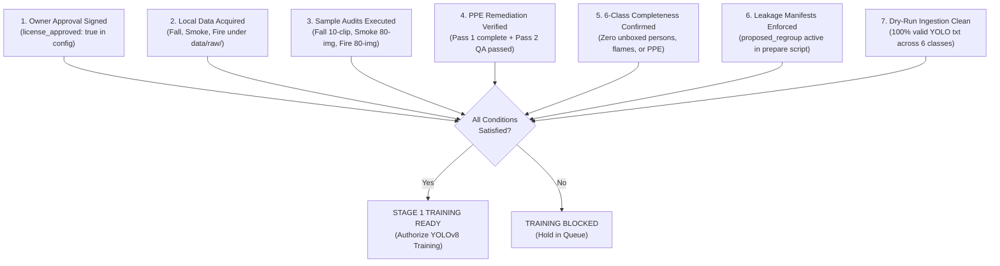

# Stage 1 Pre-Training Readiness Audit

## Project CCTV Safety — Canonical Spatial Detector (6 Classes)

> **Document Status:** Authoritative Pre-Training Readiness Baseline<br/>
> **Audit Date:** 25 September 2026<br/>
> **Target Architecture:** Stage 1 Spatial Object Detector (YOLOv8)<br/>
> **Canonical Classes (Exactly 6):** `0: person`, `1: helmet`, `2: vest`, `3: fall`, `4: fire`, `5: smoke`<br/>
> **Scope Exclusions:** `fight` is strictly excluded from Stage 1 (deferred to Stage 2 temporal video classifier; Stage 2 remains **BLOCKED / PENDING DATA APPROVAL** per [two_stage_architecture_migration.md](two_stage_architecture_migration.md)).<br/>
> **Negative Event Semantics:** `no_helmet` and `no_vest` are post-processing geometric events evaluated by [`cctv_safety/ppe.py`](../cctv_safety/ppe.py), **never positive detector classes or trained labels**. The absence of worn PPE on a detected human is a legitimate negative condition, not a missing annotation box.<br/>
> **Project Governance & Legal Baseline:** Non-commercial university course project submitted to an instructor. Under the 25 September 2026 binding project-owner decision, provenance and upstream copyright limitations are **recorded owner-accepted non-blocking limitations** for this educational course project. Dataset originals will not be redistributed in Git (`data/raw/` remains excluded via `.gitignore`), public model weights will not be released, sources and licenses will be cited, identifiable human faces in reports and presentations must be blurred, and unresolved upstream-rights limitations must be disclosed.<br/>
> **Physical Data Presence Disclosure:** Raw image archives for Smoke and Fire candidates remain **absent locally from disk** (`data/raw/` does not contain them), and their actual physical sample audits have **not been executed** on disk (audit protocols approved via primary-source desk reviews). The Fall Detection Dataset (54 MP4 clips) is present locally in `data/raw/`, with its 8-clip CVAT pilot and 10-clip targeted annotation campaign executed on disk.
<br/>

---

## 1. Executive Summary & Readiness Verdict

### Overall Stage 1 Verdict: HOLD FOR TRAINING / NOT TRAINING READY

The Stage 1 spatial detector pipeline is **NOT ready for model training**. While primary candidate datasets have been identified, license terms and educational safeguards established, and cross-split leakage resolved for the primary PPE candidate, critical data-readiness gates remain open across all six canonical classes:

1. **PPE (`person`, `helmet`, `vest`):** Ultralytics Construction-PPE has completed 100% machine inventory and a 42-image stratified human visual QA sample. However, training is blocked by **77 label files with zero `Person` boxes**, unboxed worn PPE, misclassified non-industrial garments, duplicate boxes, and 10 orphan labels. These defects are fully cataloged in [label_remediation_manifest.csv](audit_artifacts/construction_ppe/label_remediation_manifest.csv) (covering all 77 zero-Person files and 11 other evidenced defects, totaling exactly 88 data rows) and require human label remediation and second-pass review.
2. **Fall (`fall`):** The Fall Detection Dataset ([samruddhi-2308/FallDetectionDataset](https://github.com/samruddhi-2308/FallDetectionDataset)) has completed its 8-clip CVAT pilot (227 pairs) and a 10-clip targeted annotation campaign across 10 selected clips (all 6 ADL negative controls plus 4 diverse sitting-to-fall clips: `FD0007`, `FD0010`, `FD0014`, `FD0020`). Across the 10 campaign clips, 176 retained review frames were inspected via contact sheets, resulting in 20 completed human bbox frames and 156 pending manual bbox frames (`PENDING_MANUAL_BBOX`). The pilot extension dataset yields class counts: `Person 21`, `Fall 5`, with all other Stage-1 classes strictly `0`. Actor-group regrouping in `fall_actor_grouping.csv` confirms zero actor-group split leakage across 9 groups. The readiness verdict is **PILOT_EXTENSION_READY but NOT TRAINING_READY**. Provenance and upstream CC BY-NC 4.0 licensing are documented as a course-project risk note (under owner educational prototype baseline), not the present execution blocker.
3. **Fire & Smoke (`fire`, `smoke`):** The shortlisted supplementary smoke candidate ([Boreal Forest Fire — Subset A](https://doi.org/10.23729/fd-72c6cf74-b8eb-3687-860d-bf93a1ab94c9)) is approved under **GO — sample audit only** (CC BY 4.0), and the primary fire/smoke candidate ([DFireDataset](https://github.com/gaia-solutions-on-demand/DFireDataset)) is conditionally approved under **CONDITIONAL GO — educational prototype/sample audit only** (CC0 1.0 annotations). Both datasets are **absent locally** and their 80-image sample audits have **not yet been executed on disk**.

### Class-by-Class Readiness Summary

| Canonical Class ID | Canonical Class Name | Primary Candidate Dataset | Operative License | Completed Evidence | Open Work / Blockers | Current Status |
|:---:|---|---|---|---|---|:---:|
| **`0`** | **`person`** | Ultralytics Construction-PPE | AGPL-3.0 (owner accepted) | 100% machine inventory (1,416 paired files); 42-image human QA; regroup manifest resolves split leakage; all 77 zero-Person files cataloged | 77 zero-Person files (58 context-evidenced + 19 machine-only); unboxed background personnel; duplicate boxes; Pass 1 & Pass 2 remediation required | **SAMPLE AUDITED → HOLD FOR REMEDIATION** |
| **`1`** | **`helmet`** | Ultralytics Construction-PPE | AGPL-3.0 (owner accepted) | 1,734 paired instances cataloged; mapped to canonical ID 1 | Soft bucket hats, police peaked caps, bicycle racing helmets mislabeled as hardhats; unboxed helmets | **SAMPLE AUDITED → HOLD FOR REMEDIATION** |
| **`2`** | **`vest`** | Ultralytics Construction-PPE | AGPL-3.0 (owner accepted) | 1,618 paired instances cataloged; mapped to canonical ID 2 | Orange jumpsuits mislabeled as vests; unboxed hi-vis vests; source class 5 `none` must be discarded | **SAMPLE AUDITED → HOLD FOR REMEDIATION** |
| **`3`** | **`fall`** | Fall Detection Dataset (State-to-Fall + ADL) | CC BY-NC 4.0 (course-project risk note, not execution blocker) | 8 CVAT clips built into 227-pair pilot; 10 targeted campaign clips (6 ADL + FD0007/FD0010/FD0014/FD0020) with 176 retained review frames; 20 completed human bbox frames (Person 21, Fall 5, classes 1/2/4/5: 0); 0 actor-group split leakage | 156 frames pending manual bbox; loose bounding box tightening needed on 8 original pilot clips | **PILOT_EXTENSION_READY → NOT TRAINING_READY (156 PENDING FRAMES)** |
| **`4`** | **`fire`** | D-Fire (`DFireDataset`) | CC0 1.0 (annotations); source rights disclaimed | Desk review of 21,527 YOLO images; 80-image stratified sample audit protocol approved; educational constraints bound | Dataset absent locally; 80-image visual audit not executed; unboxed person review and ambient glare checks pending | **SHORTLISTED (CONDITIONAL GO: Educational Prototype) → HOLD PENDING LOCAL AUDIT** |
| **`5`** | **`smoke`** | Boreal Forest Fire — Subset A / D-Fire | CC BY 4.0 (Boreal) / CC0 1.0 (D-Fire) | Desk review of *Nature Sci Data* (2025) paper & D-Fire; 80-image sample audit protocols approved | Datasets absent locally; 80-image visual audits not executed; flame contamination check in smoke plumes pending | **SHORTLISTED (GO / CONDITIONAL GO: Sample Audit Only) → HOLD PENDING LOCAL AUDIT** |

---

## 2. Six Canonical Classes: Completed Evidence & Deficiencies

### Class 0: `person`
- **Candidate:** Ultralytics Construction-PPE ([construction_ppe_sample_audit.md](construction_ppe_sample_audit.md)).
- **Completed Evidence:**
  - 100% machine inventory across all 1,416 images and 1,426 label files in `data/raw/construction-ppe/`.
  - Exactly 1,416 image-label pairs validated (1,132 train, 143 val, 141 test); zero coordinate out-of-bounds errors; zero malformed lines.
  - 10 duplicate orphan label files identified in `labels/train/` (`image940(1).txt`, etc.) and isolated for exclusion.
  - 42-image stratified human visual QA sample completed across splits, sequences, and hard negatives.
  - Non-destructive regroup manifest [proposed_regroup_manifest.csv](audit_artifacts/construction_ppe/proposed_regroup_manifest.csv) generated (1,416 rows), completely eliminating multi-frame video leakage across splits.
  - Automated regex screening (`rg --files-without-match "^6 "`) executed directly on raw labels, reconciling all 77 label files lacking class 6.
- **Identified Deficiencies & Remediation Scope:**
  - **All 77 zero-Person files fully cataloged in [label_remediation_manifest.csv](audit_artifacts/construction_ppe/label_remediation_manifest.csv):**
    - **58 visually and context-evidenced files:** 4 `val`, 8 `test`, and 46 `train` files across defined multi-frame clusters (`grp_lobby_tryon`, `grp_vietnam_road`, `grp_fall_incident`, `grp_scene_0807..0819`, rotated scenes, and portrait negatives).
    - **19 machine-only review candidates:** 19 `train` files identified via automated regex without visual inference (`image57.jpeg`, `image81.jpg`–`image85.jpg`, `image472.jpg`, `image475.jpg`, `image479.jpg`, `image482.jpg`, `image501.jpg`, `image526.jpg`, `image539.jpg`, `image579.jpg`, `image582.jpg`, `image629.jpg`, `image653.jpeg`, `image720.jpeg`, `image734.jpeg`), scheduled for human inspection to add `person` boxes if visible.
  - **Unboxed background personnel:** In scenes such as `image1008.jpeg` (cinderblock masonry) and `image109.jpg` (blueprint review), background engineers and workers are unannotated.
  - **Duplicate annotations:** Overlapping duplicate `person` boxes on single individuals (e.g., `image207.jpg`).
- **Impact if Untrained:** YOLO penalizes detected persons as false positives during loss computation, suppressing human recall across all CCTV frames.

### Class 1: `helmet`
- **Candidate:** Ultralytics Construction-PPE.
- **Completed Evidence:**
  - 1,734 paired source instances cataloged from source class 0 (`helmet`).
  - Mapped directly to canonical detector class `1: helmet`.
- **Identified Deficiencies & Domain Shifts:**
  - **Soft bucket hats:** Mislabeled as industrial hardhats (e.g., `image3.jpeg`).
  - **Peaked police service caps:** Mislabeled as industrial hardhats (e.g., `image100.jpg`).
  - **Aerodynamic bicycle racing helmets:** Mislabeled as industrial hardhats (e.g., `image1357.jpg`).
  - **Unboxed hardhats:** Background workers wearing hardhats lack boxes (e.g., `image1008.jpeg`).
- **Negative Label Rule:**
  - Source class 7 (`no_helmet`, 485 instances) must be **strictly discarded from detector training**.
  - A worker without a hardhat is annotated with a `person` box and **zero helmet box**.
  - Worn helmet absence is a legitimate negative condition, evaluated downstream by [`cctv_safety/ppe.py`](../cctv_safety/ppe.py).

### Class 2: `vest`
- **Candidate:** Ultralytics Construction-PPE.
- **Completed Evidence:**
  - 1,618 paired source instances cataloged from source class 2 (`vest`).
  - Mapped directly to canonical detector class `2: vest`.
- **Identified Deficiencies & Domain Shifts:**
  - **Coveralls/Jumpsuits mislabeled as vests:** Full-body orange work jumpsuits mislabeled as safety vests (e.g., `image805.jpg`).
  - **Unboxed hi-vis vests:** Visible worn safety vests omitted on foreground workers (`image4.jpg`, `image100.jpg` police officer) and background personnel (`image1008.jpeg`).
- **Negative Label Rule:**
  - Source class 5 (`none`, 797 instances) represents torso negative markers (`no_vest`). It must be **strictly discarded from detector training**.
  - A worker wearing ordinary clothing without a vest is annotated with a `person` box and **zero vest box**.
  - Worn vest absence is a legitimate negative condition, evaluated downstream by [`cctv_safety/ppe.py`](../cctv_safety/ppe.py).

### Class 3: `fall`
- **Candidate:** Fall Detection Dataset (State-to-Fall + ADL) ([fall_fire_replacement_dataset_search.md](fall_fire_replacement_dataset_search.md)).
- **Completed Evidence:**
  - Primary-source desk review of creator repository ([samruddhi-2308/FallDetectionDataset](https://github.com/samruddhi-2308/FallDetectionDataset)), CITATION.cff, and academic papers.
  - Verified operative license: **CC BY-NC 4.0** (direct creator authority, non-commercial education scope accepted by owner).
  - Inventory documented: 54 MP4 clips (22 standing-to-fall, 10 sleeping-to-fall, 16 sitting-to-fall, 6 ADL negative controls).
  - 8 clips identified with CVAT XML bounding-box exports (`annotation_manifest.csv`).
  - Decision-complete 10-clip sample audit protocol executed (25 Sep 2026): 100% machine inventory across all 54 clips and 8 CVAT XMLs (diff=0).
  - Clustered into 7 actor/session groups in `docs/audit_artifacts/fall/fall_actor_grouping.csv` guaranteeing zero split leakage.
  - **Corrected Pilot Dataset Built & Executed (25 Sep 2026):**
    - Built via reusable `scripts/build_fall_corrected_pilot.py` targeting all 8 CVAT-annotated clips.
    - Yielded exactly **227 image-label pairs** in YOLO format under `data/processed/fall_corrected_pilot/`: **132 train** (58.1%), **50 val** (22.0%), **45 test** (19.8%).
    - Stage 1 canonical dual-box mapping enforced: **227 class 0 (`person`) instances**, **141 class 3 (`fall`) instances**, exactly 0 instances of classes 1, 2, 4, 5.
    - Conservative tail truncation executed: exactly 453 tail frames and 119 internal gap frames excluded across all 8 clips; 0 unannotated frames pseudo-labeled or exported (`fall_tail_exclusion_log.csv`).
    - Deterministic temporal decimation executed: 1,972 redundant frames pruned via 64-bit dHash (Hamming distance $\le 3$) while strictly preserving keyframes, state boundaries, dense falling motion (stride 3), and representative resting poses (`fall_decimation_stats.csv`).
    - 100% machine validation passed cleanly via `scripts/validate_fall_pilot.py` (0 coordinate errors, 0 class mismatches, 0 orphan pairs, 0 split leakage).
    - Human visual QA completed: 16 multi-frame contact sheets and 227 color-coded overlays inspected, verifying all 16 key state transitions (8 onset, 8 impact) ([fall_pilot_qa_report.md](audit_artifacts/fall/fall_pilot_qa_report.md)).
  - **Targeted Annotation Campaign & Pilot Extension (25 Sep 2026):**
    - 10 selected clips targeted: all 6 ADL negative controls (`FD0001`–`FD0006`) plus 4 diverse sitting-to-fall clips (`FD0007`, `FD0010`, `FD0014`, `FD0020`) spanning landscape (1920×1080) and portrait (1080×1920) orientations.
    - 176 retained review frames cataloged in `fall_annotation_work_queue.csv` and inspected via 10 clip contact sheets and 4 transition sheets (59 near-duplicate frames pruned via dHash from 235 candidates).
    - **20 completed human bbox frames / 156 pending:** 20 exemplar keyframes manually measured, verified, second-reviewed, and exported to `data/processed/fall_corrected_pilot_extension/` with exact 1:1 image-label pairing across splits (`train`: 10, `val`: 6, `test`: 4); remaining 156 frames cataloged as `PENDING_MANUAL_BBOX` without fabricated labels.
    - Extension class counts: **Person 21, Fall 5, all other Stage-1 classes 0** (classes 1, 2, 4, 5 strictly 0; multi-person scene in `FD0003` has 2 person boxes; zero fall boxes on ADL clips).
    - Actor-group regrouping: Realigned groups in `fall_actor_grouping.csv` across 9 actor groups (54 clips) confirming **zero actor-group split leakage** (`scripts/validate_fall_campaign.py` passes 100%).
    - Governance & Risk Note: Provenance and upstream CC BY-NC 4.0 licensing are documented as a course-project risk note (under owner educational prototype baseline), not the present execution blocker.
- **Current Limitations & Unfinished Work (PILOT_EXTENSION_READY / NOT TRAINING_READY):**
  - **Verdict:** **PILOT_EXTENSION_READY** for pipeline dry-runs and negative-control testing; **NOT TRAINING_READY** for full Stage 1 detector training.
  - **156 Pending Annotation Frames:** 156 frames remain `PENDING_MANUAL_BBOX`. Manual bounding box annotation must be completed across the work queue or formally excluded prior to general model training.
  - **Loose / Oversized Bounding Boxes:** Original upstream CVAT keyframes in clips `FD0044`, `FD0049`, `FD0035`, etc. span > 1000px in width. Coordinates are preserved without synthetic distortion per policy, but require polygon contour clamping or manual tightening before final training.
  - **Owner Sign-off (Gate 5):** Bounded prototype training requires formal `license_approved: true` in `configs/datasets.local.yaml`.

### Class 4: `fire`
- **Candidate:** D-Fire (`gaia-solutions-on-demand/DFireDataset`) ([fall_fire_replacement_dataset_search.md](fall_fire_replacement_dataset_search.md)).
- **Completed Evidence:**
  - Primary-source desk review of publisher repository, LICENSE file, and dataset cards.
  - Verified operative license: **CC0 1.0 Universal** on dataset collection and bounding-box annotations.
  - Applied owner-binding educational prototype policy: CONDITIONAL GO under strict safeguards (no Git commit of raw images, private model weights, creator citation, face blurring, upstream rights disclaimer).
  - Inventory documented: 21,527 images in YOLO format (14,692 fire boxes, 11,865 smoke boxes).
  - Decision-complete 80-image stratified sample audit protocol designed (Section 7 of replacement search doc).
- **Current Limitations & Unfinished Work:**
  - **Archive absent locally:** Dataset has not been downloaded to `data/raw/fire/`.
  - **Sample audit unexecuted:** Physical screening of 80 images across categories (fire-only, fire+smoke, hard negatives) has not been performed on disk.
  - **Confounder review:** Tightness of flame boundaries, screening against sodium-vapor lamps / sun glare, and exhaustive inspection for unboxed firefighters or bystanders remain pending physical audit.

### Class 5: `smoke`
- **Candidates:** Boreal Forest Fire — Subset A (Primary clean candidate for outdoor smoke) and D-Fire (Supplementary indoor/industrial smoke).
- **Completed Evidence:**
  - Primary-source desk review of peer-reviewed data descriptor (*Nature Scientific Data*, 2025), Fairdata IDA DOI, and Aalto University records.
  - Verified operative license: **CC BY 4.0** (National Land Survey of Finland / Maanmittauslaitos).
  - Inventory documented: 4,954 4K images across 4 burn locations (Evo, Ruokolahti, Karkkila, Heinola), including 256 negative images.
  - Validated large-box annotation methodology (smoke plume + immediate context).
  - Decision-complete 80-image stratified sample audit protocol designed (Section 6 of replacement search doc).
- **Current Limitations & Unfinished Work:**
  - **Archive absent locally:** Dataset has not been downloaded to `data/raw/smoke/`.
  - **Sample audit unexecuted:** Physical inspection of 80 stratified drone images has not been performed on disk.
  - **Flame contamination check:** Critical inspection gate to ensure smoke plumes do not contain visible unboxed flames (which would penalize class 4) remains pending physical audit.

---

## 3. Approved Sample Sizes & Sampling Protocols Table

The table below defines the formal, approved sample sizes and selection criteria across all candidate datasets. All sample audits are decision-complete protocols; execution awaits physical file acquisition.

| Candidate Dataset | Canonical Class(es) | Total Archive Scale | Approved Audit Sample Size | Stratification & Sampling Protocol | Status of Physical Audit |
|---|---|---|---|---|:---:|
| **Ultralytics Construction-PPE** | `0: person`<br/>`1: helmet`<br/>`2: vest` | 1,416 images<br/>(1,132 train, 143 val, 141 test)<br/>1,426 label files | **1,416 images (100% Machine Inventory)**<br/>+ **42 images (Stratified Human QA)** | • Machine check: 100% paired image/label parsing.<br/>• Human QA: 42 images across original splits (22 train, 8 val, 12 test), all multi-frame sequences, and negative portraits.<br/>• Remediation scope: **All 77 zero-Person files** (58 context-evidenced + 19 machine-only) + **11 other evidenced defects** = **88 data rows** in [label_remediation_manifest.csv](audit_artifacts/construction_ppe/label_remediation_manifest.csv). | **EXECUTED**<br/>(Yielded 77 zero-Person & 11 visual defect findings) |
| **Fall Detection Dataset (State-to-Fall + ADL)** | `3: fall`<br/>(`0: person`) | 54 MP4 video clips<br/>(~3,000–5,000 frames) | **18 video clips audited**<br/>(8 CVAT pilot + 10 campaign clips;<br/>176 retained review frames) | • Initial pilot: 8 CVAT clips (227 pairs; 227 person, 141 fall).<br/>• Targeted campaign: 10 clips (6 ADL + FD0007/FD0010/FD0014/FD0020), 176 retained frames inspected via contact sheets.<br/>• 20 completed human bbox frames / 156 pending manual bbox.<br/>• Extension counts: Person 21, Fall 5, others 0.<br/>• 9 actor groups with zero split leakage. | **PILOT_EXTENSION_READY**<br/>(20 completed labels verified;<br/>156 frames pending manual bbox;<br/>NOT TRAINING_READY) |
| **Boreal Forest Fire — Subset A** | `5: smoke` | 4,954 4K images<br/>(4 burn locations,<br/>256 negative images) | **80 images**<br/>(stratified drone frames) | • 20 images from Ruokolahti (15 smoke, 5 negative).<br/>• 20 images from Karkkila (15 smoke, 5 negative).<br/>• 20 images from Heinola (15 smoke, 5 negative).<br/>• 20 images from Evo (15 smoke, 5 negative).<br/>• Grouping by flight sequence / burn event. | **PENDING**<br/>(Dataset absent locally; protocol approved) |
| **D-Fire (`DFireDataset`)** | `4: fire`<br/>`5: smoke`<br/>(`0: person`) | 21,527 images<br/>(14,692 fire boxes,<br/>11,865 smoke boxes) | **80 images**<br/>(stratified web scenes) | • 25 Fire-only images.<br/>• 25 Fire + Smoke co-occurring images.<br/>• 15 Smoke-only images.<br/>• 15 Hard negatives (lamps, sun glare, reflections).<br/>• Grouping by web burst / scene background. | **PENDING**<br/>(Dataset absent locally; protocol approved) |

---

## 4. Mandatory Human QA & Label Remediation Procedure (Decision-Complete)

To transition Construction-PPE from **HOLD FOR REMEDIATION** to **TRAINING READY**, the following two-pass human review procedure and quantitative acceptance thresholds must be strictly enforced.

### 4.1 Pass 1: Primary Labeler Remediation
The primary labeler operates directly against the cataloged entries in [label_remediation_manifest.csv](audit_artifacts/construction_ppe/label_remediation_manifest.csv):

1. **Zero-Person Remediation (77 Files):**
   - Open each of the 77 cataloged zero-Person files (distinguishing the 58 visually/context-evidenced files from the 19 machine-only review candidates).
   - Draw tight bounding boxes enclosing all visible humans from head to toe, assigning canonical class `6` (source ID for `person`).
   - For fallen or recumbent individuals (e.g., `image806.jpg`), ensure the box tightly bounds the full recumbent body.
   - For the 19 machine-only review candidates, perform visual inspection and add `person` boxes if visible.
2. **Missing PPE Annotation:**
   - Box visible worn hi-vis vests on foreground workers (`image4.jpg`, `image100.jpg`) and background personnel (`image1008.jpeg`, `image109.jpg`), assigning source class `2` (`vest`).
   - Box visible worn industrial hardhats on all personnel, assigning source class `0` (`helmet`).
3. **Misclassification Corrections:**
   - In `image3.jpeg`, reclassify soft fabric bucket hat from `helmet` (0) to negative (delete box).
   - In `image100.jpg`, reclassify police peaked visor cap from `helmet` (0) to negative (delete box).
   - In `image1357.jpg`, reclassify bicycle racing helmets from `helmet` (0) to negative (delete box).
   - In `image805.jpg`, remove `vest` (2) label from full-body orange work jumpsuits/coveralls.
4. **Deduplication:**
   - In `image207.jpg`, merge overlapping duplicate `person` bounding boxes into a single unified bounding box.
5. **Orphan Label Exclusion:**
   - Configure dataset preparation to drop the 10 duplicate `image*(1).txt` files.

### 4.2 Legitimate Negative Semantics (Crucial Engineering Constraint)
> [!IMPORTANT]
> **Absence of worn PPE is a legitimate negative condition, NOT a missing annotation.**<br/>
> - If a worker is wearing a t-shirt or non-reflective jacket, annotate the worker with a `person` box ONLY. **Do NOT draw a vest box.**<br/>
> - If a worker is bareheaded or wearing an everyday baseball cap, annotate the worker with a `person` box ONLY. **Do NOT draw a helmet box.**<br/>
> - Source classes `7: no_helmet` and `5: none` (`no_vest`) are negative markers and **must never be mapped to positive detector classes**. They are stripped during YOLO data preparation. The Stage 1 detector outputs positive bounding boxes for `person`, `helmet`, and `vest`; downstream spatial logic in [`cctv_safety/ppe.py`](../cctv_safety/ppe.py) checks intersection-over-person to flag non-compliance.

### 4.3 Pass 2: Independent Reviewer QA Protocol
Every remediated file must undergo independent secondary verification by a second auditor before acceptance:

1. **100% Inspection of Remediated Set:** The second reviewer inspects 100% of all image files modified in Pass 1.
2. **Stratified Spot-Check of Remainder:** The reviewer inspects a randomized 10% sample of all non-remediated paired files across splits.
3. **Inter-Annotator Agreement Standards:**
   - Bounding-box intersection-over-union (IoU) between Pass 1 and Pass 2 must satisfy $\ge 0.85$.
   - Classification concordance on PPE objects must satisfy Cohen’s $\kappa \ge 0.90$.
4. **Resolution of Disagreements:** If Pass 1 and Pass 2 disagree, the item is escalated to the Project Lead for binding determination.

### 4.4 Quantitative Acceptance Thresholds

A remediated dataset is approved for training only if it passes 100% of the following quantitative gates:

```
+----------------------------------------------------------------------------------------------------+
| Gate ID   | Metric / Verification Criterion                           | Acceptance Threshold       |
+----------------------------------------------------------------------------------------------------+
| GATE-Q1   | Coordinate range validity (0.0 <= x, y, w, h <= 1.0)      | Exactly 100.0%             |
| GATE-Q2   | Malformed syntax or non-numeric label rows                | Exactly 0 rows             |
| GATE-Q3   | Zero-Person label files among human-containing scenes     | Exactly 0 files (0.00%)    |
| GATE-Q4   | Unboxed visible foreground persons                        | Exactly 0 persons          |
| GATE-Q5   | Non-industrial hats mislabeled as industrial helmets      | Exactly 0 instances        |
| GATE-Q6   | Full-body jumpsuits mislabeled as safety vests            | Exactly 0 instances        |
| GATE-Q7   | Duplicate bounding boxes on single entity (IoU > 0.80)    | Exactly 0 duplicate pairs  |
| GATE-Q8   | Ingested orphan label files without corresponding images   | Exactly 0 orphan files     |
| GATE-Q9   | Cross-split multi-frame sequence overlap                  | Exactly 0 leaked groups    |
+----------------------------------------------------------------------------------------------------+
```

---

## 5. Leakage Gates & Cross-Split Grouping Integrity

Data leakage between train, validation, and test sets is the single largest threat to valid model evaluation in video and photo-shoot datasets.

### 5.1 Construction-PPE Regrouping Gate
The original Ultralytics split dispersed identical photo-shoots and video sequences across train, val, and test. This defect has been resolved by [proposed_regroup_manifest.csv](audit_artifacts/construction_ppe/proposed_regroup_manifest.csv) (1,416 rows).

- **Implementation Gate:** The dataset preparation script (`scripts/prepare_dataset.py`) must ingest [proposed_regroup_manifest.csv](audit_artifacts/construction_ppe/proposed_regroup_manifest.csv) and assign files strictly according to `proposed_split`.
- **Enforced Allocations:**
  - `grp_rooftop_a` (160+ upright & rotated images) $\rightarrow$ **`train`** exclusively.
  - `grp_lobby_tryon` (20 images) $\rightarrow$ **`train`** exclusively.
  - `grp_warehouse_worker` (2 images) $\rightarrow$ **`train`** exclusively.
  - `grp_solar_panels` (2 images) $\rightarrow$ **`train`** exclusively.
  - `grp_rooftop_sunset_b` (17 images) $\rightarrow$ **`val`** exclusively.
  - `grp_vietnam_road` (10 images) $\rightarrow$ **`val`** exclusively.
  - `grp_russian_railway` (23 images) $\rightarrow$ **`test`** exclusively.
  - `grp_cinderblock_masonry` (7 images) $\rightarrow$ **`test`** exclusively.
- **Split Distribution:** Train: 1,151 images (81.29%), Val: 129 images (9.11%), Test: 136 images (9.60%). Multi-frame leakage: **0 images (0.00%)**.

### 5.2 Cardinal Rules for Remaining Datasets
When Fall, Smoke, and Fire datasets are retrieved locally, the following group-level isolation rules are mandatory:

1. **Fall Detection Dataset:** Split strictly by **actor identity and recording environment**. All clips featuring the same actor in the same room must reside in the exact same split. Splitting by extracted frames is strictly forbidden.
2. **Boreal Forest Fire (Subset A):** Split strictly by **burn event and UAV flight sequence**. Frames sampled 2 seconds apart have severe temporal correlation. Entire burn sites (e.g., Ruokolahti) or discrete flight missions must be held out intact.
3. **D-Fire:** Cluster images by **web source and scene background** using perceptual hash (pHash) clustering. Burst captures and identical incident scenes must never cross splits.

---

## 6. Precise "TRAINING READY" Condition

Stage 1 model training is authorized to begin **if and only if** all of the following boolean conditions evaluate to **TRUE**:



### The Seven Mandatory Gates:
1. `OWNER_LICENSE_SIGNOFF == TRUE`: Explicit acceptance of educational prototype constraints and recorded configuration setting (`license_approved: true`) in `configs/datasets.local.yaml`.
2. `LOCAL_DATA_ACQUIRED == TRUE`: Physical retrieval of Fall Detection Dataset (54 clips), Boreal Forest Fire Subset A (4,954 images), and D-Fire (21,527 images) into local `.gitignore`-protected directories.
3. `LOCAL_SAMPLE_AUDITS_PASSED == TRUE`: Physical execution of the 10-clip Fall audit, 80-image Smoke audit, and 80-image Fire audit with documented QA overlay artifacts and zero blocking defects.
4. `PPE_REMEDIATION_ACCEPTED == TRUE`: Completion of all edits in [label_remediation_manifest.csv](audit_artifacts/construction_ppe/label_remediation_manifest.csv) and 100% verification by the Pass 2 independent reviewer meeting quantitative thresholds (GATE-Q1 through GATE-Q9).
5. `EXHAUSTIVE_6CLASS_COMPLETENESS == TRUE`: Confirmation that every visible entity across the unified dataset is mapped to one of the six canonical classes (`person`, `helmet`, `vest`, `fall`, `fire`, `smoke`) or confirmed background.
6. `LEAKAGE_MANIFESTS_ACTIVE == TRUE`: Data ingestion pipeline strictly uses [proposed_regroup_manifest.csv](audit_artifacts/construction_ppe/proposed_regroup_manifest.csv) and group manifests for all external sets.
7. `PIPELINE_DRYRUN_SUCCESS == TRUE`: Execution of `scripts/prepare_dataset.py` produces verified train/val/test directories with 100% valid YOLO annotations, zero class index mismatches, and private weight output paths.

---

## 7. Prioritized Decision-Free Queue

The following sequential, decision-free task queue specifies the exact order of operational steps for the development team:

```
[QUEUE-01] ACQUIRE LOCAL CANDIDATE DATASETS
           Action: Download FallDetectionDataset (54 MP4s), Boreal Forest Fire Subset A
                   (4,954 images), and DFireDataset (21,527 images) into data/raw/.
           Constraint: Ensure all raw files remain strictly excluded from Git tracking via .gitignore.

[QUEUE-02] RECONCILE AND INGEST THE 19 UN-ENUMERATED TRAIN ZERO-PERSON FILES [COMPLETED]
           Status: COMPLETED. The 19 machine-detected zero-Person files (image57.jpeg,
                   image81.jpg–image85.jpg, image472.jpg, image475.jpg, image479.jpg,
                   image482.jpg, image501.jpg, image526.jpg, image539.jpg, image579.jpg,
                   image582.jpg, image629.jpg, image653.jpeg, image720.jpeg, image734.jpeg)
                   were extracted via rg directly from raw labels, reconciled with
                   proposed_regroup_manifest.csv, and appended to label_remediation_manifest.csv,
                   bringing total manifest records to 88 data rows (77 zero-Person + 11 visual defects).

[QUEUE-03] EXECUTE CONSTRUCTION-PPE PASS 1 LABEL REMEDIATION
           Action: Carry out bounding box additions, corrections, and deletions on all 88 rows
                   in docs/audit_artifacts/construction_ppe/label_remediation_manifest.csv.
           Rule: Add person (6) boxes on all 77 zero-Person files; add worn vest (2) and helmet (0) boxes;
                 delete bucket hat, police cap, and racing helmet boxes; remove vest label from coveralls;
                 merge duplicate boxes.

[QUEUE-04] EXECUTE CONSTRUCTION-PPE PASS 2 INDEPENDENT QA
           Action: Second reviewer validates 100% of remediated files and 10% spot check of remainder.
           Verification: Verify against GATE-Q1 through GATE-Q9 thresholds (IoU >= 0.85, kappa >= 0.90).

[QUEUE-05] EXECUTE FALL DETECTION DATASET PILOT & ANNOTATION CAMPAIGN [PILOT EXTENSION READY]
           Status: PILOT_EXTENSION_READY (8 CVAT pilot clips + 10 targeted campaign clips: 6 ADL plus
                   FD0007/FD0010/FD0014/FD0020). Built 227-pair CVAT pilot and 20-pair pilot extension
                   (Person 21, Fall 5, all other Stage-1 classes 0; zero actor-group split leakage across
                   9 groups). 176 retained review frames inspected.
           Verdict: PILOT_EXTENSION_READY but NOT TRAINING_READY. Provenance and upstream CC BY-NC 4.0
                    license are documented as a course-project risk note, not the present execution blocker.
           Open Work: Exactly 156 frames remain PENDING_MANUAL_BBOX (unfabricated labels); loose bounding
                      box tightening needed on original 8 pilot clips.
           Artifacts: fall_campaign_manifest.csv, fall_annotation_work_queue.csv,
                      fall_campaign_decimation_stats.csv, fall_actor_grouping.csv,
                      fall_campaign_qa_report.md, fall_pilot_manifest.csv, fall_pilot_qa_report.md.

[QUEUE-06] EXECUTE BOREAL SMOKE DATASET SAMPLE AUDIT
           Action: Inspect the 80 stratified drone images across Evo, Ruokolahti, Karkkila, Heinola.
           Verification: Assess large-box smoke annotations, screen against clouds/water reflections,
                         and strictly audit for unboxed visible flames (flame contamination check).
           Artifacts: Emit smoke_sample_inventory.csv and flame_contamination_log.md.

[QUEUE-07] EXECUTE D-FIRE DATASET SAMPLE AUDIT
           Action: Inspect the 80 stratified web images (fire, fire+smoke, smoke, negatives).
           Verification: Verify flame boundary tightness, screen against ambient light false positives,
                         and audit for unboxed persons (firefighters, bystanders).
           Artifacts: Emit fire_sample_inventory.csv and fire_discrepancy_log.md.

[QUEUE-08] UPDATE DATASET INGESTION PIPELINE (scripts/prepare_dataset.py)
           Action: Program scripts/prepare_dataset.py to ingest proposed_regroup_manifest.csv,
                   apply canonical 6-class index mapping (0: person, 1: helmet, 2: vest,
                   3: fall, 4: fire, 5: smoke), discard negative classes (5, 7..10), and drop
                   the 10 duplicate orphan label files.

[QUEUE-09] RE-RUN DRY-RUN VERIFICATION & LINTING
           Action: Execute data preparation pipeline in dry-run mode. Validate generated split
                   directories, box coordinates, and instance count distributions.

[QUEUE-10] SECURE FORMAL OWNER AUTHORIZATION & INITIATE TRAINING
           Action: Record license_approved: true in configs/datasets.local.yaml and initiate
                   Stage 1 YOLOv8 training with private checkpoint logging.
```

---

## 8. Explicit Reconciliations & Scope Clarifications

### 8.1 Reconciliation of Zero-Person File Counts (All 77 Reconciled in Remediation Manifest)
In [construction_ppe_sample_audit.md](construction_ppe_sample_audit.md), Section 6 reported that machine regex filtering identified **77 label files with zero Person annotations** across the 1,416 paired files:
- `val` (4 files): `image23.txt`, `image808.txt`, `image824.txt`, `image826.txt`.
- `test` (8 files): `image502.txt`, `image538.txt`, `image714.txt`, `image805.txt`, `image810.txt`, `image825.txt`, `image834.txt`, `image846.txt`.
- `train` (65 files):
  - **46 visually / context-evidenced files** across known multi-frame sequences and portrait negatives:
    - `grp_lobby_tryon` (16 train files): `image820`–`image823`, `image827`–`image833`, `image835`–`image839`.
    - `grp_vietnam_road` (9 train files): `image840`–`image845`, `image847`–`image849`.
    - `grp_fall_incident` / scaffold (12 train files): `image806`, `image807`, `image809`, `image811`–`image819`.
    - Rotated construction scenes (6 train files): `image554`, `image556`, `image559`, `image562`, `image563`, `image566`.
    - Portrait negatives (3 train files): `image1169`, `image1171`, `image1378`.
  - **19 machine-only review candidates** enumerated directly from raw labels via `rg --files-without-match "^6 "`:
    `image57.jpeg`, `image81.jpg`, `image82.jpg`, `image83.jpg`, `image84.jpg`, `image85.jpg`, `image472.jpg`, `image475.jpg`, `image479.jpg`, `image482.jpg`, `image501.jpg`, `image526.jpg`, `image539.jpg`, `image579.jpg`, `image582.jpg`, `image629.jpg`, `image653.jpeg`, `image720.jpeg`, `image734.jpeg`.

**Reconciliation Summary:**
All 77 zero-Person files ($4 \text{ val} + 8 \text{ test} + 46 \text{ train sequence} + 19 \text{ train machine-only} = 77$) are now fully enumerated and cataloged in [label_remediation_manifest.csv](audit_artifacts/construction_ppe/label_remediation_manifest.csv). Each row joins `source_split` and `group_id` from [proposed_regroup_manifest.csv](audit_artifacts/construction_ppe/proposed_regroup_manifest.csv). Combined with the 11 other explicitly evidenced defect rows (6 unboxed objects, 4 misclassifications, 1 duplicate annotation), the remediation manifest contains **exactly 88 data rows** (89 total lines including the CSV header).

### 8.2 Two-Stage Scope & Architecture Boundary
- **Stage 1 Detector:** Dedicated strictly to real-time spatial bounding-box detection of the six canonical physical classes (`person`, `helmet`, `vest`, `fall`, `fire`, `smoke`).
- **Stage 2 Temporal Video Classifier:** The detection of violent physical conflict (`fight`) requires temporal motion tracking, velocity vector analysis, and multi-frame video classification (e.g., X3D-S / VideoMAE). It is strictly excluded from Stage 1 YOLO training. Stage 2 development remains **BLOCKED / PENDING DATA APPROVAL** per [two_stage_architecture_migration.md](two_stage_architecture_migration.md).
