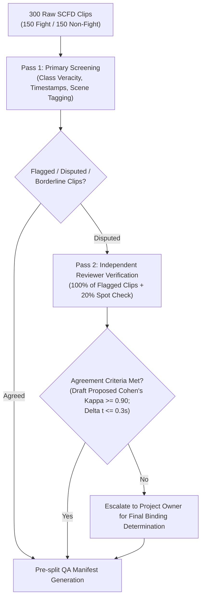
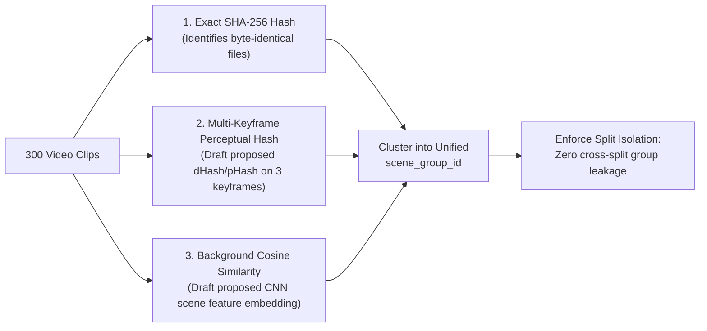
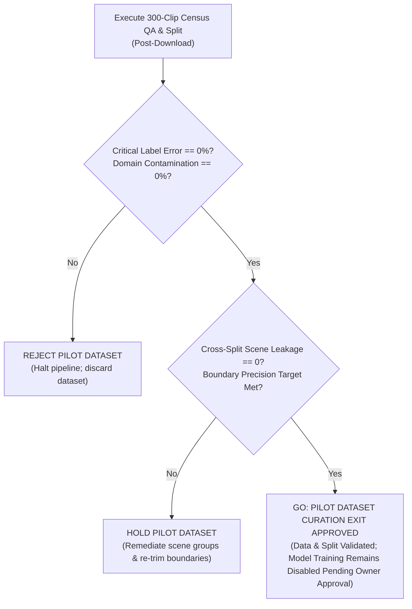

# Stage 2 SCFD Pilot Readiness & Technical Execution Specification
## Two-Stage Safety Pipeline — Temporal Event Classification (`fight`)

> **Current-status note (2026-09-28):** The SCFD pilot is no longer blocked or
> waiting for acquisition. The 300-clip dataset is present and split 210/45/45;
> owner QA disposition covers all clips (five edge cases were dispositioned
> separately, and the owner later personally inspected the remaining 295).
> X3D-S training completed with early stopping at epoch 9 (best validation
> epoch 3); held-out test results on 45 clips were accuracy 0.800, macro-F1
> 0.798407, balanced accuracy 0.802372. This is an educational pilot, not a
> production-ready classifier. Stage 1/Stage 2 integration and target-camera
> evaluation remain open. Blocked/zero-data statements below are historical.

> **Document Type:** Pilot Readiness Specification, QA Protocol, & Worker Status Report  
> **Worker ID:** `stage2_scfd_pilot_preparation`  
> **Task ID:** `stage2_scfd_pilot_readiness`  
> **Status:** `PILOT COMPLETE — INTEGRATION PENDING`  
> **Phase:** `PILOT_TRAINED_AND_EVALUATED`  
> **Date:** 2026-09-27  
> **Target Worktree:** `Project-CCTV-Safety-antigravity`  
> **Related Architecture Documents:**  
> - [docs/two_stage_architecture_migration.md](two_stage_architecture_migration.md)  
> - [docs/fight_dataset_evaluation.md](fight_dataset_evaluation.md)  
> - [docs/stage2_fight_dataset_alternatives.md](stage2_fight_dataset_alternatives.md)  

---

## 1. Document Metadata & Worker Progress Heartbeat

> The JSON heartbeat below is the worker's original 2026-09-27 planning
> snapshot. Its blocked/zero-data state was superseded by later acquisition,
> QA, split, training, and evaluation.

```json
{
  "$schema": "https://json-schema.org/draft/2020-12/schema",
  "worker_id": "stage2_scfd_pilot_preparation",
  "task_id": "stage2_scfd_pilot_readiness",
  "status": "BLOCKED",
  "phase": "PILOT_SPECIFICATION_COMPLETE_DATA_READINESS_BLOCKED",
  "started_at": "2026-09-27T03:18:00+07:00",
  "updated_at": "2026-09-27T03:25:00+07:00",
  "progress": {
    "items_total": 7,
    "items_processed": 7,
    "items_succeeded": 7,
    "items_failed": 0,
    "percentage": 100.0,
    "current_item": "Pilot specification complete / data readiness blocked: QA protocol, duplicate screening heuristics, and split plans defined; data absent locally, QA not executed, split not generated; awaiting Stage 1 Colab completion and Owner download authorization."
  },
  "specification_readiness": {
    "architecture_alignment": "COMPLETE (Fight decoupled from Stage 1)",
    "license_audit_and_reconciliation": "COMPLETE (MIT scope cited; unverified owner-accepted educational risk recorded)",
    "clip_qa_protocol_300": "COMPLETE (100% census QA audit plan defined; thresholds marked draft proposed)",
    "duplicate_detection_strategy": "COMPLETE (Exact SHA-256 + draft proposed perceptual dHash/pHash and scene similarity)",
    "leakage_safe_split_plan": "COMPLETE (Scene-level grouping 70/15/15 ratio designed)",
    "manifest_and_data_schemas": "COMPLETE (scfd_pilot_manifest.json schema defined)",
    "gate_criteria_and_blockers": "COMPLETE (Pilot specification vs data readiness distinguished; GO limited to curation exit)"
  },
  "physical_execution_readiness": {
    "stage1_baseline_status": "IN_PROGRESS_COLAB (Unverified)",
    "scfd_local_clips": 0,
    "scfd_local_bytes": 0,
    "human_qa_executed": false,
    "split_executed": false,
    "training_ready": false
  },
  "blockers": [
    "Stage 1 spatial baseline model (YOLOv8 6-class: person, helmet, vest, fall, fire, smoke) formal Colab training and verification are in progress in parallel; Stage 2 candidate trigger relies directly on Stage 1 Person detector outputs.",
    "SCFD video data is strictly 0 bytes locally (zero clips acquired); no dataset download or file writes have been initiated.",
    "SCFD video media rights are UNVERIFIED; approved solely under Project Owner educational prototype risk acceptance (commercial deployment and redistribution remain outside project scope and unresolved).",
    "100% Census Human-QA on 300 clips has not been physically executed (awaits data download authorization).",
    "Scene-level leakage-safe split has not been executed on physical clips.",
    "Overall Stage 2 status remains strictly BLOCKED per two_stage_architecture_migration.md."
  ],
  "next_action": "Await Stage 1 Colab verification from Project Owner, then obtain explicit authorization for local SCFD clip download and execution of the 100% census Human QA audit."
}
```

---

## 2. Executive Summary & Architectural Placement

In accordance with the approved Version 2.0 Two-Stage Pipeline architecture ([docs/two_stage_architecture_migration.md](two_stage_architecture_migration.md)):

1. **Stage 1 (Spatial Object Detection):** YOLOv8 is dedicated exclusively to **6 physical spatial classes**:
   - `0: person`
   - `1: helmet`
   - `2: vest`
   - `3: fall`
   - `4: fire`
   - `5: smoke`
   
   The `fight` class has been completely removed from the single-frame spatial YOLO detector. This architectural decision prevents false positives caused by static proximity (e.g. hugging, greeting, collaborative manual work) and eliminates missing-label penalties across spatial datasets.

2. **Stage 2 (Temporal Event Classification):** Detection of violent physical altercations (`fight`) is handled entirely by a downstream video action classification pipeline:
   ```
   [Video Stream] ──> [Stage 1 YOLOv8 Person Boxes] ──> [ByteTrack] 
                          │
                          ▼
             [Multi-signal Candidate Trigger]
             (Proximity + Motion Jitter + Velocity Spikes)
                          │
                          ▼ (Triggered)
             [Continuous Rolling Video Buffer]
             (Extracts T_pre context + T_post action)
                          │
                          ▼
             [Temporal Action Classifier: X3D-S]
             (16 uniformly sampled frames)
                          │
                          ▼
             [Event Schema v1 Dispatch / Cooldown] ──> [Dashboard Alert]
   ```

3. **Strategic Role of SCFD:**
   The **Surveillance Camera Fight Dataset (SCFD)** (Aktı et al., IPTA 2019) is designated strictly as a **Lightweight Pilot Benchmark / Proof-of-Concept for Dataset Curation**. It provides a compact, balanced 300-clip set of surveillance-style and YouTube footage to prepare and validate:
   - The PyTorch Video DataLoader and temporal uniform frame sampler.
   - The lightweight temporal classifier (X3D-S) architecture and inference latency.
   - The end-to-end integration between Stage 1 person bounding boxes and Stage 2 candidate triggering.
   
   SCFD is a small pilot dataset, not a full production-scale corpus. At the time
   of this original specification it was gated and absent locally; acquisition,
   QA, split, pilot training, and held-out evaluation have since been completed.

---

## 3. Legal Audit & Reconciliation of Owner Decision with Formal Entry Gates

### 3.1 Primary Source & Provenance
* **Publication:** *"Vision-based Fight Detection from Surveillance Cameras"*, Şeymanur Aktı, Gözde Ayşe Tataroğlu, Hazım K. Ekenel (Presented at 9th International Conference on Image Processing Theory, Tools and Applications - IPTA 2019; DOI: [10.1109/IPTA.2019.8936070](https://doi.org/10.1109/IPTA.2019.8936070); Verified preprint: [arXiv:2002.04355](https://arxiv.org/abs/2002.04355)).
* **Repository:** [https://github.com/sayibet/fight-detection-surv-dataset](https://github.com/sayibet/fight-detection-surv-dataset)
* **Dataset Scope (per Repository README):** 300 video clips where fight clips were collected from YouTube and non-fight clips were collected from regular surveillance videos.

### 3.2 MIT License Scope & Video Media Rights

> [!NOTE]
> **Repository License Scope:**  
> The repository `sayibet/fight-detection-surv-dataset` contains an MIT License file. By its standard statutory wording, the MIT License grants permission with respect to "the Software and associated documentation files".  
> The repository does not establish a separate license agreement or copyright conveyance for the underlying third-party video media harvested from YouTube and surveillance sources.

### 3.3 Project Owner Decision & Honest Gate Reconciliation
* **Project Owner Decision:** The Project Owner has decided to **skip contacting the SCFD authors** directly, accepting the media rights risk specifically for the scope of this **internal, non-commercial educational prototype**.
* **Formal Gate Reconciliation (Gate 2.2):**
  - Standard production gate criteria require verified upstream primary source licenses covering model training, modification, reporting, and weights distribution.
  - Reconciling this policy honestly without compromising standards:
    * The formal status of SCFD media rights is officially recorded as:  
      **`UNVERIFIED — OWNER-ACCEPTED EDUCATIONAL RISK`**.
    * This record does not establish legal copyright clearance or permit commercial deployment or public redistribution.
    * Commercial deployment and redistribution remain outside project scope, and media rights remain unresolved.
    * Formally logged as an active compliance gate blocker for any future production transition.

---

## 4. Dataset Inventory, Scale, & Technical Constraints

### 4.1 Local Physical Disk Status
* **Historical snapshot (2026-09-27):** these paths were reported absent.
* **Current (2026-09-28):** raw and processed SCFD pilot data are present in
  `data/raw/scfd/` and `data/processed/scfd_pilot/`; the pilot comprises 300
  clips. See the manifests, QA record, and split results in this worktree.

### 4.2 Dataset Scale & Class Balance
* **Total Clips:** **300 video clips**
* **Fight Sequences:** **150 clips** (reported as collected from YouTube)
* **Non-Fight Sequences:** **150 clips** (reported as collected from regular surveillance videos)
* **Class Ratio:** Exactly $1:1$ (balanced binary classes)

### 4.3 Technical Limitations of SCFD & Mitigation Plan

```
Production Pipeline Rolling Buffer:
[--------- T_pre (1.5s) ---------] [--------- T_post (1.0s) ---------]  Total: 2.5s
                                   ^ Candidate Trigger Event

SCFD Fixed Clip Window:
[======================= 2.0s Total Window =======================]  Total: 2.0s (FPS to be measured)
```

1. **Fixed 2.0-Second Duration Limitation:**
   - **Constraint:** The production two-stage pipeline is engineered for a **2.5-second buffer** ($T_{\text{pre}} = 1.5\text{s}$ pre-trigger context to observe escalation + $T_{\text{post}} = 1.0\text{s}$ post-trigger action). SCFD clips are uniformly 2.0 seconds.
   - **Impact:** 2.0 seconds captures primarily the abrupt physical clash, offering limited pre-conflict escalation cues.
   - **Mitigation:** Implement a pilot temporal sampling adapter that uniformly samples **16 frames across 2.0 seconds** (uniform temporal sampling across 2.0s; native FPS and frame counts to be measured empirically upon acquisition).
2. **Small Scale & Overfitting Risk (300 Clips Total):**
   - **Constraint:** Deep temporal networks (e.g. 3D-ResNet, X3D, VideoMAE) require large video datasets to learn invariant motion dynamics without memorizing static backgrounds.
   - **Impact:** With only ~210 training clips, a model trained from scratch or heavily fine-tuned risks overfitting on room backgrounds, wall colors, or clothing colors.
   - **Mitigation:**
     * Use **frozen Kinetics-400 pre-trained backbones** (X3D-S), evaluating or adapting only the final classification head and layer norm parameters.
     * Enforce strict **scene-level grouped splits** (Section 7) so no background is seen in both train and validation/test.
     * Restrict evaluation metrics strictly to cross-scene validation.
3. **Absence of Spatial Bounding Boxes:**
   - **Constraint:** SCFD provides only clip-level binary labels (`fight` vs `non-fight`). It contains no bounding box coordinates for people or interactions.
   - **Mitigation:** For isolated action classification benchmarking, evaluate full-frame video inputs. For end-to-end two-stage validation, generate spatial person proposals using Stage 1 YOLOv8 and evaluate whether the candidate trigger correctly flags the fight clips.
4. **Variable Video Resolutions & Frame Rates:**
   - The repository establishes a 2-second clip length but does not establish native FPS or fixed source frame counts. Sourced from various video uploads, native FPS and pixel resolutions vary across clips.
   - **Mitigation:** Native FPS and resolutions must be measured empirically after authorized acquisition. Standardize DataLoader input preprocessing: decode video, uniform temporal sample to 16 frames, resize shorter edge to 256 pixels, and center crop to $224 \times 224$ pixels.

---

## 5. Decision-Complete 100% Census Human-QA Protocol (300 Clips)

Because SCFD comprises exactly 300 clips, sampling a fraction of the corpus is unnecessary and introduces risk. We define a **100% Census Human-QA Audit Plan** where every single clip must be inspected and audited upon acquisition.



### 5.1 Temporal Event Boundary Taxonomy
Every video clip is segmented and annotated along four temporal landmarks:

```
[--- Pre-Conflict Window ---] [====== Active Conflict ======] [--- Post-Conflict Window ---]
t_pre ---------------------> t_onset ---------------------> t_cessation -------------> t_end (2.0s)
  (verbal / squaring up)       (first strike / grapple)       (combatants separate / pin)
```

1. **`t_pre_conflict` (Pre-event Phase):**
   - Individuals approaching, squaring up, verbal arguing, or tense posturing with **zero physical violence**.
   - Must strictly be annotated as negative context (Class 0); never labeled as active fight.
2. **`t_onset` (Event Start Boundary):**
   - The exact timestamp (frame) of the first aggressive physical impact: punch landing, kick, violent tackle, hard aggressive shove, or strike with a weapon/object.
3. **`t_active` (Active Conflict Window):**
   - Sustained violent physical engagement between 2 or more individuals.
4. **`t_cessation` (Event End Boundary):**
   - The exact timestamp (frame) where physical violence terminates: combatants separate, one combatant is subdued/pinned without further strikes, or third parties physically separate them.
5. **Class Assignment Rules:**
   - **`FIGHT` (Class 1):** Active physical violence between $\ge 2$ people where $(t_{\text{cessation}} - t_{\text{onset}}) \ge 0.5$ seconds.
   - **`NON_FIGHT` (Class 0):** No violent physical altercation occurs during the 2.0-second window.

### 5.2 Hard-Negative Taxonomy for 150 Non-Fight Clips
The 150 non-fight clips must be categorized during QA to benchmark detector specificity:
* **Category 0A — Normal Ambient Motion:**
  - Solitary individuals walking, standing, sitting in a cafe, browsing shop shelves, or riding transit.
* **Category 0B — Physical Interaction Hard Negatives:**
  - Close-proximity non-violent human interactions: hugging, affectionate touching, handshakes, dancing, high-fives, collaborative lifting/teamwork, fast running, or stumbling/slipping without an assault.
* **Category 0C — Ambiguous / Exclude Candidates:**
  - Playful roughhousing, choreographed stage combat, severe camera motion artifacts, or severe occlusion ($> 50\%$). Flagged for quarantine.

### 5.3 Review Procedure (Two-Pass Verification)
1. **Pass 1: Primary Screening:**
   - Reviewer watches clip at $1.0\times$ speed, then inspects boundary transitions at $0.5\times$ speed.
   - Verify label veracity: Confirm fight clips depict actual violence; confirm non-fight clips are free of violence.
   - Pinpoint exact boundaries: Record $t_{\text{onset}}$ and $t_{\text{cessation}}$ in seconds.
   - Annotate metadata: Participant count (must be $\ge 2$ for fight), environment type (indoor/outdoor), and camera stability.
   - Assign candidate `scene_group_id`.
   - Log entry into `scfd_qa_manifest.csv`.
2. **Pass 2: Independent Reviewer Verification:**
   - Second reviewer audits 100% of flagged, borderline, or remediated clips, plus a random 20% spot-check of Pass 1 accepted clips.
   - **Draft Proposed Concordance Criteria (Subject to QA Team & Owner Signoff):**
     * Boundary discrepancy target: $|\Delta t_{\text{onset}}| \le 0.3\text{s}$ and $|\Delta t_{\text{cessation}}| \le 0.3\text{s}$.
     * Label agreement target: Cohen's $\kappa \ge 0.90$.
   - Any unresolved dispute is escalated to the Project Owner.

### 5.4 Draft Proposed Acceptance Thresholds (Subject to Owner Approval)
* **Boundary Precision Target:** $|\Delta t| \le 0.3$ seconds on $\ge 95.0\%$ of audited clips *(draft proposed)*.
* **Critical Label Error:** Exactly **0.0%** (zero non-fight clips misclassified as fight; zero fight clips misclassified as non-fight).
* **Domain Contamination:** Exactly **0.0%** (zero movie clips, professional sports, or non-surveillance footage).
* **Timestamp Validity:** 100% valid ranges ($0.0 \le t_{\text{onset}} < t_{\text{cessation}} \le 2.0$).

### 5.5 QA Work Queue & Audit Artifacts
When QA is executed upon authorized download, the following audit artifacts will be emitted under `docs/audit_artifacts/stage2_scfd/`:
* `scfd_qa_manifest.csv`: 300 rows containing clip IDs, verified labels, boundary timestamps, participant counts, and scene tags.
* `scfd_discrepancy_log.md`: Detailed log of any boundary discrepancies, ambivalences, or flagged clips with resolution rationale.
* Uniform 8-frame contact sheets for all 300 audited clips for visual verification.

---

## 6. Exact & Near-Duplicate Detection Protocol

Because web-scraped video datasets frequently contain duplicated clips, re-encoded versions, or multiple short cuts from the same longer recording, a rigorous duplicate detection protocol is planned.



### 6.1 Exact Duplicate Detection
* Compute SHA-256 checksum over the raw video file bytes.
* Any pair of clips sharing identical SHA-256 hashes indicates a duplicate file. One instance is retained; the duplicate is flagged and excluded.

### 6.2 Near-Duplicate Detection (Draft Proposed Perceptual Hashing)
1. **Multi-Keyframe Extraction:**
   - For every 2.0-second clip, extract 3 reference keyframes at $25\%$ ($0.5\text{s}$), $50\%$ ($1.0\text{s}$), and $75\%$ ($1.5\text{s}$).
2. **Difference Hashing (`dHash`):**
   - Resize keyframes to $9 \times 8$ grayscale, compute adjacent pixel gradient signs, and generate a 64-bit integer hash per keyframe.
3. **Pairwise Comparison:**
   - Compute Hamming distance between all clip pairs.
   - **Draft Proposed Heuristic (Subject to Empirical Calibration):** If Hamming distance $\le 6$ bits on $\ge 2$ corresponding keyframes, the clip pair is classified as a candidate near-duplicate scene.

### 6.3 Background Cosine Similarity & Continuous Cut Detection
* Multiple 2-second clips may be cut sequentially from the same continuous incident.
* **Feature Extraction:** Compute global scene feature embeddings from static background regions using a lightweight CNN (e.g. MobileNetV3 / ResNet-18).
* **Draft Proposed Heuristic (Subject to Empirical Calibration):** Cosine similarity $> 0.92$ between background embeddings flags clips as originating from the same physical camera and session.
* **Action:** All clips flagged as near-duplicates or from the same incident are clustered into the **same `scene_group_id`**.

---

## 7. Source/Video/Scene Grouping & Leakage-Safe Split Plan

### 7.1 Cardinal Rule: Scene-Level Split Isolation

> [!IMPORTANT]
> **Cardinal Split Rule:**  
> In video event classification, dividing consecutive clips or sliced frames from the same camera view or incident across `train`, `val`, and `test` results in data leakage. The neural network learns static room features rather than dynamic action motion, yielding falsely high validation metrics.  
> **All clips sharing the same `scene_group_id` MUST reside in the same split.**

### 7.2 Grouping Hierarchy
```
source_incident_id (e.g. incident_cctv_street_042)
  └── camera_angle_id (e.g. cam_south_view)
        └── scene_group_id (e.g. scene_grp_038)
              ├── clip_fight_0038.mp4 (Assigned to Train)
              └── clip_non_fight_0039.mp4 (Assigned to Train — MUST NOT go to Val/Test)
```

### 7.3 Target Split Distribution

| Split | Target Percentage | Estimated Scene Groups | Estimated Clips | Fight Clips | Non-Fight Clips |
|---|:---:|:---:|:---:|:---:|:---:|
| **Train** | ~70% | ~140–150 groups | ~210 clips | ~105 | ~105 |
| **Validation** | ~15% | ~30–35 groups | ~45 clips | ~22–23 | ~22–23 |
| **Test** | ~15% | ~30–35 groups | ~45 clips | ~22–23 | ~22–23 |
| **Total** | **100%** | **~200–220 groups** | **300 clips** | **150** | **150** |

* Stratified balancing ensures that both Fight and Non-Fight classes are represented in approximately equal $1:1$ ratios within each split partition.
* Cross-split group leakage verification: Automated assertion ensuring `set(train_groups) & set(val_groups) == empty` and `set(train_groups) & set(test_groups) == empty`.

---

## 8. Manifest Schema, Data Layout, & Artifact Specifications

### 8.1 Proposed Data Layout
When data download is authorized, files will be organized strictly under the designated directory structure:

```
Project-CCTV-Safety-antigravity/
├── data/
│   ├── raw/
│   │   └── scfd/                               # Untouched downloaded raw videos
│   │       ├── fight/                          # 150 raw fight clips
│   │       │   ├── fight_001.mp4 ...
│   │       └── non_fight/                      # 150 raw non-fight clips
│   │           ├── non_fight_001.mp4 ...
│   │
│   └── processed/
│       └── scfd_pilot/                         # Standardized pilot dataset
│           ├── scfd_pilot_manifest.json        # Single source of truth manifest
│           ├── train/
│           │   ├── scfd_0001.mp4 ...
│           ├── val/
│           │   ├── scfd_0211.mp4 ...
│           └── test/
│               ├── scfd_0256.mp4 ...
```

### 8.2 Canonical Manifest JSON Schema (`scfd_pilot_manifest.json`)

```json
{
  "$schema": "https://json-schema.org/draft/2020-12/schema",
  "title": "SCFDPilotManifest",
  "type": "object",
  "additionalProperties": false,
  "required": [
    "dataset_name",
    "dataset_version",
    "rights_status",
    "owner_risk_acceptance",
    "total_clips",
    "class_mapping",
    "splits",
    "input_sampling_spec",
    "manifest_sha256",
    "clips"
  ],
  "properties": {
    "dataset_name": { "type": "string", "const": "scfd_pilot_temporal_fight" },
    "dataset_version": { "type": "string", "const": "1.0.0-pilot" },
    "rights_status": { "type": "string", "const": "UNVERIFIED_OWNER_ACCEPTED_RISK" },
    "owner_risk_acceptance": { "type": "boolean", "const": true },
    "total_clips": { "type": "integer", "const": 300 },
    "class_mapping": {
      "type": "object",
      "properties": {
        "0": { "type": "string", "const": "non_fight" },
        "1": { "type": "string", "const": "fight" }
      },
      "required": ["0", "1"]
    },
    "splits": {
      "type": "object",
      "properties": {
        "train": { "type": "integer" },
        "val": { "type": "integer" },
        "test": { "type": "integer" }
      },
      "required": ["train", "val", "test"]
    },
    "input_sampling_spec": {
      "type": "object",
      "properties": {
        "frames_per_clip": { "type": "integer", "const": 16 },
        "sampling_method": { "type": "string", "const": "uniform_temporal" },
        "target_resolution": { 
          "type": "array", 
          "items": { "type": "integer" }, 
          "minItems": 2, 
          "maxItems": 2 
        },
        "clip_duration_seconds": { "type": "number", "const": 2.0 }
      },
      "required": ["frames_per_clip", "sampling_method", "target_resolution", "clip_duration_seconds"]
    },
    "manifest_sha256": { "type": "string", "pattern": "^[a-f0-9]{64}$" },
    "clips": {
      "type": "array",
      "items": {
        "type": "object",
        "additionalProperties": false,
        "required": [
          "clip_id",
          "relative_path",
          "file_sha256",
          "split",
          "scene_group_id",
          "label",
          "label_name",
          "duration_sec",
          "total_frames",
          "fps",
          "resolution",
          "temporal_event_range",
          "hard_negative_category"
        ],
        "properties": {
          "clip_id": { "type": "string" },
          "relative_path": { "type": "string" },
          "file_sha256": { "type": "string", "pattern": "^[a-f0-9]{64}$" },
          "split": { "type": "string", "enum": ["train", "val", "test"] },
          "scene_group_id": { "type": "string" },
          "label": { "type": "integer", "enum": [0, 1] },
          "label_name": { "type": "string", "enum": ["non_fight", "fight"] },
          "duration_sec": { "type": "number" },
          "total_frames": { "type": "integer" },
          "fps": { "type": "number" },
          "resolution": {
            "type": "array",
            "items": { "type": "integer" },
            "minItems": 2,
            "maxItems": 2
          },
          "temporal_event_range": {
            "type": "array",
            "items": { "type": "number" },
            "minItems": 2,
            "maxItems": 2
          },
          "hard_negative_category": {
            "type": ["string", "null"],
            "enum": ["normal_ambient", "physical_interaction", null]
          }
        }
      }
    }
  }
}
```

### 8.3 Sidecar Model Manifest Schema Template (`x3d_s_pilot_model_manifest.json`)
*(Illustrative schema template; values shown are mock placeholders, not achieved metrics)*
```json
{
  "$schema": "https://json-schema.org/draft/2020-12/schema",
  "model_name": "x3d_s_scfd_pilot",
  "model_version": "1.0.0-pilot",
  "weights_sha256": "abcdef...64hex",
  "dataset_manifest_hash": "123456...64hex",
  "backbone": "x3d_s",
  "pretrained_weights": "Kinetics-400",
  "input_tensor_shape": [1, 3, 16, 224, 224],
  "class_names": ["non_fight", "fight"],
  "evaluation_metrics": {
    "val_accuracy": null,
    "val_precision": null,
    "val_recall": null,
    "val_f1": null,
    "val_roc_auc": null,
    "latency_ms_t4_gpu": null
  },
  "training_parameters": {
    "batch_size": 16,
    "learning_rate": 0.0001,
    "optimizer": "AdamW",
    "epochs_trained": null
  }
}
```

---

## 9. Historical Pilot Specification vs. Training-Ready Comparison

This historical section compared the pre-training plan with its future target.
The pilot has since been trained and evaluated; current remaining work is
integration and broader evaluation, not permission to start this pilot.

| Dimension | Historical plan snapshot (before acquisition/training) | Actual pilot outcome (2026-09-28) |
|---|---|---|
| **Specification & Rubric** | **COMPLETE:** 100% census QA rubric, taxonomy, duplicate detection heuristics, and split rules fully defined. | **COMPLETE:** Specifications frozen and implemented. |
| **Legal & Rights Status** | **RECORDED:** MIT scope cited (software/docs); unverified media rights logged as Owner-accepted educational risk. | **RECORDED / UNCHANGED:** Remains unverified owner-accepted risk; acceptable for prototype, blocked for commercial use. |
| **Physical Data on Disk** | **0 BYTES (Absent):** Zero clips downloaded; zero local data writes. | **PRESENT & VERIFIED:** 300 clips downloaded, SHA-256 verified, organized into raw/processed directories. |
| **Human-QA Audit** | **PLAN DEFINED (historical):** Zero clips audited at snapshot time. | **EXECUTED:** Owner QA disposition recorded for all 300 clips: five edge cases dispositioned separately; owner later personally inspected the remaining 295. |
| **Leakage-Safe Split** | **PLAN DEFINED:** Scene-group hierarchy and 70/15/15 ratio designed. | **EXECUTED & VERIFIED:** Automated assertion confirms zero cross-split group leakage. |
| **Stage 1 Baseline Model** | **IN PROGRESS (Colab, historical):** Unverified at snapshot time. | **PILOT RUNS COMPLETE:** YOLOv8n and YOLOv8s have held-out evaluations; project-level integration/comparability work remains. |
| **DataLoader & Pipeline** | **SPECIFIED:** PyTorch tensor contracts and uniform sampler specified. | **VERIFIED:** CPU/GPU dry-run successful; batch generation verified without errors. |
| **Overall Status** | **Historical planning state: data readiness blocked** | **PILOT TRAINED & EVALUATED; integration and target-camera evaluation pending** |

> **Current interpretation:** The SCFD/X3D-S pilot has trained and held-out
> evaluation is complete. The small pilot does not establish production
> readiness or generalization. Stage 1/Stage 2 inference integration and
> target-camera evaluation remain open.

---

## 10. Historical GO / HOLD / REJECT Curation Criteria

These were pre-training exit criteria. The physical dataset, QA, split,
training, and held-out pilot evaluation have since been completed.

> [!IMPORTANT]
> **Curation Exit Scope Notice:**  
> The GO / HOLD / REJECT criteria below govern **dataset curation, QA verification, and split exit only**.  
> **A GO determination at this stage certifies data readiness only and is NOT model training approval.**  
> Model training and inference remain disabled until a separate, explicit Project Owner authorization is granted.



### Pilot Dataset Curation GO Criteria (Dataset Curation / QA / Split Exit Only — NOT Model Training Approval):
1. **Data Integrity:** Exactly 300 video clips physically present, non-corrupt, and verified against SHA-256 hashes.
2. **QA Concordance:** 100% census QA audit completed; critical label error is exactly $0.0\%$; domain contamination is exactly $0.0\%$; concordance criteria met.
3. **Zero Split Leakage:** Strict assertion verifies zero `scene_group_id` overlap between train, val, and test splits.
4. **Class Balance:** Train split maintains approximately $1:1$ balanced fight and non-fight clips.
5. **DataLoader Smoke Test:** PyTorch Video DataLoader executes test batches without shape mismatches or memory leaks.

### Pilot Dataset Curation HOLD Criteria (Any condition triggers HOLD):
1. Boundary jitter discrepancies exceed draft target tolerances on $> 5.0\%$ of clips (requires re-trimming).
2. Near-duplicate clips detected across splits (requires re-clustering into identical `scene_group_id` and regenerating split).
3. PyTorch video decoding warnings or corrupted video container streams detected during DataLoader test.

### Pilot Dataset Curation REJECT Criteria (Any condition triggers permanent REJECT):
1. Video clips found to contain staged movie fights, animations, or professional sports ($> 5.0\%$).
2. Systematic ground-truth label inversion in the source repository ($> 5.0\%$ critical error).
3. Project Owner revokes educational prototype exception.

---

## 11. Historical Gates Before Stage 2 Pilot Training (Superseded)

The checklist below is preserved from the pre-training plan. Its open/blocked
labels are not the current state; pilot acquisition, QA, split, training, and
held-out evaluation were completed afterward.

```
[Gate 2.1: Stage 1 Spatial Baseline Acceptance] ──> OPEN / BLOCKED (In progress on Colab)
[Gate 2.2: Media Rights & Owner Exception]     ──> RESOLVED FOR PROTOTYPE (Unverified / Owner risk)
[Gate 2.3: Data Acquisition & Disk Check]       ──> OPEN / PENDING SIGNAL (0 bytes locally)
[Gate 2.4: 100% Census Human-QA Execution]     ──> OPEN / PENDING DATA (0% executed)
[Gate 2.5: Near-Duplicate & Scene Split]       ──> OPEN / PENDING DATA (0% executed)
[Gate 2.6: DataLoader & Syntax Verification]   ──> OPEN / PENDING DATA (0% executed)
[Gate 2.7: Explicit Owner Training Approval]   ──> OPEN / PENDING SEPARATE DECISION
```

1. **Gate 2.1 — Stage 1 Spatial Baseline Acceptance (Mandatory Technical Blocker):**
   - Stage 1 YOLOv8 model trained and evaluated on Colab; baseline metrics subject to formal Project Owner review and signoff.
   - Owner signs off on Stage 1 sidecar manifest.
2. **Gate 2.2 — Media Rights & Owner Risk Acceptance:**
   - Formal record that media rights are unverified and accepted by Owner for non-commercial educational prototype only. Commercial deployment and redistribution remain outside project scope.
3. **Gate 2.3 — SCFD Data Acquisition & Physical File Verification:**
   - Owner authorizes download; script downloads 300 clips to `data/raw/scfd/`; verifies file integrity.
4. **Gate 2.4 — 100% Census Human-QA Protocol Execution:**
   - Reviewers audit all 300 clips, log temporal boundaries, classify hard-negatives, and close discrepancy log.
5. **Gate 2.5 — Near-Duplicate Clustering & Leakage-Safe Split Execution:**
   - Perceptual hash clustering and scene grouping executed; `scfd_pilot_manifest.json` generated; zero leakage verified.
6. **Gate 2.6 — DataLoader & Model Verification:**
   - PyTorch X3D-S DataLoader verified with synthetic and real batches.
7. **Gate 2.7 — Explicit Project Owner Training Authorization:**
   - Separate, formal signoff from Project Owner unblocking model training execution.

---

## 12. Summary of Preserved Engineering Controls & Isolation

> **Historical implementation snapshot (2026-09-27; superseded):** The
> statements below describe the worker's original preparation-only pass before
> data acquisition, owner QA, split generation, and pilot training. They are
> not current project status; see the current-status note at the top.

* **D-Fire Worker & Assets:** Completely untouched (zero edits to D-Fire scripts, data, or QA queues).
* **Construction PPE & Fall Datasets:** Completely untouched.
* **Stage 1 Code & Scripts:** Zero modifications to `scripts/prepare_dataset.py`, `scripts/validate_dfire.py`, or any training scripts.
* **Root `final_report.md`:** Untouched to avoid interfering with concurrent active workers.
* **Worker Registry & Supervisor:** Untouched (`docs/worker_control/task_registry.json` and supervisor files preserved).
* **Git Repository State:** Zero `git add`, `git commit`, or `git push` executed.
* **System Dependencies:** Zero pip packages installed; zero conda environments altered.
* **Compute Expenditure:** Zero Colab compute used; zero GPU time consumed.
