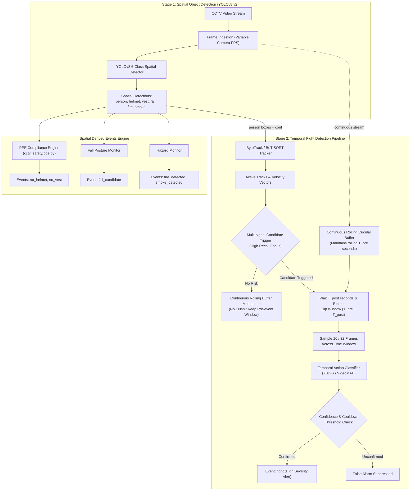
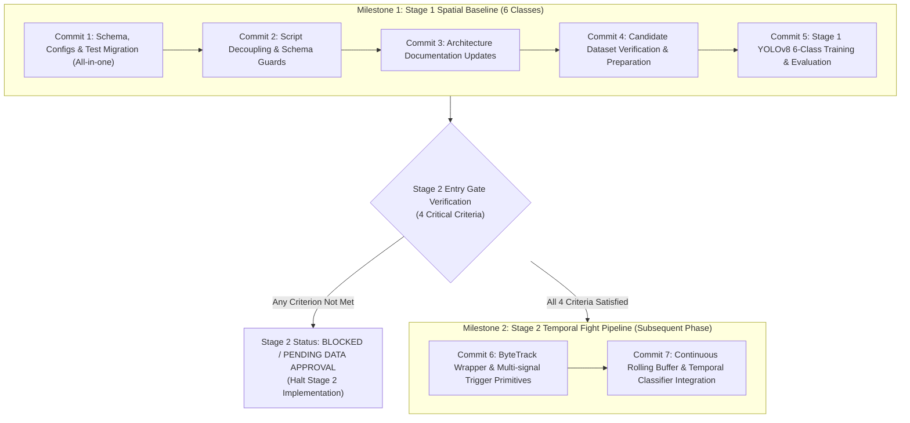

# แผนการย้ายสู่สถาปัตยกรรม Two-Stage Pipeline (Two-Stage Architecture Migration Plan)
## โครงการ Project CCTV Safety — Version 2.0 Architecture

> **สถานะเอกสาร:** ได้รับการอนุมัติอย่างเป็นทางการจากเจ้าของโครงการ (Project Owner Approved)  
> **วันที่จัดทำ:** 25 กันยายน 2026 (ฉบับปรับปรุงตามข้อกำหนดวิศวกรรม)  
> **เป้าหมาย:** กำหนดขั้นตอน มาตรฐานข้อมูล อินเทอร์เฟซ และแผนการทดสอบในการปรับปรุงระบบตรวจจับความปลอดภัยกล้องวงจรปิด จากระบบตรวจจับภาพนิ่ง 7 คลาสเดิม (v1) สู่ระบบสองระยะ (v2 Two-Stage Pipeline):  
> 1. **Stage 1 (Spatial Object Detection):** YOLOv8 รับผิดชอบ 6 คลาสเชิงพื้นที่ (`0: person`, `1: helmet`, `2: vest`, `3: fall`, `4: fire`, `5: smoke`)  
> 2. **Stage 2 (Temporal Event Classification):** โมดูลวิดีโอเชิงเวลารับผิดชอบการจำแนกเหตุการณ์ทะเลาะวิวาท (`fight`)  
> **ข้อกำหนดการควบคุม:** แผนฉบับนี้เป็นเอกสารวางแผนทางวิศวกรรม ยังไม่มีการแก้ไข Source Code, Configs, ดาวน์โหลด Dataset เพิ่มเติม, หรือรัน Training ในรอบนี้

---

## 1. บทนำและเหตุผลความจำเป็นเชิงวิศวกรรม (Executive Summary & Rationale)

### 1.1 ปัญหาของสถาปัตยกรรมแบบ Single-Stage 7 Classes (v1)
ในสถาปัตยกรรมเดิม โครงการพยายามฝึกสอนโมเดล YOLOv8 ให้ตรวจจับวัตถุและความปลอดภัยทั้งหมด 7 คลาสพร้อมกันในระดับเฟรมภาพนิ่ง (Single Frame Spatial Bounding Box):
1. **ความคลุมเครือของภาพนิ่ง 1 เฟรม (Single-frame Ambiguity):** การกอด (Hug), การทักทาย, การจับมือ, หรือคนงานทำงานร่วมกันในระยะประชิด มีลักษณะเรขาคณิตของ Bounding Box และ Pose คล้ายคลึงกับการปะทะชกต่อย ทำให้โมเดลภาพนิ่งเกิด False Positive สูงมากบนกล้อง CCTV จริง
2. **Missing-label Penalty ข้ามโดเมน:** ชุดข้อมูล Candidate เชิงพื้นที่ เช่น Person/PPE (`beyzakucuk`), Fire/Smoke (`DFire`), และ Fall (`kandagatla`) ไม่มีป้ายกำกับ Fight หากนำภาพที่มีคนยืนใกล้กันเข้ามาฝึกสอน โมเดลจะสับสนว่าภาพนั้นคือ Non-fight หรือไม่
3. **ปัญหาความพร้อมของ Dataset คลาส Fight:**
   * ชุดข้อมูล **Simuletic CCTV Aggressive Poses** ถูกตัดสินสถานะ **NO-GO FOR PHASE 3 / CLOSED** เนื่องจากพบข้อขัดแย้งของ Provenance (ภาพคนจริงขัดแย้งกับข้ออ้างว่า Synthetic), สิทธิ์ CC BY 4.0 ไม่สมบูรณ์, มี Active Fight เพียง 48 ภาพ, และ Human QA ยังไม่ได้เริ่ม
   * ชุดข้อมูล **TNUE-Fight Detection** ยังติดข้อจำกัดด้านลิขสิทธิ์ (BLOCKED pending permission) ซึ่งต้องใช้เวลาขอหนังสืออนุญาต 4 ประการ และไม่ควรเป็นตัวบล็อกการพัฒนา 6 คลาสเชิงพื้นที่

### 1.2 มติเลือกแนวทาง A: Two-Stage Pipeline
เจ้าของโครงการได้มีคำวินิจฉัยอนุมัติเลือก **แนวทาง A (Two-Stage Pipeline)** อย่างเป็นทางการ:
* **Stage 1 (Spatial Object Detection):** ปรับลดขอบเขตของ YOLOv8 ให้มุ่งเน้น **6 Spatial Classes** ที่มีความชัดเจนเชิงพื้นที่
* **Stage 2 (Temporal Event Classification):** แยกการตรวจจับเหตุการณ์ `fight` ออกไปเป็น **Temporal Event Classifier** ทำงานร่วมกับระบบ Person Tracking, Multi-signal Candidate Trigger และ Rolling Video Buffer



---

## 2. การปรับเปลี่ยน Data Schema: จาก v1 (7 Classes) สู่ v2 (6 Classes)

### 2.1 ตารางเปรียบเทียบ Data Schema v1 vs v2

| Class ID (v1) | Class ID (v2) | Class Name | หมวดหมู่การตรวจจับ | สถานะใน v2 | แหล่งข้อมูล Candidate ในการพัฒนา (Candidate Sources Pending Verification) |
|:---:|:---:|---|---|:---:|---|
| `0` | **`0`** | `person` | Spatial Object | คงเดิม | `beyzakucuk/ppe-detection-v1`, `uttejkumarkandagatla/fall-detection` (รอผลตรวจ) |
| `1` | **`1`** | `helmet` | Spatial Object | คงเดิม | `beyzakucuk/ppe-detection-v1` (รอผลตรวจ) |
| `2` | **`2`** | `vest` | Spatial Object | คงเดิม | `beyzakucuk/ppe-detection-v1` (รอผลตรวจ) |
| `3` | **`3`** | `fall` | Spatial Object | คงเดิม | `uttejkumarkandagatla/fall-detection-dataset` (รอผลตรวจ) |
| `4` | **`4`** | `fire` | Spatial Object | คงเดิม | `gaiasd/DFireDataset` (รอผลตรวจ) |
| `5` | **`5`** | `smoke` | Spatial Object | คงเดิม | `gaiasd/DFireDataset` (รอผลตรวจ) |
| `6` | **—** | `fight` | Temporal Event | **ย้ายไป Stage 2** | แยกเป็น Temporal Event Classifier (ไม่ใช่ Bounding Box ใน YOLO) |

> ⚠️ **หมายเหตุสำคัญด้านการเรียกชื่อชุดข้อมูล:** ชุดข้อมูลข้างต้นทั้งหมดถือเป็น **Candidate Sources Pending Verification** ซึ่งต้องผ่านกระบวนการตรวจสอบสิทธิ์ปฐมภูมิ (Primary License Verification), สุ่มตรวจภาพ (Sample Audit), ตรวจสอบความสมบูรณ์ของ Label (Exhaustive Label Audit) และตรวจสอบการปนเปื้อน/ภาพซ้ำ (Duplicate & Leakage Audit) ตามระเบียบข้อบังคับโครงการ ก่อนที่จะได้รับการอนุมัติอย่างเป็นทางการ

### 2.2 นิยาม Bounding Box เชิงพื้นที่สำหรับ Schema v2 (Spatial Classes)
* **`0: person`**: กรอบ Bounding Box ครอบคลุมร่างกายมนุษย์ทั้งตัว (ศีรษะถึงเท้า) ในทุกอิริยาบถปกติ (ยืน, เดิน, นั่ง)
* **`1: helmet`**: กรอบ Bounding Box ครอบคลุมหมวกนิรภัย (Safety Hardhat) บริเวณศีรษะของบุคคล
* **`2: vest`**: กรอบ Bounding Box ครอบคลุมเสื้อกั๊กสะท้อนแสงหรือชุด PPE บริเวณลำตัวท่อนบน
* **`3: fall`**: กรอบ Bounding Box ครอบคลุมบุคคลที่อยู่ในท่านอนราบกับพื้น หรือเสียหลักล้มลงอย่างกะทันหัน
* **`4: fire`**: กรอบ Bounding Box ครอบคลุมเปลวไฟจริง (ไม่รวมแสงสะท้อน แสงนีออน หรือโคมไฟ)
* **`5: smoke`**: กรอบ Bounding Box ครอบคลุมกลุ่มควันไฟจากการเผาไหม้ (ไม่รวมไอน้ำ หมอก หรือฝุ่นละออง)

### 2.3 การประกาศ Detector Schema Versioning ใน `cctv_safety/schema.py`
ระบบต้องแยก Versioning ระหว่าง Detector Schema และ Event Schema ออกจากกันอย่างเด็ดขาด:

```python
"""Canonical detector schema v2 shared by data preparation and inference."""

# Detector Schema Versioning (Explicitly separated from Event Schema)
DETECTOR_SCHEMA_VERSION = 2

# Schema Version 2: 6 Spatial Classes
CLASS_NAMES_V2 = ("person", "helmet", "vest", "fall", "fire", "smoke")
CLASS_TO_ID_V2 = {name: index for index, name in enumerate(CLASS_NAMES_V2)}

# Legacy Schema Version 1 (Preserved for compatibility and validation guards)
DETECTOR_SCHEMA_VERSION_LEGACY = 1
CLASS_NAMES_V1 = ("person", "helmet", "vest", "fall", "fire", "smoke", "fight")
CLASS_TO_ID_V1 = {name: index for index, name in enumerate(CLASS_NAMES_V1)}

# Default active detector schema pointers
CLASS_NAMES = CLASS_NAMES_V2
CLASS_TO_ID = CLASS_TO_ID_V2
IMAGE_SUFFIXES = {".jpg", ".jpeg", ".png", ".bmp", ".webp"}
```

---

## 3. Event Schema สำหรับ Derived Events และ Temporal Events

ระบบใหม่แยกผลตรวจจับวัตถุ (Detections) ออกจากเหตุการณ์ความปลอดภัย (Safety Events) โดยใช้ **`event_schema_version: 1`** สำหรับ Event Payloads:

### 3.1 โครงสร้าง Event Base Schema (`event_schema_version: 1`)
ข้อกำหนดสำคัญ:
* มี `event_schema_version: 1` และระบุ `detector_schema_version: 2` ภายใน `source_metadata`
* แยกเวลาเกิดเหตุ (`occurred_at`) และเวลาตรวจพบ (`detected_at`) ชัดเจน
* Bounding Box มีระบบพิกัดแน่นอน: `pixel_xyxy` พร้อม `frame_width` และ `frame_height`
* ฟิลด์ `clip_buffer_uri` วางไว้ที่ Top-level ตำแหน่งเดียว (ไม่ซ้ำซ้อนใน `details`)
* มี `"additionalProperties": false` ในระดับ Object สำคัญ

```json
{
  "$schema": "https://json-schema.org/draft/2020-12/schema",
  "title": "SafetyEvent",
  "type": "object",
  "additionalProperties": false,
  "required": [
    "event_id",
    "event_schema_version",
    "event_type",
    "severity",
    "occurred_at",
    "detected_at",
    "camera_id",
    "confidence",
    "bounding_boxes",
    "source_metadata",
    "details"
  ],
  "properties": {
    "event_id": { "type": "string", "description": "UUIDv4 ประจำเหตุการณ์" },
    "event_schema_version": { "type": "integer", "const": 1 },
    "event_type": { 
      "type": "string", 
      "enum": ["no_helmet", "no_vest", "fall_confirmed", "fight", "fire_detected", "smoke_detected"] 
    },
    "severity": { "type": "string", "enum": ["info", "warning", "critical"] },
    "occurred_at": { "type": "string", "format": "date-time", "description": "เวลาที่เหตุการณ์เริ่มเกิดขึ้นจริงในวิดีโอ" },
    "detected_at": { "type": "string", "format": "date-time", "description": "เวลาที่ระบบตรวจจับและยืนยันเหตุการณ์สำเร็จ" },
    "camera_id": { "type": "string" },
    "confidence": { "type": "number", "minimum": 0.0, "maximum": 1.0 },
    "track_ids": { "type": "array", "items": { "type": "integer" } },
    "clip_buffer_uri": { "type": ["string", "null"], "description": "URI ของวิดีโอคลิปหลักฐาน (ถ้ามี)" },
    "bounding_boxes": { 
      "type": "array", 
      "items": { 
        "type": "object",
        "additionalProperties": false,
        "required": ["class_name", "coordinate_system", "frame_width", "frame_height", "xyxy"],
        "properties": {
          "class_name": { "type": "string" },
          "coordinate_system": { "type": "string", "const": "pixel_xyxy" },
          "frame_width": { "type": "integer", "minimum": 1 },
          "frame_height": { "type": "integer", "minimum": 1 },
          "xyxy": { 
            "type": "array", 
            "items": { "type": "number" }, 
            "minItems": 4, 
            "maxItems": 4,
            "description": "[xmin, ymin, xmax, ymax] ในหน่วยพิกเซลจริง"
          }
        }
      }
    },
    "source_metadata": {
      "type": "object",
      "additionalProperties": false,
      "required": ["detector_schema_version", "detector_model_name", "weights_sha256"],
      "properties": {
        "detector_schema_version": { "type": "integer", "const": 2 },
        "detector_model_name": { "type": "string" },
        "weights_sha256": { "type": "string" },
        "temporal_model_name": { "type": ["string", "null"] }
      }
    },
    "details": { "type": "object" }
  }
}
```

### 3.2 รายละเอียด Event แต่ละประเภทและการกำหนดค่าเริ่มต้นที่ Configurable ได้

> ⚙️ **หลักการตั้งค่าตัวแปรเชิงเรขาคณิตและเวลา:**  
> ค่าสัดส่วนพื้นที่ (เช่น 35% สำหรับศีรษะ, 20–75% สำหรับลำตัว), ค่า IoU (0.15), และค่าระยะเวลาคงอยู่ (1.0 วินาที) ที่ระบุในส่วนนี้ **เป็นเพียง "ค่าเริ่มต้นสำหรับการทดลอง (Initial Exploratory Defaults)"** ซึ่งต้องกำหนดให้แก้ไขได้ผ่านไฟล์คอนฟิก (Configurable Parameters) หรือ Command Line Arguments **ห้ามถือเป็นข้อกำหนดตายตัวใน Source Code**

#### 1. `no_helmet` (PPE Violation Event)
* **เงื่อนไขเริ่มต้น:** ตรวจพบคลาส `person` แต่ไม่พบวัตถุ `helmet` ในพื้นที่ด้านบนของบุคคล
* **ค่าเริ่มต้นสำหรับการทดลอง:** Head region ratio = `0.0 - 0.35` (35% บนสุดของ Bbox), Persistence = `1.0` วินาที (ปรับเปลี่ยนได้ใน `configs/thresholds.yaml`)
* **Severity:** `warning`
* **ตัวอย่าง `details`:**
  ```json
  "details": {
    "person_track_id": 12,
    "head_region_xyxy": [120.0, 50.0, 180.0, 95.0],
    "duration_unprotected_seconds": 3.2,
    "head_region_ratio_used": 0.35
  }
  ```

#### 2. `no_vest` (PPE Violation Event)
* **เงื่อนไขเริ่มต้น:** ตรวจพบคลาส `person` แต่ไม่พบวัตถุ `vest` ในพื้นที่ลำตัว
* **ค่าเริ่มต้นสำหรับการทดลอง:** Torso region ratio = `0.20 - 0.75` (20% ถึง 75% ของความสูง Bbox), Persistence = `1.0` วินาที (ปรับเปลี่ยนได้)
* **Severity:** `warning`
* **ตัวอย่าง `details`:**
  ```json
  "details": {
    "person_track_id": 12,
    "torso_region_xyxy": [115.0, 80.0, 185.0, 190.0],
    "duration_unprotected_seconds": 3.2,
    "torso_region_ratio_used": [0.20, 0.75]
  }
  ```

#### 3. `fall_confirmed` (Fall Incident Event)
* **เงื่อนไขเริ่มต้น:** ตรวจพบคลาส `3: fall` ติดต่อกันอย่างน้อยตามระยะเวลาที่กำหนด หรือมีการเปลี่ยนแปลง Aspect Ratio จากแนวตั้งเป็นแนวนอน
* **ค่าเริ่มต้นสำหรับการทดลอง:** Aspect Ratio threshold $\ge 1.8$, Persistence $\ge 1.0$ วินาที (ปรับเปลี่ยนได้)
* **Severity:** `critical`
* **ตัวอย่าง `details`:**
  ```json
  "details": {
    "person_track_id": 7,
    "aspect_ratio": 2.4,
    "duration_on_ground_seconds": 2.5,
    "previous_state": "standing"
  }
  ```

#### 4. `fight` (Temporal Violence Event)
* **เงื่อนไขเริ่มต้น:** Multi-signal Candidate Trigger ตรวจพบความผิดปกติของบุคคลตั้งแต่ 2 คนขึ้นไป + Video Buffer ได้รับการยืนยันจาก Temporal Action Classifier
* **ค่าเริ่มต้นสำหรับการทดลอง:** Trigger IoU overlap $\ge 0.15$ (หรือ Center distance $\le 80$ px), Contact duration $\ge 0.5$ วินาที, Temporal Model confidence $\ge 0.75$ (ปรับเปลี่ยนได้)
* **Severity:** `critical`
* **ตัวอย่าง `details` (ไม่มี `clip_buffer_uri` ซ้ำซ้อน):**
  ```json
  "details": {
    "involved_track_ids": [3, 5],
    "trigger_reasons": ["high_motion_jitter", "close_proximity_duration_exceeded"],
    "temporal_model": "x3d_s_v1",
    "temporal_confidence": 0.884,
    "clip_duration_seconds": 2.5,
    "frames_sampled": 16
  }
  ```

---

## 4. การวิเคราะห์ผลกระทบและรายการไฟล์ที่ต้องแก้ไข (Impact Analysis & Affected Files)

| ไฟล์ที่ได้รับผลกระทบ | บทบาทเดิม (v1) | บทบาทใหม่ (v2) | การควบคุมความเสี่ยง |
|---|---|---|---|
| [configs/classes.yaml](../configs/classes.yaml) | `nc: 7`, ระบุ 0–6 รวมถึง `fight` | ปรับเป็น `version: 2`, `names` มี 0–5 (6 คลาส), เพิ่มส่วน `temporal_events` | ใส่คีย์ `version: 2` เพื่อให้ Loader ตรวจสอบ |
| [configs/data.yaml](../configs/data.yaml) | `nc: 7`, `names: [person, ..., fight]` | ปรับเป็น `nc: 6`, `names: [person, helmet, vest, fall, fire, smoke]` | ตรวจสอบว่า Dataset ไม่มีคลาส ID 6 ก่อนเทรน |
| [configs/thresholds.yaml](../configs/thresholds.yaml) | มีค่า threshold ของ 7 คลาส | ปรับ thresholds 6 คลาส และแยกคีย์ `temporal_thresholds` | ป้องกัน KeyError โดยสคริปต์ spatial ไม่อ่าน key fight |
| [cctv_safety/schema.py](../cctv_safety/schema.py) | Hardcoded tuple 7 คลาส | ประกาศ `DETECTOR_SCHEMA_VERSION = 2` (6 คลาส) และคง V1 ไว้เป็น Guard | Import เข้ากันได้ 100% |
| [cctv_safety/dataset.py](../cctv_safety/dataset.py) | ตรวจสอบคลาส 0–6 | ตรวจสอบ dynamic class range ตาม schema v2 | ปฏิเสธทันทีหากพบคลาส $\ge 6$ ในไฟล์ label |
| [cctv_safety/ppe.py](../cctv_safety/ppe.py) | จับคู่ person กับ helmet/vest | คงเดิม แต่เปิดให้ปรับค่า Head/Torso Ratio ผ่านพารามิเตอร์ได้ | ไม่กระทบ logic เดิม |
| [scripts/infer.py](../scripts/infer.py) | รัน YOLO 7 คลาส | เพิ่ม Runtime Guard `len(model.names) == 6` และโครงร่างส่ง person เข้า Tracker | แจ้งเตือนข้อผิดพลาดชัดเจนหากใช้ Weights v1 |
| [scripts/prepare_dataset.py](../scripts/prepare_dataset.py) | แปลง label เข้าสู่ 7 คลาส | **Fail Fast ทันที** หากพบ source mapping หรือ label เป็น `fight` | **ห้ามข้ามหรือทิ้ง label เงียบๆ** |
| [scripts/train_compare.py](../scripts/train_compare.py) | เทรนโมเดล 7 คลาส | เทรนโมเดล 6 คลาส, สร้าง `model_manifest.json` sidecar ทุกครั้ง | ไม่ hardcode จำนวนคลาส |
| [scripts/validate_dataset.py](../scripts/validate_dataset.py) | Validate 7 คลาส | Validate 6 คลาส และตรวจว่าต้องไม่มีคลาส 6 หลงเหลือ | สแกนทั้ง dataset ก่อนเทรน |
| [tests/test_dataset.py](../tests/test_dataset.py) | Unit tests 7 คลาส | ปรับ test fixtures เป็น 6 คลาส และทดสอบการ reject คลาส 6 | รวมอยู่ใน Commit 1 |
| [docs/data_schema_7classes.md](data_schema_7classes.md) | เอกสารหลัก 7 คลาส | ใส่ Deprecation Banner แจ้งว่าถูกทดแทนด้วย Schema v2 | ป้องกันความสับสน |

---

## 5. มาตรการป้องกัน Weights & Schema Mismatch และระบบ Model Metadata

### 5.1 Runtime Schema & Weights Integrity Validation Guard (Fail Fast)
ในสคริปต์ [scripts/infer.py](../scripts/infer.py) และโมดูลที่เกี่ยวข้อง ต้องมีฟังก์ชันตรวจสอบความเข้ากันได้ทันทีที่โหลด Checkpoint:
* **การตรวจจับต้องไม่ใช่เพียงตรวจจำนวนคลาส (`len == 6`):** ต้องตรวจสอบทั้ง **ลำดับและชื่อคลาสทุกคลาสแบบ Exact Match & Exact Order** เทียบกับ `CLASS_NAMES_V2`
* **ต้องมีไฟล์ `model_manifest.json` สำหรับ Schema v2 (Mandatory Sidecar):** สำหรับโมเดล Detector Schema v2 กำหนดให้ไฟล์ `model_manifest.json` เป็น **ไฟล์บังคับ (Strictly Mandatory)** หากไม่พบไฟล์ ต้อง **Fail Fast ด้วย `FileNotFoundError` ทันที** ห้ามข้ามการตรวจสอบโดยเด็ดขาด
* **การตรวจสอบ JSON Schema ก่อนนำค่าไปใช้:** ต้อง Validate โครงสร้างและชนิดข้อมูลของ Manifest กับ JSON Schema (ตามข้อกำหนดใน Section 5.2) ก่อนนำค่าฟิลด์ใดๆ ไปใช้งาน
* **การตรวจสอบ Field สำคัญใน Manifest อย่างเคร่งครัด:**
  1. ตรวจสอบ `detector_schema_version == 2` (ตรงกับเวอร์ชัน Schema ที่คาดหวัง)
  2. ตรวจสอบว่า `weights_file` ใน Manifest ตรงกับชื่อไฟล์ Weights ที่กำลังโหลดจริง (`weights_path.name`)
  3. คำนวณและตรวจสอบค่า **`weights_sha256` ของไฟล์ Weights จริง** ให้ตรงกับค่าใน Manifest เสมอ (ป้องกันการสลับไฟล์หรือ Weights เสียหาย)
  4. ตรวจสอบ `class_names` ใน Manifest ว่ามีลำดับและชื่อคลาสตรงกับ `CLASS_NAMES_V2` ทุกตำแหน่งแบบ Exact Match
  5. ตรวจสอบ `num_classes == len(CLASS_NAMES_V2)` (ต้องเท่ากับ 6)
* **การรองรับ Legacy / Local Dev Mode:** หากจำเป็นต้องรองรับ Checkpoint รุ่นเก่า (Legacy v1) หรือ Local Development Scratch Mode ให้กำหนดผ่าน Explicit Flag เช่น `allow_missing_manifest: bool = False` โดย **ค่า Default ต้องเป็น `False` เสมอ และห้ามเปิดใช้งานใน Production หรือ Verification Pipeline โดยเด็ดขาด**

```python
import hashlib
import json
from pathlib import Path
import jsonschema
from ultralytics import YOLO
from cctv_safety.schema import CLASS_NAMES_V2, CLASS_NAMES_V1

# JSON Schema definition matching Section 5.2
MANIFEST_JSON_SCHEMA = {
    "$schema": "https://json-schema.org/draft/2020-12/schema",
    "type": "object",
    "additionalProperties": False,
    "required": [
        "model_name", "weights_file", "weights_sha256", "detector_schema_version",
        "class_names", "num_classes", "dataset_manifest_hash", "training_config_hash",
        "framework_version", "ultralytics_version", "torch_version", "trained_at_utc",
        "input_resolution"
    ],
    "properties": {
        "model_name": {"type": "string"},
        "weights_file": {"type": "string"},
        "weights_sha256": {"type": "string", "pattern": "^[a-f0-9]{64}$"},
        "detector_schema_version": {"type": "integer", "const": 2},
        "class_names": {
            "type": "array",
            "items": {"type": "string"},
            "minItems": 6,
            "maxItems": 6,
            "uniqueItems": True
        },
        "num_classes": {"type": "integer", "const": 6},
        "dataset_manifest_hash": {"type": "string", "pattern": "^[a-f0-9]{64}$"},
        "training_config_hash": {"type": "string", "pattern": "^[a-f0-9]{64}$"},
        "framework_version": {"type": "string"},
        "ultralytics_version": {"type": "string"},
        "torch_version": {"type": "string"},
        "trained_at_utc": {"type": "string", "format": "date-time"},
        "input_resolution": {"type": "array", "items": {"type": "integer"}, "minItems": 2, "maxItems": 2}
    }
}

def validate_model_weights_and_schema(
    weights_path: Path, 
    model: YOLO, 
    expected_version: int = 2,
    manifest_path: Path | None = None,
    allow_missing_manifest: bool = False  # Strictly False by default; FORBIDDEN in production
) -> None:
    """
    Strict runtime validation of weights integrity and schema conformance.
    For Schema v2:
      1. Validates exact class names and sequence in model checkpoint match detector schema.
      2. Enforces mandatory model_manifest.json (raises FileNotFoundError if missing).
      3. Validates manifest against JSON Schema before reading properties.
      4. Validates detector_schema_version == 2.
      5. Validates weights_file matches actual weights filename.
      6. Validates calculated SHA-256 hash of actual weights file matches weights_sha256.
      7. Validates exact class names, order, and num_classes in manifest match CLASS_NAMES_V2.
    """
    # 1. Strict Class Names & Order Validation from loaded model object
    expected_names = list(CLASS_NAMES_V2) if expected_version == 2 else list(CLASS_NAMES_V1)
    actual_names = list(model.names.values()) if isinstance(model.names, dict) else list(model.names)
    
    if actual_names != expected_names:
        raise ValueError(
            f"Model schema mismatch! Expected detector schema v{expected_version} classes: {expected_names} "
            f"(count={len(expected_names)}), but loaded checkpoint has classes: {actual_names} "
            f"(count={len(actual_names)}). "
            f"If you are loading a legacy 7-class checkpoint, it cannot be run with 6-class Schema v2. "
            f"Please retrain or specify the matching configuration."
        )

    # 2. Mandatory Manifest File Verification (Fail Fast with FileNotFoundError)
    manifest_file = manifest_path or weights_path.with_name("model_manifest.json")
    if not manifest_file.exists():
        if expected_version == 2 and not allow_missing_manifest:
            raise FileNotFoundError(
                f"Mandatory sidecar metadata missing! Could not find '{manifest_file}' for weights '{weights_path}'. "
                f"For Detector Schema v2, 'model_manifest.json' is strictly mandatory to guarantee provenance and integrity. "
                f"Bypassing via allow_missing_manifest=True is strictly forbidden in production."
            )
        return  # Allow legacy v1 or dev scratch only when explicitly permitted

    # 3. Validate Manifest against JSON Schema before reading values
    try:
        manifest = json.loads(manifest_file.read_text(encoding="utf-8"))
    except json.JSONDecodeError as err:
        raise ValueError(f"Corrupted manifest! '{manifest_file}' is not valid JSON: {err}") from err

    try:
        jsonschema.validate(instance=manifest, schema=MANIFEST_JSON_SCHEMA)
    except jsonschema.ValidationError as err:
        raise ValueError(f"Manifest schema validation failed for '{manifest_file}': {err.message}") from err

    # 4. Check detector_schema_version == 2
    manifest_version = manifest.get("detector_schema_version")
    if manifest_version != expected_version:
        raise ValueError(
            f"Manifest detector_schema_version mismatch! Expected {expected_version}, got {manifest_version}."
        )

    # 5. Check weights_file matches the actual loading weights filename
    manifest_weights_file = manifest.get("weights_file")
    if manifest_weights_file != weights_path.name:
        raise ValueError(
            f"Manifest weights_file mismatch! Manifest specifies '{manifest_weights_file}', "
            f"but loading '{weights_path.name}'."
        )

    # 6. Check actual weights file SHA-256 hash
    calculated_hash = hashlib.sha256(weights_path.read_bytes()).hexdigest().lower()
    expected_hash = manifest.get("weights_sha256", "").lower()
    if calculated_hash != expected_hash:
        raise ValueError(
            f"Weights SHA-256 mismatch! File: {weights_path}, "
            f"Calculated: {calculated_hash}, Manifest: {expected_hash}. "
            f"The weights file may be corrupted or mismatched with manifest."
        )

    # 7. Check class_names (exact sequence) and num_classes
    manifest_classes = manifest.get("class_names", [])
    if manifest_classes != expected_names:
        raise ValueError(
            f"Manifest class_names mismatch! Manifest: {manifest_classes}, Expected: {expected_names}"
        )
    
    manifest_num_classes = manifest.get("num_classes")
    if manifest_num_classes != len(expected_names):
        raise ValueError(
            f"Manifest num_classes mismatch! Manifest: {manifest_num_classes}, Expected: {len(expected_names)}"
        )
```

### 5.2 ระบบ Sidecar Metadata: `model_manifest.json` เป็น Single Source of Truth
เพื่อแก้ไขปัญหาการฝัง Metadata ลงในไฟล์ PyTorch `.pt` หรือ ONNX ที่อาจหลุดหายระหว่างการ Export หรือ Quantization โครงการกำหนดให้ใช้ **`model_manifest.json` (Sidecar File)** ที่บันทึกคู่กับไฟล์ Weights เสมอ โดยการฝังลงใน `.pt` เป็นเพียงตัวเลือกเสริม (Optional Helper):

```json
{
  "$schema": "https://json-schema.org/draft/2020-12/schema",
  "title": "ModelManifest",
  "type": "object",
  "additionalProperties": false,
  "required": [
    "model_name",
    "weights_file",
    "weights_sha256",
    "detector_schema_version",
    "class_names",
    "num_classes",
    "dataset_manifest_hash",
    "training_config_hash",
    "framework_version",
    "ultralytics_version",
    "torch_version",
    "trained_at_utc",
    "input_resolution"
  ],
  "properties": {
    "model_name": { "type": "string" },
    "weights_file": { "type": "string", "description": "ชื่อไฟล์ weights สัมพัทธ์ เช่น best.pt" },
    "weights_sha256": { 
      "type": "string", 
      "pattern": "^[a-f0-9]{64}$",
      "description": "SHA-256 hash ของไฟล์ weights ในรูปแบบ lowercase hexadecimal 64 ตัวอักษร"
    },
    "detector_schema_version": { "type": "integer", "const": 2 },
    "class_names": { 
      "type": "array", 
      "items": { "type": "string" },
      "minItems": 6,
      "maxItems": 6,
      "uniqueItems": true,
      "description": "รายชื่อคลาสเรียงตาม ID 0..5 ต้องมี 6 คลาสพอดีและไม่ซ้ำกัน"
    },
    "num_classes": { "type": "integer", "const": 6 },
    "dataset_manifest_hash": { 
      "type": "string", 
      "pattern": "^[a-f0-9]{64}$",
      "description": "SHA-256 hash ของไฟล์ dataset_manifest.json ในรูปแบบ lowercase hexadecimal 64 ตัวอักษร"
    },
    "training_config_hash": { 
      "type": "string", 
      "pattern": "^[a-f0-9]{64}$",
      "description": "SHA-256 hash ของไฟล์ training config ในรูปแบบ lowercase hexadecimal 64 ตัวอักษร"
    },
    "framework_version": { "type": "string" },
    "ultralytics_version": { "type": "string" },
    "torch_version": { "type": "string" },
    "trained_at_utc": { "type": "string", "format": "date-time" },
    "input_resolution": { "type": "array", "items": { "type": "integer" }, "minItems": 2, "maxItems": 2 }
  }
}
```

---

## 6. แนวทางการเตรียม Dataset: กฎเหล็ก Fail Fast และการตรวจ Class ID 6

### 6.1 กฎเหล็ก Fail Fast เมื่อพบ Class `fight` ในการแปลง Dataset
ในสคริปต์ [scripts/prepare_dataset.py](../scripts/prepare_dataset.py):
* **ห้ามข้าม (Skip) หรือละทิ้ง (Drop) ป้ายกำกับ `fight` อย่างเงียบๆ โดยเด็ดขาด** เพราะจะทำให้เกิด Missing-label penalty หรือทำให้ข้อมูลหลุดรอดเข้าสู่ Training set โดยไม่รู้ตัว
* หาก Manifest ของชุดข้อมูลต้นทางใดมีการ Map ป้ายกำกับเป็น `fight` สคริปต์ต้อง **โยน `ValueError` และหยุดทำงานทันที (Fail Fast)**:
  ```python
  if canonical_name == "fight" or canonical_name not in CLASS_TO_ID_V2:
      raise ValueError(
          f"FATAL: Source '{source['id']}' specifies mapping to '{canonical_name}'. "
          f"In Detector Schema v2, 'fight' is NOT a valid spatial detector class. "
          f"Do not silently drop fight labels. Please remove 'fight' mappings and audit raw data."
      )
  ```

### 6.2 การตรวจ Scan ทั้ง Dataset ก่อน Training
ก่อนเริ่มรันคำสั่ง `model.train()` สคริปต์ [scripts/validate_dataset.py](../scripts/validate_dataset.py) ต้องสแกนไฟล์ `.txt` ทุกไฟล์ใน `images/train`, `images/val`, `images/test`:
* ตรวจสอบว่า Class ID ทุกตัวต้องอยู่ในช่วง $[0, 5]$ เท่านั้น
* หากพบ Class ID 6 หรือมากกว่า ให้ระบุเป็น `Severity: ERROR` และบล็อกไม่ให้เกิดกระบวนการเทรน

---

## 7. สถาปัตยกรรมและอินเทอร์เฟซของ Stage 2 (Temporal Fight Detection Pipeline)

### 7.1 ผังการทำงานและกลไก Continuous Rolling Buffer
ข้อกำหนดสำคัญ:
* **ห้าม Flush / Discard Buffer เมื่อ "No Risk":** ระบบต้องรักษา Rolling Pre-event Buffer ไว้ตลอดเวลาในหน่วยความจำ เพื่อให้มีภาพย้อนหลังก่อนเกิดเหตุเสมอ
* **เลิก Hardcode 30 FPS:** กล้อง CCTV แต่ละตัวมี Frame Rate แตกต่างกัน (เช่น 15, 20, 25, 30 FPS) ระบบจะเก็บแต่ละเฟรมควบคู่กับ **Timestamp จริง (PTS / Time Delta)** และกำหนดความยาว Buffer เป็น **"หน่วยวินาที (Seconds)"** แทนจำนวนเฟรมคงที่
* เมื่อ Trigger ทำงาน ระบบจะดึงเฟรมช่วงเวลาก่อนเกิดเหตุ ($T_{\text{pre}}$ วินาที) มารวมกับช่วงเวลาหลังเกิดเหตุ ($T_{\text{post}}$ วินาที) แล้วทำการ **Uniform Temporal Sampling** ให้ได้จำนวนเฟรมคงที่ (เช่น 16 หรือ 32 เฟรม) ตามที่ Temporal Model ต้องการ

```
[Video Stream (Variable FPS)] 
      │
      ├──────────────────────────────────────────┐
      ▼ (Frame Ingestion)                        ▼ (Continuous Write)
[YOLOv8 6-Class Detector]           [Continuous Rolling Circular Buffer]
      │                             (Stores timestamped frames for last T_pre seconds)
      ▼ (person detections)                      │
[ByteTrack / BoT-SORT Tracker]                   │
      │                                          │
      ▼ (active tracks & velocities)             │
[Multi-signal Trigger (High Recall)]             │
      │                                          │
      ├── [No Risk] ──► (Keep rolling, NO flush) │
      │                                          │
      ▼ [Trigger Fired!]                         ▼
[Clip Assembler Engine] ◄────────────────────────┘
      │ (Wait T_post seconds -> Extract window [T_pre + T_post] seconds)
      ▼
[Temporal Uniform Sampler] (Samples 16 or 32 frames across the window)
      │
      ▼
[Temporal Action Classifier (X3D-S / VideoMAE)]
      │
      ▼
[Temporal Smoothing & Cooldown Manager]
      │
      ▼
[Safety Alert Dispatcher: "fight"]
```

### 7.2 รายละเอียด Interface Components

#### 1. Tracker Interface (`cctv_safety/tracking.py`)
```python
@dataclass(frozen=True)
class TrackedPerson:
    track_id: int
    current_box: tuple[float, float, float, float]  # pixel_xyxy
    confidence: float
    velocity_px_per_sec: tuple[float, float]
    last_seen_timestamp: float
```

#### 2. Multi-signal Candidate Trigger Interface
* **เป้าหมาย:** **เน้น Recall สูงสุด (High Recall Objective)** เพื่อให้ความเสี่ยงในการต่อสู้ทั้งหมดถูกส่งต่อไปยัง Temporal Classifier โดยไม่หลุดรอด
* **ข้อห้าม:** **ห้ามใช้ Proximity หรือ IoU เพียงอย่างเดียวในการตัดสิน Fight**
* **Signals ที่นำมาหลอมรวม (Heuristics):**
  1. *Distance / Overlap:* ระยะห่างกึ่งกลางบุคคล $\le D_{\text{th}}$ หรือ IoU $\ge 0.15$ (ค่าเริ่มต้นปรับจูนได้)
  2. *Velocity Variance & Spikes:* มีอัตราเร่งหรือความสั่นไหวของเวกเตอร์การเคลื่อนที่กะทันหัน
  3. *Interaction Duration:* สภาพชิดกันคงอยู่ต่อเนื่องเกิน $T_{\text{contact}}$ (เช่น 0.5 วินาที)

#### 3. Continuous Video Buffer Interface (`cctv_safety/buffer.py`)
* จัดเก็บเฟรมในรูปแบบ Ring Buffer ด้วย Deque หรือ Circular Memory พร้อม Timestamp:
  ```python
  class ContinuousRollingBuffer:
      def __init__(self, pre_trigger_seconds: float = 2.0, max_camera_fps: int = 30):
          self.pre_trigger_seconds = pre_trigger_seconds
          # Storage stores tuples of (timestamp_utc, frame_image)
          self.buffer: collections.deque[tuple[float, np.ndarray]] = collections.deque()
          
      def push(self, timestamp_utc: float, frame: np.ndarray) -> None:
          """Push frame and evict frames older than current_time - pre_trigger_seconds."""
          self.buffer.append((timestamp_utc, frame))
          cutoff = timestamp_utc - self.pre_trigger_seconds
          while self.buffer and self.buffer[0][0] < cutoff:
              self.buffer.popleft()
  ```

#### 4. Temporal Action Classifier Interface
* รับ Input เป็น Tensor สุ่มขนาดตามเวลา `[Batch=1, Channels=3, Frames=16, Height=224, Width=224]`
* คืนค่าผลการทำนาย:
  ```json
  {
    "action": "fight",
    "probability": 0.88,
    "inference_ms": 28.5,
    "frames_evaluated": 16,
    "window_duration_seconds": 2.5
  }
  ```

---

## 8. แผนการทดลองสำหรับ Tracker, Buffer และ Temporal Classifier (Experiment Plan)

> 🔬 **แนวทางการประเมินผล:**  
> ลบเกณฑ์สมมติในอดีต (เช่น Missed Fight $\le 2\%$, Precision $\ge 85\%$, หรือลด False Alarm $80-90\%$) โดยกำหนดเป็น **Provisional Research Exploration Targets** ที่ต้องวัดผลและกำหนดเกณฑ์มาตรฐานใหม่ (Baseline Re-benchmarking) หลังมีชุดข้อมูลทดสอบวิดีโอจริง

| การทดลอง (Experiment) | วัตถุประสงค์ | ปัจจัยทดสอบ | ตัวชี้วัดที่ต้องบันทึกจริง (Metrics to Measure) |
|---|---|---|---|
| **EXP-T1: Tracker Robustness** | ประเมินความเสถียรของ Tracker บนกล้อง CCTV | 1. ByteTrack (Baseline)<br/>2. BoT-SORT (Motion Compensation) | ID Switches ต่อคลิป, Track Fragmentation, Tracking Latency (ms/frame) |
| **EXP-T2: Candidate Trigger Tuning** | ปรับจูน Trigger ให้ได้ Recall สูง โดยไม่สร้างภาระให้โมเดลวิดีโอเกินจำเป็น | 1. Proximity Thresholds<br/>2. Motion Jitter Thresholds<br/>3. Minimum Contact Duration | **Trigger Recall**, **False Triggers per Camera-Hour**, จำนวนคลิปที่ส่งเข้า Classifier, และ **Compute Load (GPU/CPU %)** |
| **EXP-T3: Buffer Time Window & Sampling** | หาความยาวหน้าต่างเวลาที่เหมาะสม | 1. Window $1.5$ วินาที ($T_{\text{pre}}=1.0, T_{\text{post}}=0.5$)<br/>2. Window $2.5$ วินาที ($T_{\text{pre}}=1.5, T_{\text{post}}=1.0$)<br/>3. Window $3.0$ วินาที ($T_{\text{pre}}=2.0, T_{\text{post}}=1.0$) | Action Classification F1-Score, Buffer Memory Usage (MB), Sampled Frame Quality |
| **EXP-T4: Temporal Model Benchmark** | เปรียบเทียบความเร็วและความแม่นยำของ Model Backbone | 1. X3D-XS<br/>2. X3D-S<br/>3. VideoMAE (Small) | Throughput (Clips/sec), Latency (ms/eval), Model Weights Size (MB), Top-1 Accuracy |
| **EXP-T5: Future Dataset Permission** | วิจัยชุดข้อมูลวิดีโอสำหรับ Stage 2 ในระยะยาว | 1. ทำหนังสือขอสิทธิ์ TNUE-Fight 4 ประการไปยัง ICTU<br/>2. ติดตามความก้าวหน้าการตรวจสอบสิทธิ์ | บันทึกความคืบหน้าด้านลิขสิทธิ์ใน Legal Audit Document |

---

## 9. แผนการทดสอบและการตรวจรับระบบ (Test Plan & Acceptance Criteria)

### 9.1 แผนการทดสอบระดับ Unit Tests
1. **`test_detector_schema_v2_properties`:** ตรวจสอบว่า `CLASS_NAMES_V2` มี 6 คลาส และไม่มี `fight`
2. **`test_dataset_validation_rejects_class_6`:** ตรวจสอบว่า [cctv_safety/dataset.py](../cctv_safety/dataset.py) ปฏิเสธ Dataset ที่มีคลาส ID $\ge 6$ ทันที
3. **`test_ppe_assessment_configurable`:** ตรวจสอบว่าฟังก์ชัน PPE รับค่า `head_ratio` และ `torso_ratio` แบบปรับเปลี่ยนได้ และทำงานได้ถูกต้อง
4. **`test_model_schema_guard_rejects_7classes`:** ตรวจสอบว่า Runtime Guard ปฏิเสธ Checkpoint 7 คลาสเดิมพร้อมแสดงข้อความแนะนำ
5. **`test_continuous_rolling_buffer_time_based`:** ตรวจสอบว่า Rolling Buffer รักษาเฟรมย้อนหลังตามระยะเวลา $T_{\text{pre}}$ วินาที โดยไม่เกิด Memory Leak
6. **`test_prepare_dataset_fail_fast_on_fight`:** ตรวจสอบว่าสคริปต์เตรียม Dataset โยน `ValueError` ทันทีที่พบ label หรือ mapping เป็น `fight`

### 9.2 เกณฑ์การตรวจรับการย้ายระบบ (Acceptance Criteria)
* ✅ **การรายงานประสิทธิภาพ Stage 1:** รายงานผล mAP50, mAP50-95, Precision, Recall บนชุดทดสอบ 6 Spatial Classes อย่างโปร่งใส (ไม่มีการอ้างว่า Zero Regression เทียบกับโมเดล 7 คลาส เนื่องจากยังไม่มีโมเดล 7 คลาสที่เทรนสำเร็จในโครงการ)
* ✅ **Strict Schema Boundary:** สคริปต์ Spatial YOLO ไม่มีส่วนใดที่ Hardcode หรืออ้างอิงถึงการตรวจจับ Fight แบบภาพนิ่ง
* ✅ **Explicit Fail Fast:** เมื่อพบ Weights เก่า หรือไฟล์ Label เก่าที่มีคลาส 6 ระบบต้องหยุดทำงานและแสดงคำอธิบายที่ชัดเจนทันที
* ✅ **Clean Git Repository Hygiene:** ห้าม Commit ไฟล์ Dataset, Checkpoint Weights (`.pt`), หรือ Training Run Logs เข้าสู่ Git Repository อย่างเด็ดขาด

---

## 10. แผนผังการตรวจสอบความสอดคล้องระดับสถาปัตยกรรม (Comprehensive Architecture Validation Matrix)

ตารางนี้เป็นเกณฑ์การตรวจสอบ (Validation Matrix) เพื่อรับรองความถูกต้องของระบบก่อนและหลังการ Migrate:

| จุดตรวจสอบ (Validation Checkpoint) | ฝั่งที่ 1 (Source A) | ฝั่งที่ 2 (Source B) | เงื่อนไขความสอดคล้อง (Verification Rule) | ผลลัพธ์เมื่อไม่สอดคล้อง |
|---|---|---|---|---|
| **VM-1: Config ↔ Code Schema** | [configs/classes.yaml](../configs/classes.yaml) | [`cctv_safety.schema`](../cctv_safety/schema.py) | `names` ใน YAML ต้องตรงกับ `CLASS_NAMES_V2` ทุกตัวอักษรและลำดับ index | Build / CI Fail |
| **VM-2: Dataset Labels ↔ Config** | ไฟล์ `.txt` ใน `dataset/labels/` | [configs/data.yaml](../configs/data.yaml) | ค่า Class ID ใน Label ต้องอยู่ในช่วง $[0, \text{nc}-1]$ ($[0, 5]$) เท่านั้น | `validate_dataset.py` คืนค่า 1 (Error) |
| **VM-3: Model Names ↔ Schema** | Checkpoint `model.names` | `CLASS_NAMES_V2` | จำนวนและชื่อคลาสใน Checkpoint ต้องตรงกับ Schema v2 | `validate_model_schema` โยน ValueError |
| **VM-4: Thresholds ↔ Classes** | [configs/thresholds.yaml](../configs/thresholds.yaml) | [configs/classes.yaml](../configs/classes.yaml) | Keys ใน `thresholds` ต้องมีครบทั้ง 6 คลาส และไม่มี spatial key `fight` | KeyError Guard แจ้งเตือน |
| **VM-5: Legacy Weights Rejection** | Checkpoint 7 Classes (v1) | [scripts/infer.py](../scripts/infer.py) | ต้องถูกตรวจพบและปฏิเสธทันทีด้วยข้อความแนะนำการ Migrate | Fail Fast ทันที |
| **VM-6: PPE Behavior Consistency** | [`cctv_safety.ppe`](../cctv_safety/ppe.py) | Unit Tests | คำนวณ compliance ถูกต้องทั้งกรณีสวม/ไม่สวมอุปกรณ์ โดยไม่มีผลกระทบจากคลาส 6 | Tests Pass 100% |
| **VM-7: Prepare Dataset Fail-fast** | [configs/datasets.*.yaml](../configs/datasets.example.yaml) | [scripts/prepare_dataset.py](../scripts/prepare_dataset.py) | หากพบ mapping ใดชี้ไปที่ `fight` ต้องโยน Exception ห้าม skip ทิ้งเงียบๆ | Fail Fast พร้อม error message |

---

## 11. ลำดับขั้นตอนการพัฒนาทีละ Commit (Atomic Implementation Roadmap)

โครงการแบ่งการพัฒนาออกเป็น **2 Milestones หลัก** โดย Commit ใน Stage 2 จะยังไม่เริ่มดำเนินการจนกว่า Stage 1 Spatial Baseline จะเสร็จสมบูรณ์และผ่านการตรวจรับ:



### 11.1 เงื่อนไขประตูผ่านสู่ Stage 2 (Stage 2 Mandatory Entry Gate)

ก่อนที่โครงการจะเริ่มดำเนินการใน Milestone 2 (Stage 2 Temporal Fight Pipeline หรือ Commit 6–7) จะต้องผ่าน **Stage 2 Entry Gate** ครบถ้วนทั้ง 4 ประการดังต่อไปนี้:

1. **Stage 1 Verification:** โมเดล Stage 1 Spatial Baseline (6 Classes) ต้องผ่านการฝึกสอน ประเมินผล และตรวจรับอย่างเป็นทางการเรียบร้อยแล้ว
2. **Primary License / Permission Verification:** มีชุดข้อมูล Temporal Fight Video Dataset อย่างน้อย 1 ชุด ที่ผ่านการยืนยันสิทธิ์สัญญาอนุญาตปฐมภูมิ หรือได้รับหนังสืออนุญาตการใช้งาน 4 ประการเป็นลายลักษณ์อักษร (เช่น ได้รับหนังสืออนุญาตจาก ICTU สำหรับ TNUE-Fight)
3. **Provenance Audit:** ผ่านการตรวจสอบที่มาของวิดีโอ (Source Provenance Audit) อย่างโปร่งใส ไม่มีความขัดแย้งด้านสิทธิ์ และไม่ละเมิดลิขสิทธิ์ของบุคคลภายนอก
4. **Human QA & Scene Split:** ผ่านการตรวจสอบคุณภาพโดยมนุษย์ (Human QA) ครบถ้วน และมีการแบ่งชุดข้อมูล `train/val/test` ในระดับ **Video/Scene-based Split** เพื่อป้องกันปัญหา Overfitting และ Data Leakage อย่างเด็ดขาด

> ⛔ **การบังคับใช้สถานะ BLOCKED (Strict Gate Enforcement):**  
> **หากยังไม่มีชุดข้อมูลวิดีโอใดที่ผ่านเกณฑ์ครบทั้ง 4 ข้อข้างต้น ให้ Milestone 2 (Stage 2) คงสถานะ `BLOCKED / PENDING DATA APPROVAL` โดยเด็ดขาด** ห้ามเริ่มเขียนโค้ด Commit 6–7 หรือดำเนินการสร้างโมเดล Temporal จนกว่าจะมีชุดข้อมูลที่ผ่านการอนุมัติอย่างเป็นทางการ

---

### นโยบายความสะอาดของ Git Repository (Git Hygiene Policy)
* **สิ่งที่จะถูก Commit เข้า Git:** เฉพาะ Source code, Test scripts, Configuration files, Manifest templates, และรายงานผลสรุปขนาดเล็ก (Markdown / JSON Summary)
* **สิ่งที่ห้าม Commit เข้า Git โดยเด็ดขาด (Enforced in `.gitignore`):**
  * `dataset/` (ไฟล์รูปภาพและ Label ทั้งหมด)
  * `runs/` และ Checkpoint Weights (`.pt`, `.onnx`)
  * `data/raw/` (ชุดข้อมูลดิบที่ดาวน์โหลดมา)
  * Logs ขนาดใหญ่ หรือ Cache ต่างๆ

---

### Milestone 1: Stage 1 Spatial Baseline

#### Commit 1: Schema, Configs & Test Migration (All-in-One Atomic Commit)
* **Commit Message:** `chore(schema): migrate detector schema to 6 classes with config and test updates`
* **ขอบเขต:**
  * อัปเดต [cctv_safety/schema.py](../cctv_safety/schema.py) ประกาศ `DETECTOR_SCHEMA_VERSION = 2` (6 คลาส) และคง V1 ไว้เป็น Guard
  * อัปเดต [configs/classes.yaml](../configs/classes.yaml) (`version: 2`, 6 คลาส)
  * อัปเดต [configs/data.yaml](../configs/data.yaml) (`nc: 6`, 6 คลาส)
  * อัปเดต [configs/thresholds.yaml](../configs/thresholds.yaml) (6 spatial thresholds)
  * อัปเดต [tests/test_dataset.py](../tests/test_dataset.py) ให้ทดสอบผ่านทันทีใน Commit เดียวกัน

#### Commit 2: Script Decoupling & Schema Guards
* **Commit Message:** `refactor(core): decouple scripts from hardcoded class counts and add schema guards`
* **ขอบเขต:**
  * เพิ่ม `validate_model_schema` ใน [scripts/infer.py](../scripts/infer.py) ป้องกัน weights 7 คลาส
  * เพิ่ม Fail-fast logic ใน [scripts/prepare_dataset.py](../scripts/prepare_dataset.py) เมื่อพบ mapping หรือ label `fight`
  * อัปเดต [scripts/train_compare.py](../scripts/train_compare.py) ให้สร้าง `model_manifest.json` sidecar

#### Commit 3: Architecture Documentation Updates
* **Commit Message:** `docs: update architecture references and add 6-class schema specification`
* **ขอบเขต:**
  * สร้าง [docs/data_schema_6classes.md](data_schema_6classes.md) เป็นเอกสารอ้างอิงหลัก
  * ใส่ Deprecation Notice ใน [docs/data_schema_7classes.md](data_schema_7classes.md)
  * อัปเดต [docs/yolov8_architecture.md](yolov8_architecture.md) และ [README.md](../README.md)

#### Commit 4: Candidate Dataset Verification & Preparation
* **Commit Message:** `data(spatial): verify candidate sources and prepare 6-class spatial dataset`
* **ขอบเขต:**
  * ดำเนินการ Audit ชุดข้อมูล Candidate เชิงพื้นที่ (`beyzakucuk`, `kandagatla`, `DFire`)
  * ปรับปรุง [configs/datasets.example.yaml](../configs/datasets.example.yaml)
  * รันสคริปต์ [scripts/prepare_dataset.py](../scripts/prepare_dataset.py) และตรวจสอบว่าไม่มี Class ID 6 ด้วย [scripts/validate_dataset.py](../scripts/validate_dataset.py)

#### Commit 5: Stage 1 YOLOv8 6-Class Training & Evaluation
* **Commit Message:** `train(yolo): train and evaluate YOLOv8n and YOLOv8s 6-class spatial baseline`
* **ขอบเขต:**
  * เทรน YOLOv8n และ YOLOv8s บน 6 Spatial Classes
  * สร้างรายงานสรุปผลโมเดลและบันทึก `model_manifest.json`
  * บันทึกตัวชี้วัดประสิทธิภาพใน `reports/model_comparison/summary.csv`

---

### Milestone 2: Stage 2 Temporal Fight Pipeline (สถานะ: BLOCKED / PENDING DATA APPROVAL)
*(จะเริ่มดำเนินการได้ต่อเมื่อผ่าน Stage 2 Entry Gate ครบทั้ง 4 ประการเท่านั้น)*

#### Commit 6: ByteTrack Wrapper & Multi-signal Trigger Primitives
* **Commit Message:** `feat(tracking): implement ByteTrack integration and multi-signal candidate trigger`
* **ขอบเขต:**
  * สร้างโมดูล `cctv_safety/tracking.py` และ `cctv_safety/trigger.py`
  * เพิ่ม Unit Tests สำหรับ Tracker และ Trigger logic ใน `tests/test_tracking.py`

#### Commit 7: Continuous Rolling Buffer & Temporal Classifier Integration
* **Commit Message:** `feat(temporal): implement continuous rolling buffer and action classifier interface`
* **ขอบเขต:**
  * สร้างโมดูล `cctv_safety/buffer.py` (Continuous Rolling Circular Buffer ตามเวลาจริง)
  * สร้างโมดูล `cctv_safety/temporal_classifier.py`
  * อัปเดต [scripts/infer.py](../scripts/infer.py) ให้รองรับการส่ง Event JSON ตาม `event_schema_version: 1`

---

## 12. สรุปสถานะปัจจุบันและขั้นตอนถัดไป (Current Status & Next Steps)

ณ วันที่ 25 กันยายน 2026:
1. **รอบการทำงานนี้จัดทำเฉพาะ Documentation & Planning:**
   * เอกสาร [docs/two_stage_architecture_migration.md](two_stage_architecture_migration.md) ได้รับการปรับปรุงครบถ้วนทั้ง 11 ประเด็นทางวิศวกรรม
2. **การคงข้อกำหนดความปลอดภัยอย่างเคร่งครัด:**
   * ยังไม่มีการแก้ไข `configs/classes.yaml` หรือ `configs/data.yaml`
   * ยังไม่มีการแก้ไข Source Code ใดๆ ใน `cctv_safety/`, `scripts/`, `tests/`
   * ยังไม่มีการดาวน์โหลด Dataset เพิ่มเติม
   * ยังไม่มีการเริ่มฝึกสอนโมเดล (Training)
   * ไม่มีการ Commit หรือ Push เข้าสู่ Git Repository
3. **ขั้นตอนถัดไป:** ส่งมอบรายงานเพื่อให้เจ้าของโครงการตรวจรับแผนการย้ายระบบฉบับปรับปรุง ก่อนเริ่มการ Implementation ในรอบถัดไป
