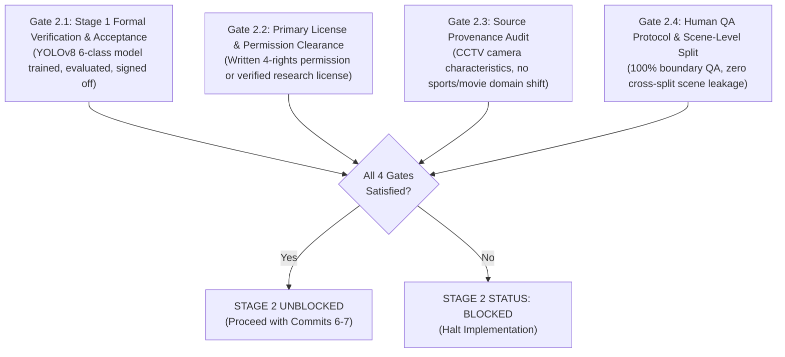

# Stage 2 Readiness Preparation Package & Final Report

> **Historical worker report — superseded (2026-09-28):** This report records the preparation state on 26 September 2026. Its `BLOCKED`, “zero data,” and “training not run” statements are accurate only for that snapshot and are not current. Since then, Stage 1 YOLOv8n/YOLOv8s pilots and the Stage 2 SCFD/X3D-S pilot have been trained and evaluated. Current remaining work is Stage 2 pipeline integration and target-camera evaluation. See [README.md](README.md) and [the current Stage 2 pilot status](docs/stage2_scfd_pilot_readiness.md). The report body is retained as an audit record.
## Temporal Event Classification (`fight`) — Version 2.0 Two-Stage Pipeline

> **Worker ID:** `stage2_prep`  
> **Task ID:** `stage2_readiness_preparation`  
> **Status:** `BLOCKED` (Strictly preserved per two-stage architecture controls)  
> **Phase:** `STAGE2_PREPARATION_COMPLETE_GATED_ON_STAGE1`  
> **Date:** 2026-09-26  
> **Worktree Target:** `Project-CCTV-Safety-antigravity`  
> **Mandatory Policy Controls:** Preparation only. Zero data downloaded/acquired; zero dependencies installed; zero inference/training run; zero Colab compute spent; zero Git add/commit/push performed; zero Stage 1 data altered. Stage 2 status strictly maintained as `BLOCKED`.

---

## 1. Executive Summary

This report delivers the decision-complete preparation package for **Stage 2 (Fight Temporal Event Classification)**, executed in parallel with the Project Owner's planned Stage 1 spatial detector Colab training.

Under the approved Version 2.0 Two-Stage Pipeline architecture ([docs/two_stage_architecture_migration.md](docs/two_stage_architecture_migration.md)):
- **Stage 1 (Spatial Object Detection):** YOLOv8 is strictly dedicated to six physical spatial classes (`0: person`, `1: helmet`, `2: vest`, `3: fall`, `4: fire`, `5: smoke`).
- **Stage 2 (Temporal Event Classification):** Detection of interpersonal violence (`fight`) is completely decoupled from single-frame spatial bounding boxes and assigned to a temporal video action classification pipeline (`ByteTrack` $\rightarrow$ `Multi-signal Candidate Trigger` $\rightarrow$ `Continuous Rolling Buffer` $\rightarrow$ `X3D-S / VideoMAE Classifier`).
- **Operating Status:** Stage 2 implementation (Commits 6–7) remains strictly **`BLOCKED / PENDING DATA APPROVAL`**. No fight video dataset has been acquired locally, and no candidate has cleared all four mandatory entry gates.

---

## 2. Evidence-Based Inventory & Comparison of Fight Video Candidates and Actual Local Availability

### 2.1 Physical Local Disk Inventory Audit
A full physical audit of the local filesystem confirmed:
- `data/raw/`: Contains only `dfire/` and `fall_detection_dataset/`.
- `data/processed/`: Contains only Stage 1 processed directories (`construction_ppe_corrected/`, `dfire_corrected/`, `fall_corrected_pilot/`, `fall_corrected_pilot_extension/`, and `stage1_unified/`).
- **Fight Data Locally Present:** **EXACTLY ZERO (0) CLIPS / ZERO (0) BYTES / ZERO (0) ANNOTATIONS**.
- No fight data was downloaded, extracted, or staged during this preparation task, strictly respecting project controls.

### 2.2 Comparative Candidate Analysis (Primary Source Evidence Only)

| # | Candidate Dataset | Primary Publisher & Repository / Citation | Operative Primary License | Data Modality & Scale | Annotation Format | Local Disk Availability | Screening Status & Governing Owner Decision |
|:---:|---|---|---|---|---|:---:|---|
| **1** | **TNUE-Fight Detection** | Duc-Quang Vu et al. (ICTU, Vietnam)<br/>[GitHub: vdquang1991/TNUE_FightDetection](https://github.com/vdquang1991/TNUE_FightDetection) | **No LICENSE file in repository** (All rights reserved by default; source footage scraped from social media) | Video clips (MP4/AVI)<br/>Variable resolution | CSV (`xmin, ymin, xmax, ymax`) per person | **0 clips (Absent)** | **OPTIONAL FUTURE CANDIDATE**<br/>Pending formal written 4-rights permission from ICTU. Explicitly **not** a Stage 1 dependency. |
| **2** | **Simuletic CCTV Aggressive Poses** | Simuletic<br/>[Hugging Face: Simuletic/CCTV_Aggressive_Poses...](https://huggingface.co/datasets/Simuletic/CCTV_Aggressive_Poses_Fight_Detection_Dataset) | **Unverified Authority / Provenance Conflict** (Card claims CC BY 4.0 & "3D synthetic", but frames show real human CCTV footage) | Static frames (103 images)<br/>Only 48 active fight images | YOLOv8 Pose (1 bbox + 17 keypoints per person) | **0 images (Absent)** | **OFFICIALLY CLOSED / NO-GO FOR PHASE 3**<br/>Binding Project Owner decision: Zero training policy enforced; permanently rejected. |
| **3** | **RWF-2000 Video Dataset** | M. Soliman et al. (2019)<br/>arXiv:1911.11868<br/>[Kaggle: mohamedmustafa/real-life-violence...](https://www.kaggle.com/datasets/mohamedmustafa/real-life-violence-situations-dataset) | **License not confirmed; academic citation terms observed** (No OSI/CC license; source clips from YouTube CCTV) | 2,000 video clips (1,000 Fight, 1,000 Non-Fight)<br/>5.0s per clip @ 30 FPS | Clip-level binary classification (No bboxes) | **0 clips (Absent)** | **BLOCKED PENDING LICENSE CLARIFICATION**<br/>Best video candidate for rolling buffer, but requires owner acceptance of research terms & non-commercial scope. |
| **4** | **Yash07Yadav Violence Combined** | User `yash07yadav`<br/>[Kaggle: yash07yadav/project-data](https://www.kaggle.com/datasets/yash07yadav/project-data) | **Unverified Compiler Claim** (Card states MIT, but merges YouTube, RWF-2000, hockey, and movie clips) | Multi-source video clips | Binary / Multi-class video labels | **0 clips (Absent)** | **REJECTED / HOLD**<br/>Compiler cannot grant MIT over third-party copyrighted films and sports broadcasts. |
| **5** | **Roboflow Universe Candidates**<br/>(`colab16/street-fight`, `ezgis-workspace/fight`) | Roboflow community uploaders<br/>[Roboflow Universe](https://universe.roboflow.com/) | **User-declared CC BY 4.0** (Web declaration without source provenance) | Static images (206 to ~1,000 images) | YOLO bounding boxes (`object`, single `non-fight` person) | **0 images (Absent)** | **REJECTED**<br/>Severe task mismatch (static images, no temporal motion), contaminated classes, unverified provenance. |
| **6** | **BEHAVE Video Dataset (2010)** | Blunsden & Fisher (Univ. of Edinburgh)<br/>[BEHAVE Project](http://homepages.inf.ed.ac.uk/rbf/BEHAVE/) | **Academic Research Use Only** | Single continuous campus CCTV video (~90,000 frames) | VIPER XML (Pedestrian bbox + interaction tags) | **0 clips (Absent)** | **HOLD / REJECTED FOR BASELINE**<br/>Single campus camera view, zero scene/lighting diversity, high XML conversion overhead. |
| **7** | **Hockey Fights / UCF-Crime (Fight Subset)** | Nievas (2011) / Sultani (CVPR 2018) | Academic citation only / Fair use research | Video clips | Clip binary / temporal range | **0 clips (Absent)** | **REJECTED FOR BASELINE**<br/>Hockey is a sports domain shift; UCF-Crime has extreme class imbalance and long untrimmed sequences. |

### 2.3 Unverified Claims & Critical Distinctions
1. **The "Education Automatically Waives Licensing" Fallacy:** Non-commercial educational prototype use does *not* grant statutory immunity or wipe away third-party copyright claims. Upstream license terms remain binding.
2. **Compiler MIT License Claims (e.g. Yash07Yadav):** MIT declared on a Kaggle dataset card applies exclusively to the uploader's directory structure and preprocessing scripts, *never* to the underlying third-party video footage harvested from YouTube or movies.
3. **Simuletic "Synthetic" Claim:** Provenance audit proved footage depicts real individuals recorded on real surveillance cameras. Claiming synthetic immunity is unsupported by empirical evidence.

---

## 3. Exact Remaining Stage 2 Entry Gates & Stage 1 Dependency

Stage 2 development (Commits 6–7) cannot begin until all four mandatory entry gates are evaluated to **`PASS`**:



### 3.1 Gate 2.1 — Stage 1 Formal Verification & Acceptance (Mandatory Technical Dependency)
- **Why Stage 2 Depends on Stage 1:**
  1. The Stage 2 pipeline does *not* run a heavy 3D-CNN / VideoMAE model on the raw CCTV stream 24/7. Doing so would overwhelm edge compute and produce high false-positive alert rates.
  2. The candidate trigger relies entirely on Stage 1 outputs: spatial `person` bounding boxes, detection confidences, and tracking state.
  3. Spatial detections are fed to `ByteTrack` to generate tracklets and velocity vectors. When the proximity and motion jitter heuristics trigger a candidate event, the system extracts a temporal window from the rolling video buffer and invokes the Stage 2 action classifier.
  4. Without a trained, validated, and frozen Stage 1 YOLOv8 model (with its mandatory `model_manifest.json` sidecar and verified mAP50 metrics), Stage 2 cannot receive spatial person proposals.
- **Current Status:** **OPEN / BLOCKED** (Stage 1 training is currently being prepared by the Project Owner on Colab).

### 3.2 Gate 2.2 — Primary License & Written Permission Clearance
- **Requirement:** At least one temporal fight video dataset must have verified legal clearance.
  - If **TNUE-Fight** is selected: A formal written permission letter covering 4 explicit rights (Annotation modification, Model training, Experimental reporting, Model weights distribution) must be executed with ICTU authors.
  - If **RWF-2000** is selected: Project Owner must formally accept academic citation terms and document non-commercial research constraints.
  - Simuletic is permanently excluded (`NO-GO`).
- **Current Status:** **OPEN / BLOCKED**.

### 3.3 Gate 2.3 — Source Provenance & CCTV Domain Suitability Audit
- **Requirement:** Audited documentation verifying that footage matches fixed/semi-fixed surveillance camera viewpoints, variable lighting (indoor/outdoor, day/night), realistic physical conflict (strikes, grappling, shoving), and excludes staged professional sports (hockey, wrestling) or cinema footage.
- **Current Status:** **OPEN / BLOCKED**.

### 3.4 Gate 2.4 — Human QA Protocol & Scene-Level Split Execution
- **Requirement:** Execution of the temporal Human-QA protocol (Section 4) with zero cross-split scene leakage and documented hard-negative non-fight samples.
- **Current Status:** **OPEN / BLOCKED**.

---

## 4. Decision-Complete Human-QA Protocol for Temporal Event Classification

### 4.1 Clip Unit & Duration Standards
- **Clip Length:** Standardized continuous video windows of **2.0 to 5.0 seconds** (recommended nominal: 2.5 seconds, matching the continuous rolling buffer $T_{\text{pre}} = 1.5\text{s} + T_{\text{post}} = 1.0\text{s}$).
- **Frame Rate Support:** Native variable frame rates (15–30 FPS). System samples exactly 16 or 32 uniformly spaced frames across the temporal window.

### 4.2 Temporal Event Boundary Taxonomy
Every candidate video sequence must be segmented into four precise temporal phases:

```
[--- Pre-Conflict Window ---] [====== Active Conflict ======] [--- Post-Conflict Window ---]
t_approach ---------------> t_onset ---------------------> t_cessation -------------> t_recovery
  (verbal / posturing)         (first strike / tackle)        (separation / ground stop)
```

1. **`t_pre_conflict` (Pre-event Phase):** Approaching individuals, verbal altercations, aggressive squaring up, but **no physical contact**. Annotated as negative context or candidate-trigger benchmark frames; strictly **never** labeled as active fight.
2. **`t_onset` (Event Start Boundary):** The exact millisecond/frame of the first violent physical impact (punch, kick, aggressive shove, tackle to ground, or violent grapple).
3. **`t_active` (Active Conflict Window):** Sustained physical violence between 2 or more individuals.
4. **`t_cessation` (Event End Boundary):** The exact frame where violent strikes/grappling cease (combatants separate, third parties intervene, or combatants are pinned without further violent motion).
5. **Class Assignment Rules:**
   - **`FIGHT` (Class 1):** Active physical violence where $(t_{\text{cessation}} - t_{\text{onset}}) \ge 0.5$ seconds.
   - **`NON_FIGHT_HARD_NEGATIVE` (Class 0):** High-motion or close-proximity human interactions without violence:
     - Close physical greetings (hugging, kissing, handshakes).
     - Collaborative physical labor (carrying equipment together, lifting, construction teamwork).
     - Running, dancing, high-fives, or stumbling/tripping.
   - **`NON_FIGHT_NORMAL` (Class 0):** Solitary walking, standing, sitting, general ambient movement.
   - **`AMBIGUOUS_EXCLUDE`:** Staged choreography, roughhousing, boxing/martial arts sports, severe occlusion ($> 50\%$), or camera artifacts. Excluded from training.

### 4.3 Sampling & Grouping Protocol
- **Audit Sample Scale:** Stratified sample of **100 clips** (or 10% of total archive, whichever is smaller, minimum 50 clips).
- **Stratification Breakdown:**
  - 50% Fight clips (stratified across striking, wrestling/grappling, group brawl).
  - 30% Hard-negative interaction clips (hugging, teamwork, crowd jostling).
  - 20% Normal CCTV baseline clips.
- **Grouping Unit:** Clustered strictly by `scene_group_id` (location + camera angle + event session).

### 4.4 Reviewer Procedure (Two-Pass Verification)
- **Pass 1: Primary Annotator Screening:**
  1. Inspect clip at $1.0\times$ speed, then inspect boundary transitions at $0.5\times$ speed.
  2. Pinpoint exact timestamps: $t_{\text{onset}}$ and $t_{\text{cessation}}$.
  3. Tag participant count (must be $\ge 2$ for interpersonal fight).
  4. Tag camera stability: Fixed CCTV (pass) vs hand-held camera shake / cinematic zooms (flag for exclude).
  5. Log entry into `temporal_qa_work_queue.csv`.
- **Pass 2: Independent Reviewer Verification:**
  1. Review 100% of remediated clips and 20% random spot-check of Pass 1 accepted clips.
  2. Check boundary concordance: $|\Delta t_{\text{onset}}| \le 0.3\text{s}$ and $|\Delta t_{\text{cessation}}| \le 0.3\text{s}$ (approx. 5–9 frames @ 30 FPS).
  3. Check classification agreement: Cohen's $\kappa \ge 0.90$.
  4. Any irreconcilable dispute is escalated to the Project Owner for binding verdict.

### 4.5 Quantitative Acceptance Thresholds
- **Temporal Boundary Jitter:** $|\Delta t| \le 0.3$ seconds on $\ge 95.0\%$ of audited clips.
- **Critical Classification Error:** Exactly $0.0\%$ (zero peaceful interactions labeled as fight; zero violent fights labeled as non-fight).
- **Out-of-Domain Contamination (Movies/Sports):** Exactly $0.0\%$.
- **Temporal Coordinate Integrity:** 100% valid timestamps ($0.0 \le t_{\text{onset}} < t_{\text{cessation}} \le t_{\text{duration}}$).

### 4.6 QA Artifacts Emitted
- `docs/audit_artifacts/stage2_fight/temporal_qa_manifest.csv`
- `docs/audit_artifacts/stage2_fight/temporal_discrepancy_log.md`
- 8-frame uniformly sampled temporal contact sheets per audited clip.

### 4.7 GO / HOLD / REJECT Criteria
- **`GO`:** 100% verified license, zero cross-split scene leakage, $\ge 98\%$ boundary accuracy, all acceptance thresholds met.
- **`HOLD`:** Boundary discrepancies correctable by trimming; pending formal signature on license permission letter; missing hard negatives requiring supplementary collection.
- **`REJECT`:** Cinema/sports contamination $> 5\%$, uncurable copyright infringement, unresolvable provenance contradictions (e.g. Simuletic), or static frames lacking temporal sequence.

---

## 5. Leakage-Safe Video/Scene/Person-Group Split & Near-Duplicate Strategy

### 5.1 The Danger of Video Data Leakage
In video event classification, dividing consecutive clips or sliced frames from the same camera incident across `train`, `val`, and `test` results in catastrophic data leakage. The neural network learns to memorize static scene features (wall color, floor texture, ambient lighting, clothing) rather than dynamic temporal action patterns. This produces misleadingly high validation accuracy that fails completely in real CCTV deployments.

### 5.2 Cardinal Partitioning Rule: Scene-Level Split
- **Rule:** Slicing clips across splits from the same physical camera view, incident, or actor session is **strictly prohibited**.
- **Grouping Hierarchy:**
  ```
  facility_id (e.g., Warehouse_A)
     └── camera_id (e.g., Cam_02_LoadingDock)
           └── incident_session_id (e.g., Incident_20260926_01)
                 └── [ALL extracted clips must reside in the SAME split]
  ```
- **Split Distribution Target:**
  - **Train:** 70% of scene groups
  - **Validation:** 15% of scene groups
  - **Test:** 15% of scene groups
  - Class balance (Fight vs Non-Fight) maintained proportionally within each split.

### 5.3 Near-Duplicate Detection Strategy
1. **Multi-Keyframe Perceptual Hashing (dHash / pHash):**
   - For every video clip, extract 3 reference keyframes at $25\%$, $50\%$, and $75\%$ duration.
   - Compute 64-bit difference hashes (`dHash`) for each keyframe.
   - Pairwise compare all clips across the archive. If Hamming distance $\le 6$ bits on $\ge 2$ keyframes, flag as candidate near-duplicate scene.
2. **Background Cosine Similarity Screening:**
   - Compute static background embeddings using a lightweight CNN.
   - Background similarity $> 0.92$ forces clips into the same `scene_group_id`.
3. **Actor Identity Clustering:**
   - Clips featuring identical actors in identical clothing must share the same `actor_group_id`.

---

## 6. Colab Handoff Plan for Stage 2 (Temporal Model Training)
*(Engineering blueprint prepared without launching a Colab runtime or spending compute)*

### 6.1 Canonical Manifest Schema (`stage2_manifest.json`)
```json
{
  "$schema": "https://json-schema.org/draft/2020-12/schema",
  "dataset_name": "cctv_safety_stage2_temporal_fight",
  "dataset_version": "1.0.0",
  "total_clips": 1000,
  "splits": { "train": 700, "val": 150, "test": 150 },
  "class_mapping": { "0": "non_fight", "1": "fight" },
  "input_format": {
    "frames_per_clip": 16,
    "sampling_rate": "uniform",
    "resolution": [224, 224],
    "clip_duration_seconds": 2.5
  },
  "manifest_sha256": "4a7d...64hex",
  "clips": [
    {
      "clip_id": "clip_0001",
      "relative_path": "clips/train/clip_0001.mp4",
      "file_sha256": "8b2e...64hex",
      "split": "train",
      "scene_group_id": "scene_loc_042",
      "label": 1,
      "label_name": "fight",
      "duration_sec": 2.5,
      "total_frames": 75,
      "fps": 30.0,
      "temporal_event_range": [0.5, 2.5]
    }
  ]
}
```

### 6.2 Expected Input Format for PyTorch Video DataLoader
- **Input Tensor Dimensions:** `(B, C, T, H, W)`
  - $B$: Batch size (8 or 16)
  - $C$: 3 channels (RGB normalized to ImageNet mean/std)
  - $T$: 16 frames uniformly sampled across the 2.5s clip window
  - $H \times W$: $224 \times 224$ pixels
- **Data Augmentations:** Random horizontal flip ($p=0.5$), spatial random crop/scale ($0.8$–$1.0$), slight temporal jitter ($\pm 2$ frames), color jitter (brightness=0.1, contrast=0.1).

### 6.3 Storage & Transfer Architecture
- **Archive Packaging:** Single compressed archive `stage2_temporal_dataset_v1.tar.gz` hosted in Google Drive at `/content/drive/MyDrive/Project-CCTV-Safety/data/`.
- **Fast NVMe Extraction:** Copy archive to local Colab instance storage (`/content/dataset/`) and extract before training. This avoids Google Drive FUSE latency during multi-epoch video loading.
- **Git Hygiene:** No video files or archives are committed to Git (`.gitignore` enforced).

### 6.4 GPU & Model Architecture Recommendations (Non-Binding Guidance)
1. **Option A (Recommended Edge CCTV Baseline): X3D-S (Small)**
   - Parameters: ~3.8M, ~2.0 GFLOPs.
   - Inference Latency: ~18ms on NVIDIA T4 GPU; runnable on edge hardware (Jetson Orin Nano).
   - Colab Compute: Runs smoothly on free-tier T4 GPU (16GB VRAM) with batch size 16.
2. **Option B (Ultra-Lightweight Embedded): X3D-XS (Extra Small)**
   - Parameters: ~1.9M, ~0.9 GFLOPs.
   - Recommended if edge inference must run concurrently with YOLOv8 on constrained CPU/GPU.
3. **Option C (High-Accuracy Research Benchmark): VideoMAE (ViT-Small)**
   - Self-supervised masked autoencoder pre-trained on Kinetics-400.
   - Parameters: ~22M. Superior spatial-temporal feature quality, but higher latency (~45–60ms). Requires Colab Pro (A100 or V100 GPU) for efficient training. Recommended as an accuracy ceiling reference.

### 6.5 Checkpoint & Output Specification
- **Local Runs:** `/content/runs/stage2_x3d_s_run01/`
- **Persistent Weights:** Synced to Google Drive `/content/drive/MyDrive/Project-CCTV-Safety/models/stage2/x3d_s_best.pt`
- **Mandatory Sidecar:** `x3d_s_best_model_manifest.json` containing:
  - `model_name`: `"x3d_s_temporal_fight"`
  - `weights_sha256`: lowercase 64-char hex
  - `dataset_manifest_hash`: SHA-256 of `stage2_manifest.json`
  - `class_names`: `["non_fight", "fight"]`
  - `input_resolution`: `[16, 224, 224]`
  - `training_metrics`: `{ "val_f1": ..., "val_auc": ..., "inference_latency_ms": ... }`

---

## 7. Division of Labor: Precise Owner Inputs Needed vs. Worker/Team Execution

| Domain | Precise Project Owner Inputs Needed (Owner-Only Decisions) | Worker / Development Team Technical Execution |
|---|---|---|
| **Stage 1 Verification** | • Formally review and sign off on Stage 1 YOLOv8 6-class training results on Colab.<br/>• Approve Stage 1 baseline metrics and sidecar `model_manifest.json`. | • Maintain local worktree schema integrity and configuration guards.<br/>• Run local validation checks against Stage 1 contracts. |
| **Fight Dataset Authorization** | • Review and approve Fight video candidate shortlist (TNUE-Fight vs RWF-2000).<br/>• Authorize educational prototype research scope or approve written permission request to ICTU.<br/>• Re-affirm zero-training policy on Simuletic. | • Execute primary-source provenance and license audits.<br/>• Monitor publisher repositories and legal requirements.<br/>• Zero local fight data downloaded until authorized. |
| **Human QA & Quality Gates** | • Review and approve temporal QA protocol thresholds ($|\Delta t| \le 0.3\text{s}$, critical error $= 0\%$).<br/>• Provide binding determinations on escalated ambiguous video clips. | • Generate video temporal contact sheets, overlays, and queue CSVs.<br/>• Execute Pass 1 screening and Pass 2 audit verification.<br/>• Maintain discrepancy logs. |
| **Infrastructure & Compute** | • Confirm Google Drive storage allocation for video archives.<br/>• Select Colab GPU tier preference (Free T4 vs Pro A100). | • Build reproducible Colab training notebook (`stage2_temporal_training.ipynb`).<br/>• Perform CPU dry-run syntax and DataLoader verification.<br/>• Build `stage2_manifest.json` generation scripts. |
| **Code Implementation** | • Authorize transition of Stage 2 from `BLOCKED` to `ACTIVE` once Entry Gates 2.1–2.4 are satisfied. | • Implement Commits 6–7 in worktree:<br/>  - `cctv_safety/tracking.py` (ByteTrack wrapper)<br/>  - `cctv_safety/trigger.py` (Candidate trigger)<br/>  - `cctv_safety/buffer.py` (Continuous rolling buffer)<br/>  - `cctv_safety/temporal_classifier.py` (X3D-S model)<br/>  - `scripts/infer.py` Event Schema v1 dispatch. |

---

## 8. Summary of Files Changed & Preserved Controls

### Files Created / Updated:
1. `docs/worker_control/workers/stage2_prep/status.json`: Live worker progress contract reflecting `BLOCKED` status, 100% preparation progress, exact blockers, and next action.
2. `docs/worker_control/workers/stage2_prep/final_report.md`: Complete decision-complete preparation report.
3. `final_report.md`: Root-level synchronization of this final report.

### Preserved Controls & Non-Interference Confirmation:
- **Stage 1 Data:** Untouched (zero modifications to `construction_ppe_corrected/`, `dfire_corrected/`, `fall_corrected_pilot/`, or `stage1_unified/`).
- **Dependencies:** Zero new packages installed.
- **Compute:** Zero Colab compute spent; zero runtimes initiated.
- **Git State:** No `git add`, `git commit`, or `git push` executed.
- **Stage 2 Status:** Strictly maintained as **`BLOCKED / PENDING DATA APPROVAL`**.
